# Connecting Exasol with Google Analytics 360 
## Background

Google Analytics is a web analytics service that tracks and reports website traffic and is the most widely used web analytics service on the web. Google launched the service in November 2005 after acquiring Urchin software. It tracks website activity of the users such as sessions duration, page impressions, bounce rate, visits  and many other important web metrics. In March 2016, Google released Google Analytics 360, the premium version of Google Analytics, it allows analyzing customer data from all touch-points. The major feature of GA360 is a native integration with Google BigQuery.   
  
I would like to explain how to connect Exasol with Google Analytics 360 using a simple example. Imagine we want to find out the different browsers of the Linux operating system and their number of sessions in a specific date range (see screenshot below). In the next steps, we ingest Google Analytics data into Exasol and extract the same metric from the raw data level.

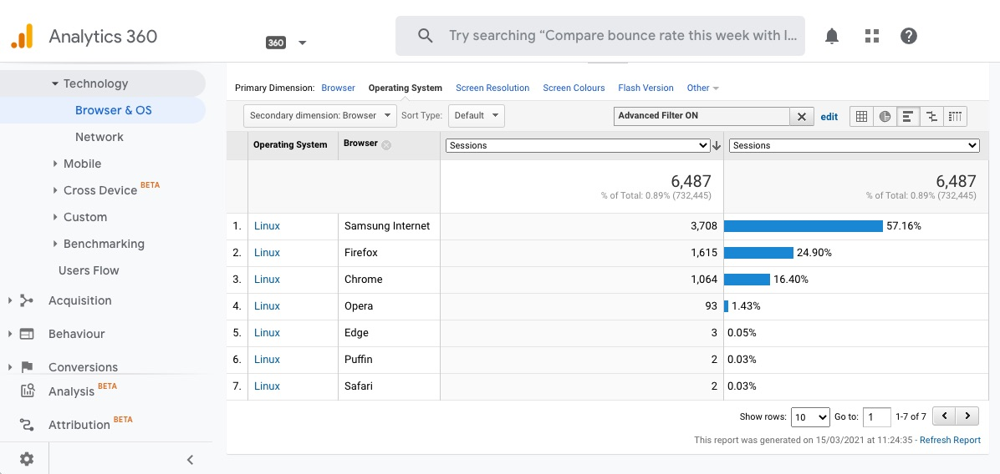

## Prerequisites

Before we are able to begin loading data, you need to do the following preparation:

* You need a [Google Analytics 360 account](https://marketingplatform.google.com/about/analytics-360/ "Google")
* You need a [Google Cloud Account](https://console.cloud.google.com "Google") and a [Google Service Account key](https://cloud.google.com/iam/docs/creating-managing-service-account-keys "Google")
* Download [Simba BigQuery JDBC driver](https://cloud.google.com/bigquery/providers/simba-drivers/ "Simba")
* You need access to BucketFS
* Exasol instance with access to the internet

## How to connect Google Analytics from Exasol

## Step 1 - Link Google Analytics with BigQuery

When you initially link a specific Google Analytics view to BigQuery ([Set up BigQuery Export](https://support.google.com/analytics/answer/3416092?hl=en "Set")). GA360 exports 13 months or 10 billion hits (whichever is smaller) of historical data to BigQuery. However, this export happens only once per view, if the link is detached, a re-export of the historical data from Google is no longer possible. To create the connection between Google Analytics and BigQuery, administration rights are required.

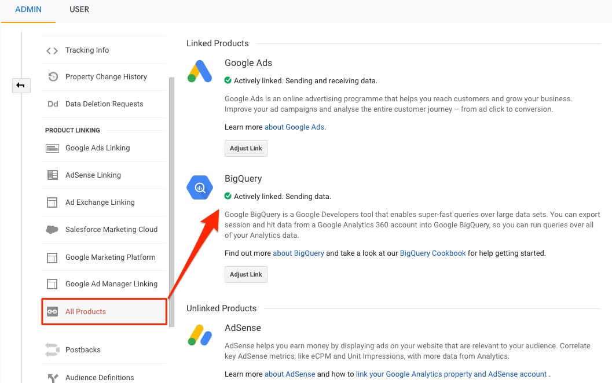

## Step 2 - Google BigQuery Dataset

The name of the dataset in BigQuery project corresponds to the View ID from the associated Analytics account. Within the dataset, a table is created for each day according to the following name structure "ga_sessions_YYYYMMDD". Intraday data are temporary tables. These tables are updated approximately three times a day. During the same day, each import of intraday data overwrites the previous import in the same table.

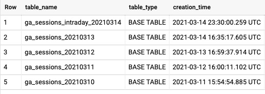

Each row within a table corresponds to a session (visit). Many of the columns will be familiar to Google Analytics users, such as userId, visits (sessions), hits, pageviews, etc. The BigQuery export schema contains 257 columns, a good overview of the individual columns and their description can be found on the following documentation page [BigQuery Export schema](https://support.google.com/analytics/answer/3437719?hl=en&ref_topic=3416089 "BigQuery").

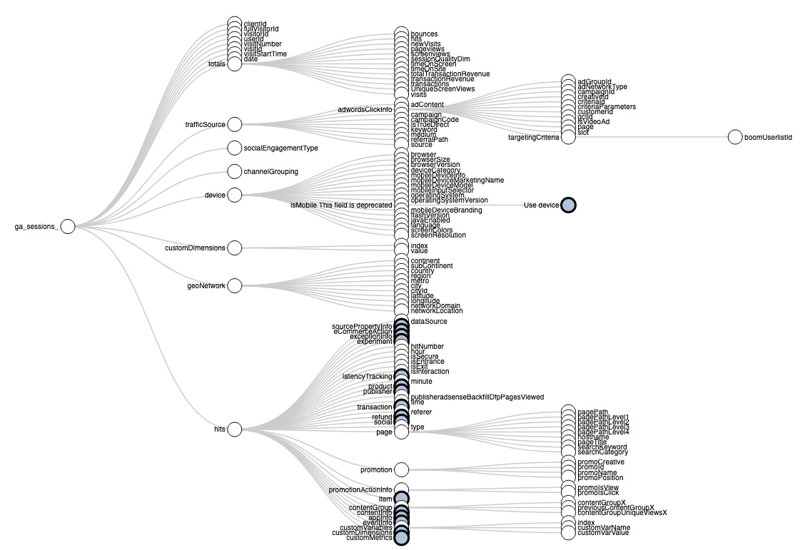

[BigQuery Export Schema Collapsible Tree](https://storage.googleapis.com/e-nor/visualizations/bigquery/ga360-schema.html#section-collapsible-tree "BigQuery")

The user count between the Google Analytics UI and the data exported to Bigquery data will always have an expected 1–2% discrepancy. The reason for that is the approach of the aggregation techniques of the data. Google Analytics UI estimates the total number of users according to a certain algorithm, whereas BigQuery uses the unsampled raw data of the fullVisitorId for the aggregation of the number of users.  
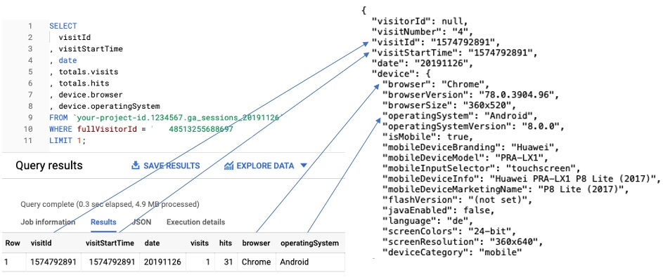

## Step 3 - Connecting Exasol with BigQuery

The data is available in BigQuery, now we would of course also like to import it into Exasol. There are many ways to import this data into [Exasol](https://community.exasol.com/t5/connect-with-exasol/importing-and-exporting-data-with-google-bigquery/ta-p/1385 "Exasol") (API, Google Cloud Storage, Python script). The easiest and most comfortable way is to setup the Simba JDBC driver.  
On the documentation page "[Google BigQuery](https://docs.exasol.com/loading_data/connect_databases/google_bigquery.htm)" there is already an excellent explanation how to configure the Simba Driver correctly in Exasol.  
The JDBC driver leverage the BigQuery interface to ingest or export data between Google BigQuery and the existing Exasol environment.

Since the JDBC setup for BigQuery has already been discussed in detail in the following document page, for this reason, I will not explain the individual steps again in detail, but only describe them in a few basic steps:

Step 3.1 - Create Service Account for your GCP project  


  
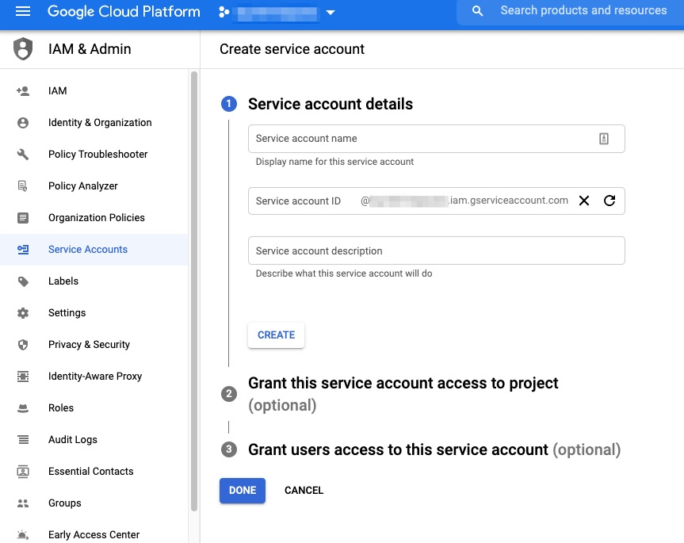

Step 3.2 - Upload JSON Key File to [BucketFS](https://docs.exasol.com/administration/on-premise/bucketfs/bucketfs.htm "BucketFS")  
  
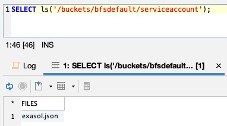

Step 3.3 - Configure the Driver in EXAoperation (Configuration/Software/JDBC Drivers)  
  
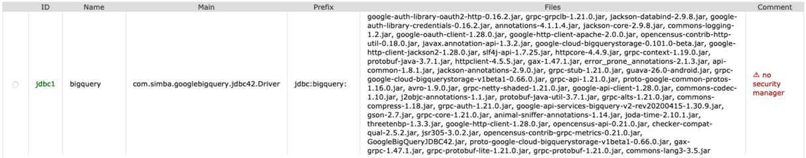

Step 3.4 - Create Database Connection

If all requirements are fulfilled, the [connection URL](https://www.simba.com/products/BigQuery/doc/JDBC_InstallGuide/content/jdbc/bq/using/connectionurl.htm "Building") to BigQuery can be established with the Exasol Connection Command.


```sql
CREATE OR REPLACE CONNECTION BIGQUERY_JDBC TO  'jdbc:bigquery://https://www.googleapis.com/bigquery/v2:443;ProjectId=<your-project-id>;OAuthType=0;Timeout=600;OAuthServiceAcctEmail=<your-service-account>;OAuthPvtKeyPath=/d02_data/<bucketfs-service>/<bucket-name>/<your-account-keyfile>;';
```
Afterwards, the [IMPORT](https://docs.exasol.com/sql/import.htm "IMPORT") Command can be used to transfer data from BigQuery into Exasol database.

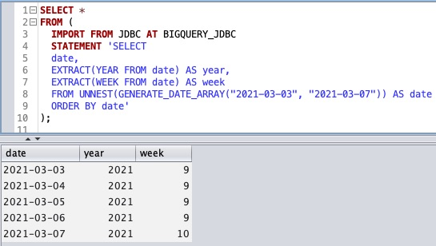

Please note, however, that the Simba driver cannot cover the entire functionality and covers only a subset of the full capabilities of BigQuery. For example, nested and repeated data, also known as STRUCTS and ARRAYS in BigQuery are represented as the JSON output, because the JDBC data model does not have an appropriate way to represent the data.

Table (nested data) preview inside Google BigQuery:

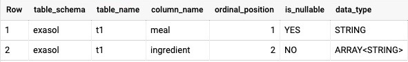  
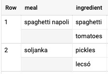  
Table preview using JDBC driver inside Exasol:  
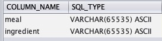


## Step 4 - Set up a Virtual Schema for BigQuery

The use of [Virtual Schema](https://github.com/exasol/virtual-schemas "Virtual") within Exasol simplifies the handling of an external database and makes the integration of external data even more easy. The Exasol Virtual Schema provides an abstraction layer that makes it easy to access an external database from an Exasol database through regular SQL commands. After creating a virtual schema, you can use BigQuery tables and combine them with persistent tables stored in Exasol. The SQL optimizer transforms the virtual objects into connections to BigQuery and transfers the requested data.  
Since the required JDBC Jar files have already been installed in the software section of EXAoperation, we also need this data in an additional BucketFS storage.  
The required files can be uploaded comfortably with the python script [DriverUploader.py](https://github.com/exasol/exa-toolbox/blob/master/jdbc_drivers_tool/DriverUploader.py "DriverUploader.py") or via CURL.

  
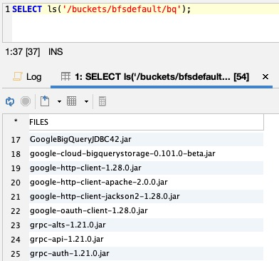

In addition to the existing driver files we also need the BigQuery Virtual Schema jar file from Exasol. The current version of the [BigQuery Virtual Schema](https://github.com/exasol/bigquery-virtual-schema/blob/main/doc/user_guide/bigquery_user_guide.md "BigQuery") is available on [github](https://github.com/exasol/bigquery-virtual-schema "bigquery-virtual-schema").


```sql
CREATE JAVA ADAPTER SCRIPT SCHEMA_FOR_VS_SCRIPT.ADAPTER_SCRIPT_BIGQUERY AS     %scriptclass com.exasol.adapter.RequestDispatcher;     %jar /buckets/bfsdefault/bq/virtual-schema-dist-9.0.1-bigquery-2.0.0.jar;     %jar /buckets/bfsdefault/bq/GoogleBigQueryJDBC42.jar; ... / ;
```
After all the required files have been uploaded to BucketFS, the Virtual Schema can be created with the following adapter script. The adapter script defines the Java class and tells the UDF framework where to find the required libraries (JAR files) for Virtual Schema and database driver.


```sql
CREATE VIRTUAL SCHEMA VS_BIGQUERY     USING SCHEMA_FOR_VS_SCRIPT.ADAPTER_SCRIPT_BIGQUERY     WITH     CONNECTION_NAME = 'BIGQUERY_JDBC'     CATALOG_NAME = '<your-project-id>'     SCHEMA_NAME = '<your-dataset>';
```
Let's go back to our example from Google Analytics and answer the question we asked at the beginning. We wanted to find out which browser generates the most visits from Linux users over a specific time period. We will create a view (example dataset: exasol) from the Analytics raw data in BigQuery and make this data available in Exasol using Virtual Schema.


```sql
-- Example Analytics View in BigQuery CREATE VIEW `your-project-id.exasol.linux_visits_example` AS SELECT   CAST(date AS INT64) AS date,   device.operatingSystem,   device.browser,   SUM(totals.visits) AS visits FROM `your-project-id.1234567.ga_sessions_*` WHERE _TABLE_SUFFIX BETWEEN '2021XXXX' AND '2021XXXX' GROUP BY   date,   device.operatingSystem,   device.browser ;
```
The initial question can be answered directly within Exasol with a simple query.


Afterwards, I would like to make a note about the performance. Virtual schemas are a convenient and simple way of integrating external data databases, but this approach is only suitable for processing a few thousand rows (Please also consider the costs that may be charged for each scan in BigQuery). If the need of processing large databases is required, the implementation with python or another library is certainly a better and more performant approach. For example, direct parallel import of data from Google Cloud Storage is the faster and better alternative for migration of large amounts of data.  
Another interesting project on this topic is the Exasol Github project [Exasol Cloud Storage Extension](https://github.com/exasol/cloud-storage-extension/blob/main/doc/user_guide/user_guide.md "Exasol"). The Exasol Cloud Storage Extension enables the parallel import of data from [Google Cloud Storage](https://cloud.google.com/bigquery/docs/reference/standard-sql/other-statements#export_data_statement "EXPORT") therefore also data from BigQuery.

## Additional Notes

* Google BigQuery is very time sensitive and tolerates only a very small time offset from UTC, to prevent such an error, you should make sure that the NTP server is correctly configured and synchronized in EXAOperation.


```markup
[BigQueryJDBCDriver](100004) HttpTransport IO error : 400 Bad Request {   "error" : "invalid_grant",   "error_description" : "Invalid JWT: Token must be a short-lived token (60 minutes) and in a reasonable timeframe. Check your iat and exp values in the JWT claim." }.​
```
* ExaOperation allows only one jar file per upload in the JDBC Driver Configuration menu. However, the Simba driver requires many jar files. The best and easiest way is to upload using the [python script](https://github.com/exasol/exa-toolbox/blob/master/jdbc_drivers_tool/DriverUploader.py "DriverUploader.py").
* I have used the ExaCommunity Version 7.0.6 for this tutorial. Even if you don't have a premium account from Google Analytics. BigQuery offers the possibility to create a free dataset, so it is possible to link Exasol with the [public BigQuery dataset](https://cloud.google.com/bigquery/public-data "BigQuery").

## Additional References

* [Set Up BigQuery Export](https://support.google.com/analytics/answer/3416092 "Set")
* [ODBC and JDBC drivers for BigQuery](https://cloud.google.com/bigquery/providers/simba-drivers/ "ODBC")
* [Big Query Virtual Schema](https://github.com/exasol/bigquery-virtual-schema "Big")
* [Loading Data from Google BigQuery](https://docs.exasol.com/loading_data/connect_databases/google_bigquery.htm "Loading")
* [Importing and Exporting Data with Google BigQuery](https://community.exasol.com/t5/connect-with-exasol/importing-and-exporting-data-with-google-bigquery/ta-p/1385 "Importing")
* [database-migration Script](https://github.com/exasol/database-migration/blob/master/bigquery_to_exasol.sql "database-migration")

I'm happy to get your experiences and feedback on this article! 

