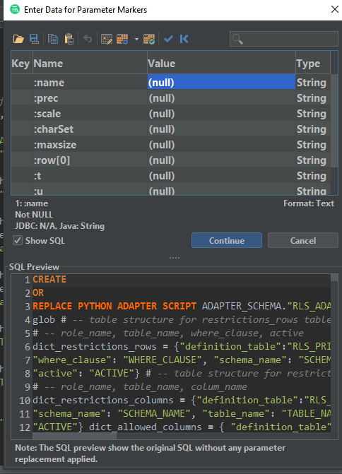
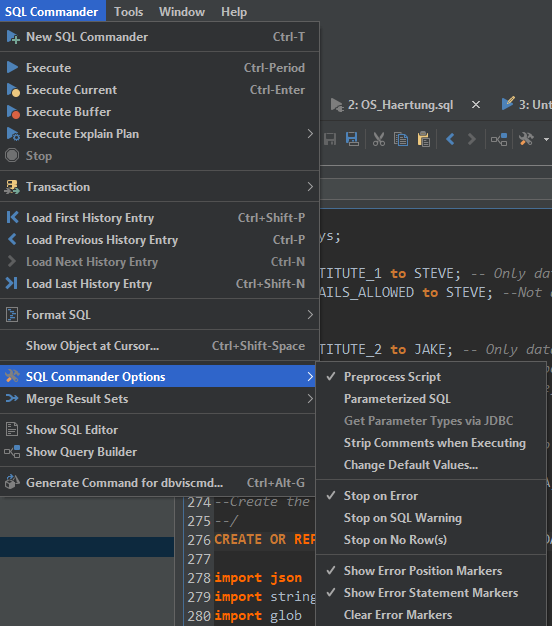

# DbVisualizer: Syntax Errors with Scripts 
## Scope

This article describes how to fix some syntax errors with Scripts when using DbVisualizer.

## Diagnosis

When trying to create a script using DbVisualizer, you may get a popup to insert values for variables, like this:



If you just hit "Continue", the database will then more than likely throw a syntax error on your script, even though the code is correct. 

## Explanation

DbVisualizer supports several different type of "Parameter Markers", which look like:

```
&name
:name
:{name}
:'name'
```
If your UDF contains one of these markers, DbVisualizer will assume that it is a parameter and will ask you to insert a value for that parameter, even though you don't intend for this to be one. You can read more about these Markers in [DbVisualizer's documentation](http://confluence.dbvis.com/display/UG100/Parameterized+SQL+-+Variables+and+Parameter+Markers)

## Recommendation

You can disable "Parameterized SQL" in DBVIsualizer. Go to SQL Commander in the top menu -> SQL Commander Options -> Uncheck “Parameterized SQL”. Then try to create your script again. This time, you should not be prompted to insert values.



## Additional References

* [Connect to DbVisualizer](https://docs.exasol.com/connect_exasol/sql_clients/db_visualizer.htm)

*We appreciate your input! Share your knowledge by contributing to the Knowledge Base directly in [GitHub](https://github.com/exasol/public-knowledgebase).* 