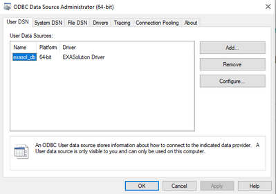
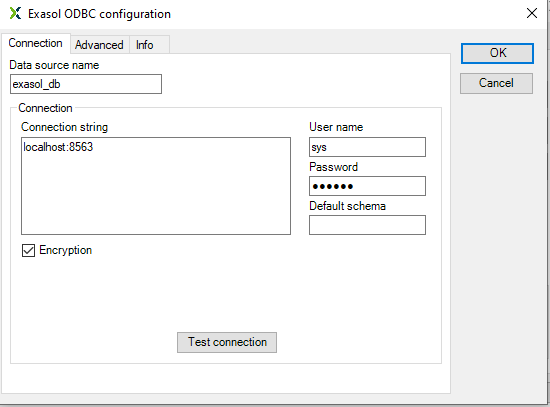
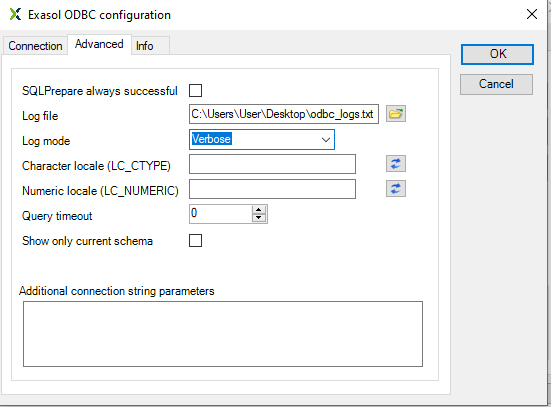
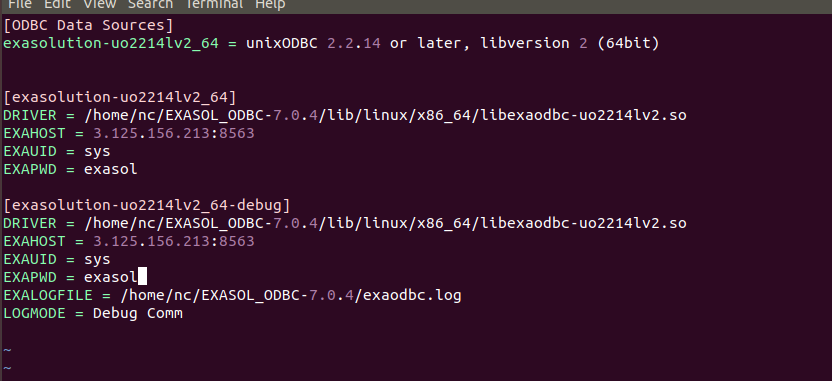

# Debugging Issues using ODBC drivers 
## Scope

Users may experience problems when working with Exasol ODBC drivers. This article will describe how you can configure the ODBC driver for logging, so you can send this information to Exasol support, or try to debug the problem on your own. 

## Diagnosis

There can be various issues with drivers that need to be investigated, such as:

* Driver performance
* Data type mappings
* Network problems

A user may report that a query is running slower than normal, for example. However, if you look at [profiling](https://docs.exasol.com/database_concepts/profiling.htm) or [auditing](https://docs.exasol.com/database_concepts/auditing.htm) for the query in question, you may notice that the execution in the database is quite fast. This could suggest that the slow-down occurred while transferring data between the database and the client in question. 

A user may also report that the data types when interacting between an Exasol Database and another DBMS are mismatched. You can check this by comparing the definition of the column(s) in [EXA_DBA_COLUMNS](https://docs.exasol.com/sql_references/system_tables/metadata/exa_dba_columns.htmhttps://docs.exasol.com/sql_references/system_tables/metadata/exa_dba_columns.htm) with what is returned by the client. 

In both cases, ODBC logs are critical to help Exasol Support narrow down the problem. 

## Explanation

ODBC Drivers use Microsoft's Open Database Connectivity (ODBC) interface to work with various DBMS's. The drivers are responsible for sending the information between the client and the database, including metadata information, queries, resultsets, and perform any necessary mappings. Due to the wide variety of tools on the market, there may be some instances where the driver has a bug which needs to be fixed. 

## Recommendation

Whenever there is an issue when using an ODBC driver. Exasol requires the ODBC logs to further investigate it. You can do the following to enable ODBC logging:

## Windows

1. In Windows, search for "ODBC Data Sources" and choose the Data Source Manager that corresponds to the driver you chose. If you are using the 64-bit version of the Exasol ODBC driver, you would choose "ODBC Data Sources (64 bit)".
2. Select the DSN that your client or tool is using to connect to the database and click "Configure".



3. Click on the "Advanced" tab at the top:



4. In the advanced Tab, set the following


	* Log file = Choose a file that will contain the log
	* Log Mode = **Debug comm** in case of performance or connection issues and **Verbose** otherwise  
	


5. Click OK to save these changes
6. Re-run the process.  Please note that ODBC logging will impact performance.
7. After the process is finished, **deactivate the logging to remove any potential performance impacts during logging by setting LOG MODE = None.**
8. Send the ODBC logfile to Exasol Support with information about the tool, process, Session ID and the problem.

## Linux/other environments

In non-Windows environments, you do not configure the ODBC Data Source using the GUI like in Windows. Instead, the properties are usually defined in a so-called ODBC Connection String. In this case, you need to modify the connection string to include the following properties:

* EXALOGFILE=/path/to/logfile
* LOGMODE=**DEBUGCOMM** in case of performance or connection issues and **VERBOSE** otherwise

The logfile is stored in that path on the local machine. The local machine is the same machine that you are applying these settings on. This could be your desktop or a server somewhere if you are connected via SSH. 

Where you modify these properties depends on the tool/application, but it is most often found in the place where you manage your data sources. To do this in Tableau, see [this article](https://exasol.my.site.com/s/article/How-to-create-ODBC-Logfiles-with-Tableau). Your connection string should look something like this once it is added:


```markup
DSN=exa_test;UID=sys;PWD=exasol;EXASCHEMA=MY_SCHEMA;EXALOGFILE=/tmp/odbc_logs.txt;LOGMODE=VERBOSE
```
You can also modify the DSN in the .odbc.ini, which you configured during the installation of the ODBC driver.  

During the installation of the ODBC driver, it creates a DSN that is already configured for debugging. You can tell your application to use this DSN instead of the default one. You can add -debug to the dsn name to use this pre-configured DSN. For example, I have a dsn called exasolution-uo2214lv2_64 which is my default DSN. I can tell my application instead to use the debug DSN called  exasolution-uo2214lv2_64-debug.

My .odbc.ini file looks like this:



If you do not have a DSN entry for debug, you can add the parameters to your DSN by modifying the .odbc.ini file:

* EXALOGFILE = /path/to/log
* LOGMODE = VERBOSE

Re-run the process using this DSN.  Please note that ODBC logging will impact performance. **After the process is finished, you can deactivate the logging by removing the two parameters that you added to the connection string.**

Finally, send the ODBC logfile to Exasol Support with information about the tool, process, Session ID, and the problem. 

## Additional References

* [Create ODBC Logfiles with Tableau](https://exasol.my.site.com/s/article/How-to-create-ODBC-Logfiles-with-Tableau)
* [ODBC Driver Documentation](https://docs.exasol.com/connect_exasol/drivers/odbc.htm)
* [Configuring ODBC Driver in Windows](https://docs.exasol.com/connect_exasol/drivers/odbc/odbc_windows.htm)
* [ODBC Connection Strings](https://docs.exasol.com/connect_exasol/drivers/odbc/using_odbc.htm#ConnectingthroughConnectionStrings)
