# Easily Access Exasol data from within Excel 
##  Background

This article will explain how to access the Exasol database from within Excel and extract data using a navigator and optionally a custom query. 

## Table of Contents

## Prerequisites

* Exasol database
* Excel
* Exasol ODBC Driver and Visual Studio C++ Redistributables 2015-2019

## How to extract data from the Exasol database

We'll go over extracting data from the Exasol database into an excel sheet.

In this tutorial we'll work with a data source name since this generally is the most convenient way.

You could also use a connection string if you prefer.

## Installing the ODBC Driver

As a prerequisite for the ODBC driver to function you'll need to install the "Microsoft Visual C++ Redistributable for Visual Studio 2015, 2017 and 2019". It can be found here : <https://support.microsoft.com/en-us/topic/the-latest-supported-visual-c-downloads-2647da03-1eea-4433-9aff-95f26a218cc0>

The Exasol ODBC Driver installers can be found here: <https://www.exasol.com/portal/display/DOWNLOAD/7.0>

Which version of the driver and redistributables you need depends on the excel version you're using, but I generally recommend to install both the x86 and x64 versions of the redistributables and the ODBC drivers as to avoid any complications.

## Create a Data Source Name (DSN)

In windows, navigate to 'ODBC Data sources'.

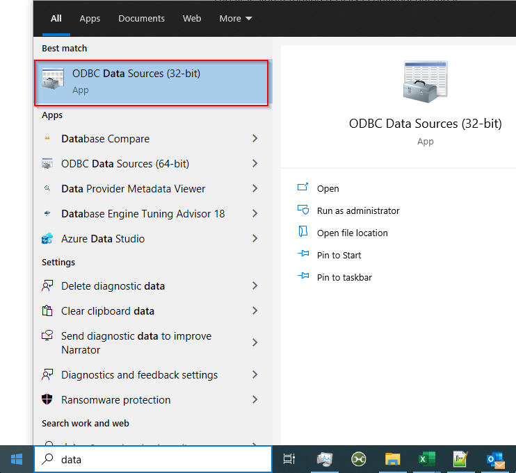

Let's create a New Data Source.

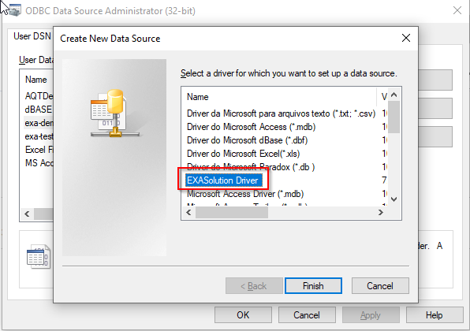

Let's pick 'EXASolution Driver'. This option is available after installing the Exasol ODBC driver.

Enter the connection string for the database, like so: (I'm using the exasol demo db for this tutorial)

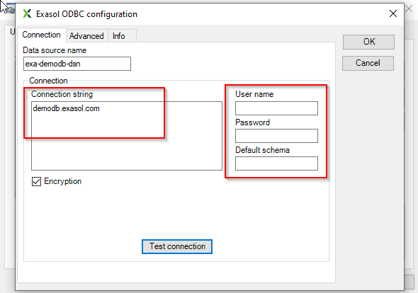

You can also test the connection here (with the username and password).

## Fetching data in Excel

Let's open excel.

Navigate to the data tab.

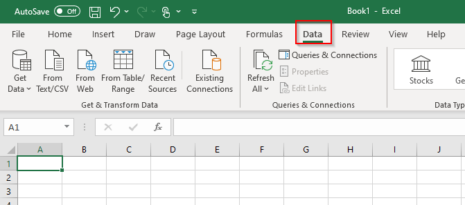

Pick 'Get data' , 'From other sources' and then 'From ODBC'.

A new wizard window will pop up.

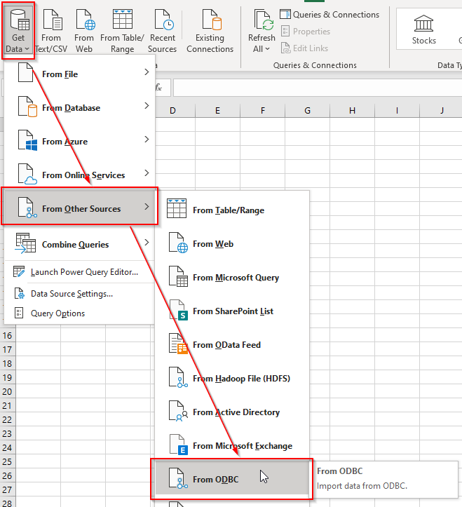

Select the DSN you just created.

(You could also use a connection string instead, available under 'Advanced Options.')

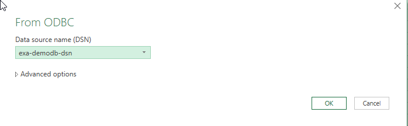

You'll be prompted to authenticate.

Provide the username and password from your database account (or pick 'Default or Custom' if you already did so in the DSN).

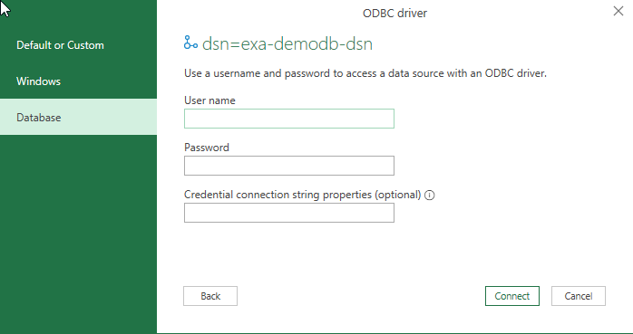

After clicking connect a navigator will pop up:

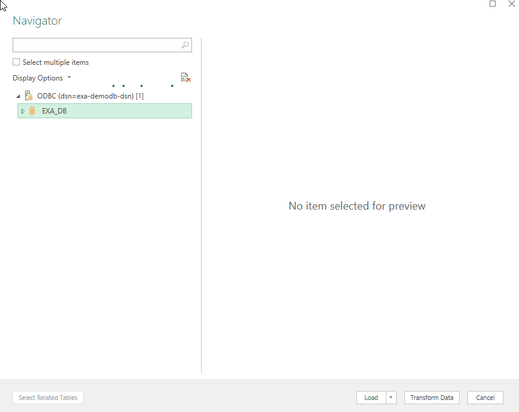

Here you can select the data you'd like to import.

As an example I will pick a table with NYC taxi companies:

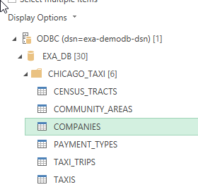

You'll get a new sheet added to your excel file that contains the data you selected.

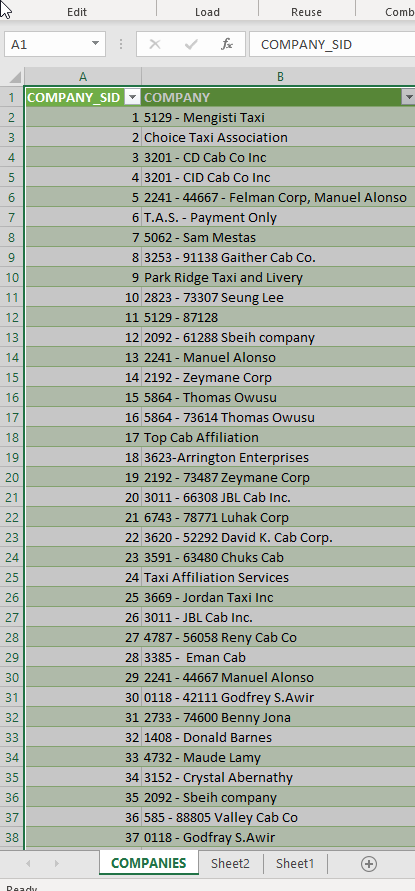

You can then further change this data in the excel sheet itself or in the Power Query Editor.

To access the Power Query Editor you need to select the Query tab and then press 'Edit',

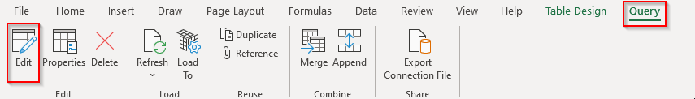

or double click on the 'Queries and Connections' panel on the right.

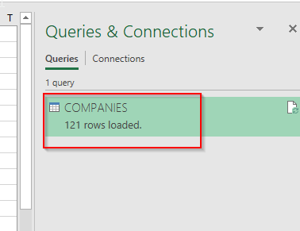

## Refreshing

 You can also easily refresh this data under the 'Queries & Connections' menu by right clicking and selecting 'Refresh'.
 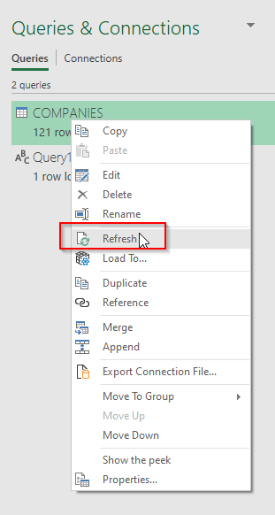
 
 ## Extracting data using a query

Using a custom SQL query is also possible, albeit a little more tricky.

In Excel, select the 'Data' tab, then 'Get Data' and 'Launch Power Query Editor'.

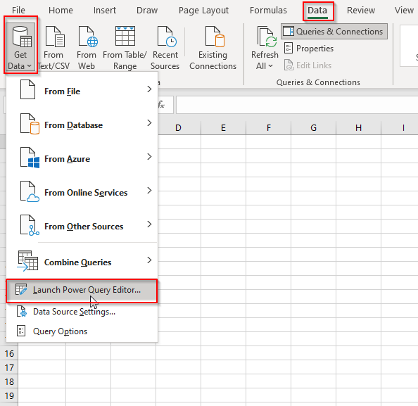 

Right mouse click, select "New Query," "Other Sources," and then "Blank Query" respectively.

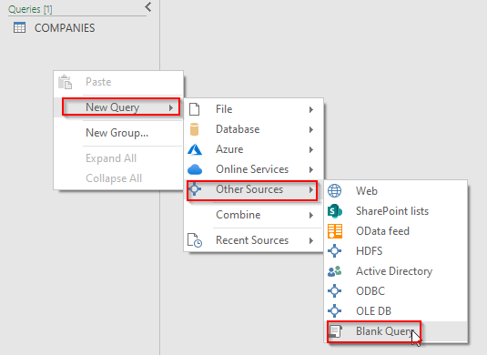 

Click 'Advanced Editor' on top:

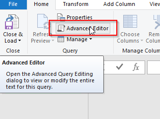

Here we have Power Query at our disposal: 

We'll use the PowerQuery `Odbc.Query` function (documented here: <https://docs.microsoft.com/en-us/powerquery-m/odbc-query>).

As an example I'll write an SQL statement where I request 20 taxi company names:

The first argument we pass in is the DSN name or connection string, the second the query.

`let`  
`SqlStatement = "SELECT COMPANY FROM CHICAGO_TAXI.COMPANIES LIMIT 20;",`  
`Source = Odbc.Query("dsn=exa-demodb-dsn", SqlStatement)`  
`in`  
`Source`

This is how it looks for us in the editor:

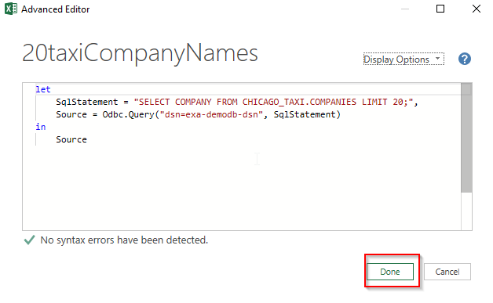

Press 'Done'.

Excel will ask you for permission to run the native database query. Click on 'Edit Permission'.

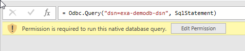

Select 'Run'.

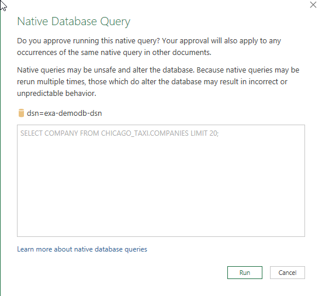

The results will pop up in the Power Query Editor.

 Press 'Close and Load.'  
 

The results should swiftly load in to your worksheet:

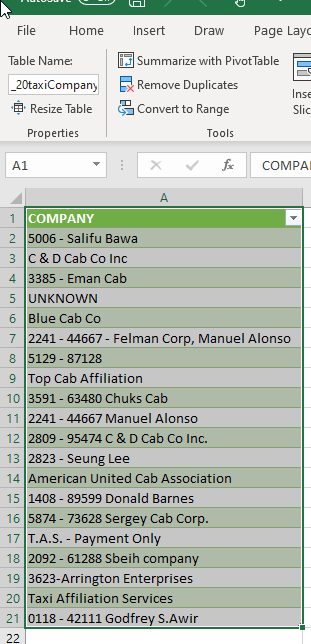

And you've successfully imported data using PowerQuery with an SQL query!

