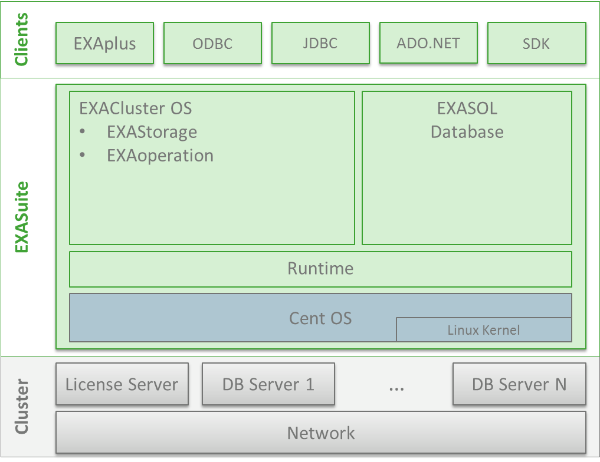

# Exasol Software Stack 
EXASuite is an integrated, self-contained software bundle provided by Exasol. This standalone distribution includes the Exasol database, EXAoperation web administration interface, EXACluster OS services, a runtime environment, and an underlying enterprise operating system (CentOS with Linux Kernel).

Exasol Clients and Drivers include the EXAplus database client and the drivers provided by Exasol (eg. ODBC, JDBC, ADO.NET). 

