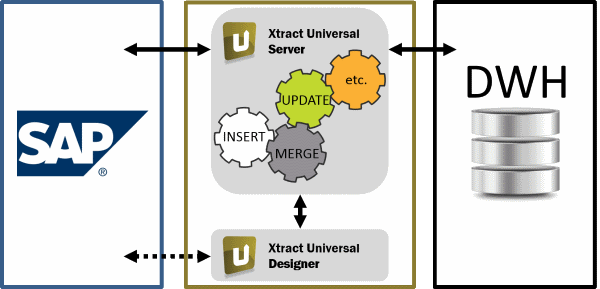

# Extracting data from SAP system (BW/ERP/R3) 
## Background

Although it is possible to directly access and copy the internal database table of an SAP system, this manual process is tedious and error-prone.  
Using a 3rd party product instead ensures data consistency, provides means for automation and saves development and maintenance efforts.

## How to extract data from SAP system (BW/ERP/R3) to Exasol.

We recommend using the 3rd party product Xtract Universal from Theobald Software:  
Link to product home page: <https://theobald-software.com/de/exasolution-destination.html> :

*Xtract Universal enables you to save data streams from SAP to any destination environment, and thereby significantly reduce development time, thanks to a high degree of automation.*

*The central server component constitutes the data hub between SAP and EXASolution applications. Extractions are created as well as accesses released and monitored for consumers via the Designer. Access is to one or more SAP ERP or SAP BW systems*

*Xtract Universal supports an **incremental delta load process**, that is, the limiting of the download to the data content that has been changed or added since the last download.* 

