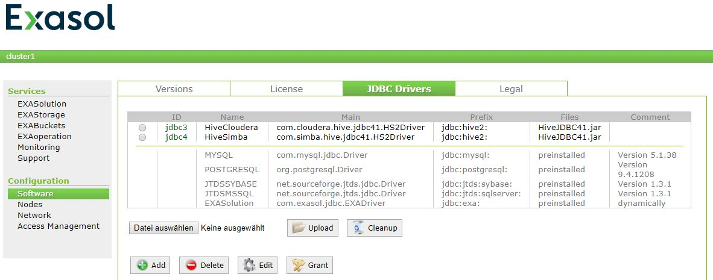

# How to create and work with a Hive JDBC connection? 
## Background

You have an Exasol database and want to connect it via JDBC to Hive for using EXAloader IMPORT/EXPORT statements.

## Prerequisites

Choose one of the following drivers:

* Cloudera Hive JDBC driver:  
[https://www.cloudera.com/downloads/connectors/hive/jdbc/2-6-5.html](https://www.cloudera.com/downloads/connectors/hive/jdbc/2-6-5.html "Follow")
* Simba Hive JDBC driver:  
[https://www.simba.com/product/apache-hive-driver-with-sql-connector/?attribute_pa_license-type=evaluation&attribute_pa_os=java&attribute_pa_client-server=server](https://www.simba.com/product/apache-hive-driver-with-sql-connector/?attribute_pa_license-type=evaluation&attribute_pa_os=java&attribute_pa_client-server=server "Follow")

## How to create and work with a Hive JDBC connection?

## Step 1: Configuring the JDBC driver in EXAoperation:



##  Step 2: Create or replace connection


```"code-sql"
-- Connecting EXAloader via Cloudera Hive driver and Simba Hive driver to Cloudera, MapR and Hortonworks Hadoop distributions  
-- cloudera-quickstart-vm-5.13.0-0-vmware 
create or replace connection hive_conn to 
 'jdbc:hive2://192.168.42.133:10000' user 'cloudera' identified by 'cloudera';  
-- MapR-Sandbox-For-Hadoop-6.1.0-vmware 
create or replace connection hive_conn to 
 'jdbc:hive2://192.168.42.134:10000' user 'mapr' identified by 'mapr';  
-- Azure Hortonworks Sandbox with HDP 2.6.4 
create or replace connection hive_conn to 
 'jdbc:hive2://192.168.42.1:10000' user 'raj_ops' identified by 'raj_ops'; 
```
## Step 3: EXPORT/IMPORT

### EXPORT test for Cloudera and Simba driver


```"code-sql"
export exa_syscat into jdbc driver = 'HiveCloudera' at hive_conn table exa_syscat 
 created by 
 'create table exa_syscat (schema_name varchar(128), object_name varchar(128), 
 object_type varchar(15), object_comment varchar(2000))' replace;  
 
export exa_syscat into jdbc driver = 'HiveSimba' at hive_conn table exa_syscat 
 created by     
  'create table exa_syscat (schema_name varchar(128), object_name varchar(128), 
  object_type varchar(15), object_comment varchar(2000))' replace; 
```
### IMPORT test for Cloudera and Simba driver


```"code-sql"
import into(schema_name varchar(128), object_name varchar(128), object_type varchar(15), object_comment varchar(2000))     
 from jdbc driver = 'HiveCloudera' at hive_conn table exa_syscat;  

import into(schema_name varchar(128), object_name varchar(128), object_type varchar(15), object_comment varchar(2000))     
 from jdbc driver = 'HiveSimba' at hive_conn table exa_syscat;  
```
