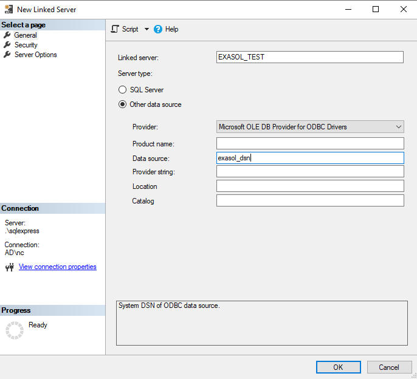

# How to use Exasol as a Linked Server in SQL Server 
## Background

"Linked Servers" in Microsoft SQL Server are what other database systems call "Database Links", "Database Gateway", "External Tables" or similar: It is a way to access contents from other systems to use in local processing. While other systems typically use ODBC or JDBC connectivity for this, Microsoft mainly supports its own OLEdb connectivity. Luckily, Microsoft also provides an "OLEdb to ODBC bridge".

Using this, MS SQL Server can be configured to access data in Exasol, both for reading and for writing.

## Prerequisites

* The Exasol ODBC driver for windows, in the architecture (x86 / amd64) fitting the SQL Server installation. We recommend installing the latest available Exasol ODBC driver, even if it is a newer version than your Exasol database. All drivers are backward compatible. You can get them here: [Downloads](https://downloads.exasol.com/clients-and-drivers/odbc)
* A properly configured ODBC data source (DSN), again with the correct architecture (x86 or 64).
	+ Provide a default schema if schema name and user name are not equal. The following setup will be limited to accessing tables in that schema
	+ on the advanced tab, check the "Show only current schema" option. This will limit all catalog queries to one schema, eliminating "more than one table" errors later.
* As with many other systems, Exasol's database/catalog/schema concept is not 100% compatible with SQL Server, which is why we have to 'tune down' the data provider to lower its expectations:
	+ In the SQL Server Management Console, open the tree view to access "Linked Servers -&gt; Data Providers -&gt; MSDASQL". Use the context menu to open its properties
	+ Check the '**use level 0 only**' option. This will reduce cross-checks on table metadata, especially catalog/schema names.

## How to Create a Linked Server

## Step 1

In the tree view, right-click on "Linked Servers" to add a new server.



## Step 2

From the drop-down list, select "Microsoft OLE DB Provider for ODBC Drivers".

## Step 3

Enter a Linked Server name on top and the preconfigured ODBC DSN name below. Other fields are not required.

## Step 4

Click OK to create your linked server.

## Using the Linked Server

In the tree view, you can now 'drill down' to table and view level on the remote database. This is all you will get in this view, due to the limitations of the MSDASQL provider.

In queries/views you will be able to access the Exasol database objects using two different methods:

* Three-dots-notation &lt;link-name&gt;...&lt;object_name&gt; will allow you to use objects in native SQL, SQL Server will exchange data with Exasol as necessary (see Limitations below).
```markup
SELECT * FROM EXASOL_TEST...SUPPLIER;
```
* OPENQUERY (see <http://msdn.microsoft.com/en-us/library/ms188427.aspx>).

To execute LUA scripts stored in Exasol from SQL Server do the following steps:

* Edit the properties of the linked server. Set the parameter "RPC out" to True in the section "Server Options". This enables the execution of remote procedure calls.
* Use the following command to trigger the execution of LUA Scripts
```markup
 EXEC('EXECUTE SCRIPT my_schema.my_lua_script') AT <link-name>;
```

## Additional Notes

### Limitations:

* When using three-dots-notation, SQL Server will always perform a full table select without any column selection or filters. Obviously, this is a performance killer for larger tables. When using views to transparently embed Exasol into an SQL Server environment, you might want to use OPENQUERY or Views on Exasol's side instead.
* The MSDASQL provider is limited in terms of VARCHAR size. If any column definition in Exasol exceeds VARCHAR(8191), this will result in an "unexpected catastrophic failure" on the SQL Server side. The contents of the column are not even considered.
* When sending data towards Exasol (for UPDATE, INSERT or DELETE), SQL Server will send VARCHAR data for all parameters. For that reason, be very careful about your combination of language settings for numeric values. After all, in most cases, there is some difference between '50.001' and '50,001'
* SQL Server sets a QUERY TIMEOUT of 30 seconds on INSERT statements. This breaks larger transfers to Exasol, as our query timeout affects the whole prepared statement, not single execs as expected.

### Performance:

The following measurements are done on a single machine, using SQL Server 2017 Express and a local VM running a single-node Exasol 6.2.4. The benchmark consists of transferring the 1 million row SUPPLIER table of the TPC-H scenario between both systems, the target table always truncated before the run.


|  |  |
| --- | --- |
|  **SQL Server** | **Exasol** |
| SQL Server -&gt; Exasol | 
```markup
insert into EXASOL_TEST...SUPPLIER select * from Test.dbo.SUPPLIER
```
 Duration: 600 seconds (estimated) | 
```markup
IMPORT INTO TEST.SUPPLIER FROM JDBC AT  
 'jdbc:jtds:sqlserver://<ip address>;databaseName=Test'  
 user 'sa' identified by *** TABLE SUPPLIER;
```
 Duration: 52 seconds |
| Exasol -&gt; SQL Server | 
```markup
insert into Test.dbo.SUPPLIER select * from EXASOL_TEST...SUPPLIER;
```
 Duration: 108 seconds | 
```markup
export tpc.supplier into JDBC at CONN_SQLEXPRESS -- same as above, but in a connection object table SUPPLIER;
```
 Duration: 68 seconds |

The SQL Server -&gt; EXA export using a Linked Server could only be estimated because of the 30-second timeout.

### Stored Procedures (aka. EXECUTE SCRIPT)

The above methods all rely on prepared statements, which is not compatible with Exasol's Lua scripting. If you need to trigger script execution remotely from the SQL Server, you need to use the RPC functionality:

1. In the properties of your linked server (your Exasol), go to the page 'Server Options' and enable the 'RPC Out' feature
2. You can now use [SQL Server's EXECUTE](https://technet.microsoft.com/en-us/library/ms188332(v=SQL.110).aspx) command to run arbitrary statements on the linked server **and** receive the results for further local processing:


```"code-java"
EXECUTE ('execute script sr_test.LuaTest(1,2,3)') AT LOCALVM
```
## Additional References

* [IMPORT](https://docs.exasol.com/sql/import.htm)
* [EXPORT](https://docs.exasol.com/sql/export.htm)
* [SQL Server Documentation](https://docs.microsoft.com/en-us/sql/sql-server/?view=sql-server-ver15)

*We appreciate your input! Share your knowledge by contributing to the Knowledge Base directly in [GitHub](https://github.com/exasol/public-knowledgebase).* 