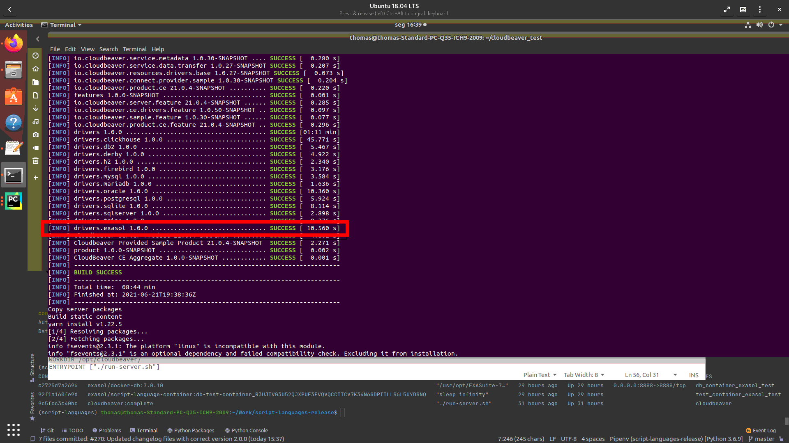
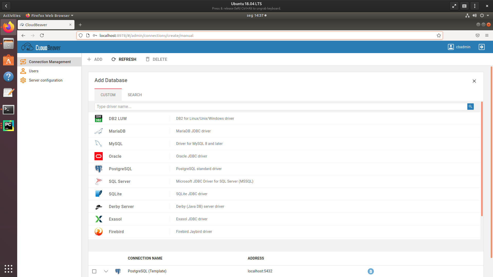
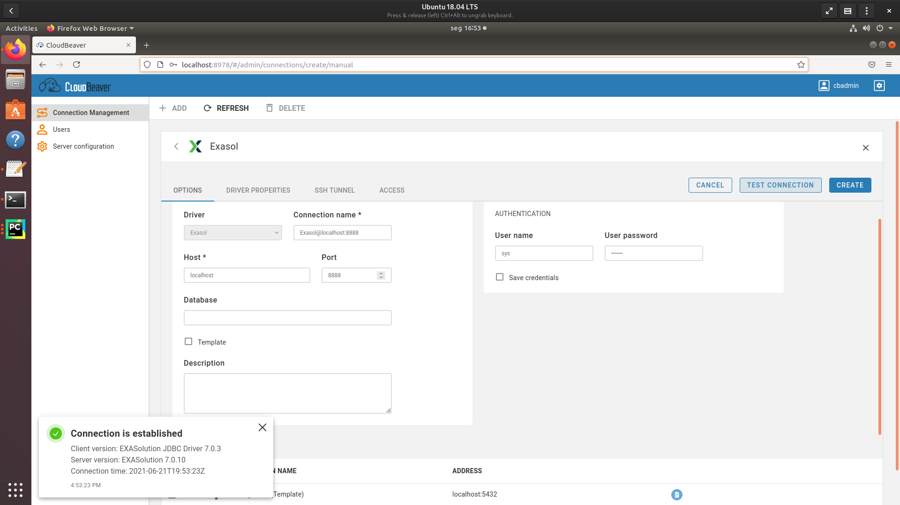
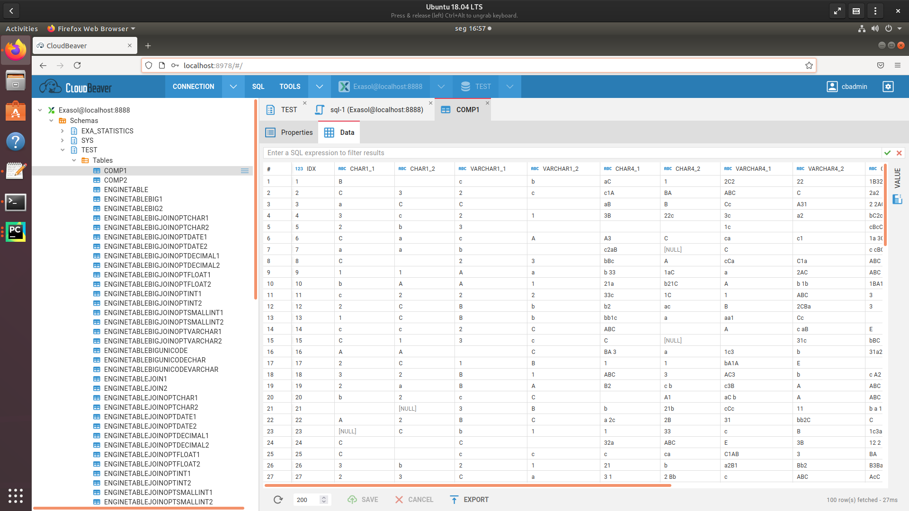

# Integrate Exasol into CloudBeaver 
## Background

[CloudBeaver](https://cloudbeaver.io/) is a SQL client, running as web app, and based on [DBeaver](https://dbeaver.io/). By default it supports several databases, but not yet Exasol. In order to integrate the Exasol JDBC driver, we will need to build CloudBeaver from scratch, including the drivers.

## Blog Snapshot

This blog will show you how to: 

* Integrate Exasol JDBC driver into CloudBeaver build environment
* Use Docker to build CloudBeaver + Exasol


	+ Build CloudBeaver and install it onto a runtime Docker image, using multistage Dockerfile
	+ Test the final run-time image with the Exasol integration-test-docker-environment

## Prerequisites

The first part of this article should be applicable to Windows/Linux (and probably MacOS); the prerequisites can be found in the [CloudBeaver wiki](https://github.com/dbeaver/cloudbeaver/wiki/Build-and-deploy#prerequisites).

However, for the second part we use Docker, which comes with more restrictions:

Host OS:

We will use Linux with Docker to build CloudBeaver. Also, for testing the connection we'll use an Exasol sample database from a Docker image. The requirement for Linux OS is O_DIRECT access.

Docker installed Linux machine:

In this article, I’m going to use a Ubuntu 18.04 virtual machine with the latest version of docker (currently Version 20.10.7).

Privileged mode:

Docker privileged mode is required for permissions management, UDF support, and environment configuration and validation (sysctl, hugepages, block-devices, etc.).

Memory requirements for the host environment:

The database instance needs at least 2 GiB RAM. Because I’m going to deploy a single node container, I will use 4GiB RAM for VM.

## How to integrate Exasol connection into CloudBeaver

To integrate the connection to Exasol, we will build CloudBeaver from scratch.

We'll follow the [CloudBeaver wiki page](https://github.com/dbeaver/cloudbeaver/wiki/Build-and-deploy) step-by-step until section “Build and deploy”.

Here we need to clone the CloudBeaver repository, using git clone:


```"western"
git clone https://github.com/dbeaver/cloudbeaver.git
```
  
Now we want to integrate the Exasol connection before starting the build.

Again, the [documentation](https://github.com/dbeaver/cloudbeaver/wiki/Driver-managements) gives us a hint. Basically we have to change 3 things:

* Add the new Exasol driver
* Add the new dependency in the CloudBeaver driver module
* Add the new driver to the server

## Add the new Exasol driver

We create a new directory under server/drivers:


```
cd cloudbeaver/server/drivers  
mkdir exasol
```
And add the new project file (pom.xml) there.


```
<?xml version="1.0" encoding="UTF-8"?>  
<project xsi:schemaLocation="http://maven.apache.org/POM/4.0.0 http://maven.apache.org/xsd/maven-4.0.0.xsd"  
xmlns="http://maven.apache.org/POM/4.0.0" xmlns:xsi="http://www.w3.org/2001/XMLSchema-instance">  
  
<repositories>  
 <repository>  
  <id>exasol-maven-repo</id>  
  <name>Exasol Repository</name>  
  <url>https://maven.exasol.com/artifactory/exasol-releases</url>  
 </repository>  
</repositories>  
  
<modelVersion>4.0.0</modelVersion>  
  
<groupId>com.exasol</groupId>  
<artifactId>drivers.exasol</artifactId>  
<version>1.0.0</version>  
  
<parent>  
 <groupId>io.cloudbeaver</groupId>  
 <artifactId>drivers</artifactId>  
 <version>1.0.0</version>  
 <relativePath>../</relativePath>  
</parent>  
  
<properties>  
 <deps.output.dir>exasol</deps.output.dir>  
</properties>  
  
<organization>  
 <name>EXASOL AG</name>  
 <url>http://www.exasol.com/</url>  
</organization>  
  
<dependencies>  
 <dependency>  
  <groupId>com.exasol</groupId>  
  <artifactId>exasol-jdbc</artifactId>  
  <version>7.0.7</version>  
 </dependency>  
</dependencies>  
</project>
```
This project file is just an empty container, and its only purpose is to create the dependency to the Exasol JDBC driver.

The header of this file is common to all driver project files. However, as the Exasol JDBC driver is not stored on the Maven standard repository, we need to add the Exasol Maven repository. Otherwise the build will not be able to locate the JDBC driver package during the build.


```
<repositories>  
 <repository>  
  <id>exasol-maven-repo</id>  
  <name>Exasol Repository</name>  
  <url>https://maven.exasol.com/artifactory/exasol-releases</url>  
 </repository>  
</repositories>
```
Then we declare the ArtifactId, which will be used later in the Bundles list of the server configuration.


```
...  
  
<artifactId>drivers.exasol</artifactId>  
  
…
```
Ultimately we add the dependency to the Exasol JDBC driver:


```
<dependencies>  
 <dependency>  
  <groupId>com.exasol</groupId>  
  <artifactId>exasol-jdbc</artifactId>  
  <version>7.0.7</version>  
 </dependency>  
</dependencies>
```
With that, we should have the following file structure:


```
pwd  
~/cloudbeaver/server/drivers  
tree  
.  
├── clickhouse  
│   ├── pom.xml  
├── db2  
│   ├── pom.xml  
├── derby  
│   ├── pom.xml  
├── exasol  
│   ├── pom.xml  
├── h2  
│   ├── pom.xml  
├── pom.xml  
├── postgresql  
│   ├── pom.xml  
…
```
## Add the new dependency in the CloudBeaver driver module

Next, we need to create the dependency to the new driver, in the drivers project file (~/cloudbeaver/server/drivers/pom.xml):


```
<project xmlns="http://maven.apache.org/POM/4.0.0" xmlns:xsi="http://www.w3.org/2001/XMLSchema-instance"  
xsi:schemaLocation="http://maven.apache.org/POM/4.0.0 http://maven.apache.org/xsd/maven-4.0.0.xsd">  
  
<modelVersion>4.0.0</modelVersion>  
<groupId>io.cloudbeaver</groupId>  
<artifactId>drivers</artifactId>  
<version>1.0.0</version>  
<packaging>pom</packaging>  
  
<properties>  
<deps.output.dir>output</deps.output.dir>  
</properties>  
  
<modules>  
 <module>clickhouse</module>  
 <module>db2</module>  
 <module>derby</module>  
 <module>h2</module>  
 <module>jaybird</module>  
 <module>mysql</module>  
 <module>mariadb</module>  
 <module>oracle</module>  
 <module>postgresql</module>  
 <module>sqlite</module>  
 <module>sqlserver</module>  
 <module>trino</module>  
 <module>exasol</module>  
</modules>  
...
```
And finally, we add the new driver to the server, by adding the reference to the plugins.xml, under

~/cloudbeaver/server/bundles/io.cloudbeaver.resources.drivers.base/plugin.xml


```
<?xml version="1.0" encoding="UTF-8"?>  
  
<plugin>  
<!-- Resource mappings -->  
 <extension point="org.jkiss.dbeaver.resources">  
 <resource name="drivers/db2"/>  
 <resource name="drivers/mysql/mysql8"/>  
 <resource name="drivers/mariadb"/>  
 <resource name="drivers/oracle"/>  
 <resource name="drivers/postgresql"/>  
 <resource name="drivers/clickhouse"/>  
 <resource name="drivers/derby"/>  
 <resource name="drivers/jaybird"/>  
 <resource name="drivers/h2"/>  
 <resource name="drivers/sqlite/xerial"/>  
 <resource name="drivers/mssql/new"/>  
 <resource name="drivers/trino"/>  
 **<resource name="drivers/exasol"/>**  
</extension>  
  
<!-- Bundles -->  
<extension point="org.jkiss.dbeaver.product.bundles">  
 <bundle id="drivers.db2" label="DB2 drivers"/>  
 <bundle id="drivers.mysql" label="MySQL drivers"/>  
 <bundle id="drivers.mariadb" label="MariaDB drivers"/>  
 <bundle id="drivers.oracle" label="Oracle drivers"/>  
 <bundle id="drivers.postgresql" label="PostgreSQL drivers"/>  
 <bundle id="drivers.clickhouse" label="Clickhouse drivers"/>  
 <bundle id="drivers.derby" label="Derby drivers"/>  
 <bundle id="drivers.firebird" label="Firebird drivers"/>  
 <bundle id="drivers.h2" label="H2 drivers"/>  
 <bundle id="drivers.sqlite.xerial" label="SQLite drivers"/>  
 <bundle id="drivers.mssql.new" label="SQL Server drivers"/>  
 <bundle id="drivers.trino" label="Trino drivers"/>  
 <bundle id="drivers.exasol" label="Exasol drivers"/>  
</extension>  
  
<!-- Enabled drivers -->  
<extension point="io.cloudbeaver.driver">  
 <driver id="db2:db2"/>  
 <driver id="mysql:mysql8"/>  
 <driver id="mysql:mariaDB"/>  
 <driver id="oracle:oracle_thin"/>  
 <driver id="postgresql:postgres-jdbc"/>  
 <driver id="jaybird:jaybird"/>  
 <driver id="generic:yandex_clickhouse"/>  
 <driver id="generic:derby_server"/>  
 <driver id="generic:h2_embedded"/>  
 <driver id="generic:sqlite_jdbc"/>  
 <driver id="sqlserver:microsoft"/>  
 <driver id="generic:trino_jdbc"/>  
 <driver id="exasol:exasol"/>  
</extension>  
</plugin>
```
## Build CloudBeaver and test

Now we can continue to follow the CloudBeaver build instructions,


```
cd ~/cloudbeaver/deploy  
./build.sh
```
If everything went well, we should see the new driver during the build:



Final artifacts can be found in deploy/cloudbeaver.

Now, we can test if the new driver works:


```
cd cloudbeaver  
./run-server.sh
```
 When connecting to CloudBeaver, we should be able to see our new Exasol driver in the connection list:



## Use Docker to automatize Exasol integration

In the first part we saw how to manually adjust the CloudBeaver build environment to add the Exasol JDBC driver. Now we want to automatize this process, so it's easy to create a new version of CloudBeaver app with the Exasol connection whenever a new release of CloudBeaver is being published on GitHub.

## Build CloudBeaver with Docker

As already mentioned, this requires a Linux OS available. The installation steps for Docker can be found [here](https://docs.docker.com/engine/install/ubuntu/). For convenience, we add the [current user to the Docker group](https://docs.docker.com/engine/install/linux-postinstall/#manage-docker-as-a-non-root-user).

Now we create the Dockerfile, and use an Ubuntu image as base:


```
FROM ubuntu:18.04
```
  
First, we update the package manager, and then install curl and gnupg2 (both required for the next step). As we can see in the [CloudBeaver wiki](https://github.com/dbeaver/cloudbeaver/wiki/Build-and-deploy#install-prerequisites-on-ubuntu), we have to install yarn via curl.


```
RUN curl -sL https://dl.yarnpkg.com/debian/pubkey.gpg | apt-key add -  
RUN echo "deb https://dl.yarnpkg.com/debian/ stable main" | tee /etc/apt/sources.list.d/yarn.list  
RUN curl -sL https://deb.nodesource.com/setup_12.x | bash -
```
  
Next we can install all packages via *apt*, similar to the CloudBeaver documentation. Additionally, we install git (which we need to clone the CloudBeaver repository) and xmlstarlet (the reason comes later).


```
RUN apt-get -y update && \  
      apt-get -y install \  
      openjdk-11-jdk \  
      maven \  
      yarn \  
      nodejs \  
      git \  
      xmlstarlet
```
The next step is again similar to the CloudBeaver documentation: We install lerna via npm:


```
RUN npm install -g lerna
```
Now we have all packages installed and can clone the CloudBeaver repository from Github:


```
RUN git clone <https://github.com/dbeaver/cloudbeaver.git>
```
  
After that, we have to do the manual modifications, described in the first part of the article, via some command line tricks.

Basically, we have to add one new XML file (Exasol Driver Project file) and modify two existing XML files. Adding the new XML file is easy. We assume that we have the pom.xml in the same directory as the Dockerfile.


```
RUN mkdir ./cloudbeaver/server/drivers/exasol  
COPY ./pom.xml ./cloudbeaver/server/drivers/exasol/
```
  
For the modifications of the two other files we use [XMLStarlet](http://xmlstar.sourceforge.net/), which supports the Xpath language for operations on XML files.

This command adds the dependency to the new EXASOL driver in the driver project files:


```
RUN xmlstarlet ed -N my=http://maven.apache.org/POM/4.0.0 -s "/my:project/my:modules" -t elem -n module -v "exasol" ./cloudbeaver/server/drivers/pom.xml > /tmp/pom.xml  
RUN mv /tmp/pom.xml ./cloudbeaver/server/drivers/pom.xml
```
Please observe that XMLStarlet requires us to set the namespace correctly on the elements.

And this command updates the server configuration:


```
RUN xmlstarlet ed \  
   -s "/plugin/extension[@point='org.jkiss.dbeaver.resources']" -t elem -n resource -v "" \  
   -i "/plugin/extension[@point='org.jkiss.dbeaver.resources']/resource[not(@*)]" -t attr -n name -v drivers/exasol \  
   -s "/plugin/extension[@point='org.jkiss.dbeaver.product.bundles']" -t elem -n bundle -v "" \  
   -i "/plugin/extension[@point='org.jkiss.dbeaver.product.bundles']/bundle[not(@*)]" -t attr -n id -v drivers.exasol \  
   -i "/plugin/extension[@point='org.jkiss.dbeaver.product.bundles']/bundle[@id='drivers.exasol']" -t attr -n label -v "Exasol drivers" \  
   -s "/plugin/extension[@point='io.cloudbeaver.driver']" -t elem -n driver -v "" \  
   -i "/plugin/extension[@point='io.cloudbeaver.driver']/driver[not(@*)]" -t attr -n id -v exasol:exasol \  
   ./cloudbeaver/server/bundles/io.cloudbeaver.resources.drivers.base/plugin.xml \  
   > /tmp/plugin.xml  
  
RUN mv /tmp/plugin.xml ./cloudbeaver/server/bundles/io.cloudbeaver.resources.drivers.base/
```
  
As XMLStarlet does not allow creation of new elements with attributes — we have to create an empty element and then add the respective attributes to any element without attributes (*not(@*)*).

Finally we build CloudBeaver:


```
RUN cd cloudbeaver/deploy; bash ./build.sh
```
  
Now we can build our Docker image, on the command line:


```
docker build -t cloudbeaver:with_exasol .
```

```
  
After finishing, we will find the image with:  
  
docker images:  
  
REPOSITORY       TAG     IMAGE ID     CREATED       SIZE  
cloudbeaver with_exasol b24c1c55067a 51 minutes ago 2.64GB  
...
```
Now we can copy the resulting CloudBeaver runtime files from the image with:


```"western"
`id=$(docker create cloudbeaver:with_exasol)`   
`docker cp $id:/``cloudbeaver/deploy/cloudbeaver` `- >` `~/cloudbeaver.``tar`  `docker rm -v $id`
```
 Nice — we've prepared the build environment, pulled the repository, added the Exasol driver, and built CloudBeaver all in one step.

## Multistage Dockerfile for build and runtime

Now that we have a Dockerfile that builds CloudBeaver, we also want to create a Docker image for the runtime. We could use the same docker image from the last chapter, but this includes all the build dependencies and would increase the image size significantly. The solution is called Docker Multistage files. We can declare two different images within one Dockerfile, and define dependencies between them.

The first part of the Docker image is similar to the one in the previous chapter, we just give the step a name:


```
FROM ubuntu:18.04 AS cloudbeaver_build  
...
```
And then we add the new multistage step:


```
...  
RUN cd cloudbeaver/deploy; bash ./build.sh  
  
  
FROM adoptopenjdk/openjdk11:jdk-11.0.10_9-ubuntu-slim  
COPY --from=cloudbeaver_build cloudbeaver/deploy/cloudbeaver /opt/cloudbeaver  
EXPOSE 8978  
WORKDIR /opt/cloudbeaver/  
ENTRYPOINT ["./run-server.sh"]
```
Please note that the second part is almost identical to CloudBeaver’s own [Dockerfile](https://github.com/dbeaver/cloudbeaver/blob/devel/deploy/docker/Dockerfile). We only change the source of the runtime files.


```
COPY --from=cloudbeaver_build cloudbeaver/deploy/cloudbeaver /opt/cloudbeaver
```
  
Now, we run the docker build again:


```
docker build -t cloudbeaver:runtime_with_exasol .
```
When finished we can use the same command as in the [CloudBeaver documentation](https://github.com/dbeaver/cloudbeaver/wiki/Run-Docker-Container#running) to start the app:


```
docker run --name cloudbeaver --rm -ti -p 8080:8978 -v /var/cloudbeaver/workspace:/opt/cloudbeaver/workspace cloudbeaver:runtime_with_exasol
```
## Test the final run-time image

Finally I want to show how I tested the app with Exasol’s integration-test-docker-environment.

The latter is used to run integration tests on the script-language containers, but is very handy for testing a sample Exasol database, because it spawns a database and pumps in data with just one command.

First clone the repository:


```
<https://github.com/exasol/integration-test-docker-environment.git>
```
and then spawn the test database at port 8888 with:


```
./start-test-env spawn-test-environment --environment-name exasol_test --database-port-forward 8888
```
  
Now we can start CloudBeaver and connect to the test database, with username “sys” and password “exasol” at port 8888.



Once the connection is created we can access our test data:



## Additional References

Other relevant sites/information:

* [CloudBeaver official site](https://cloudbeaver.io/)
* [CloudBeaver Github site](https://github.com/dbeaver/cloudbeaver)
* [Docker](https://www.docker.com/)

## Downloads
[CloudBeaverWithExasolDocker.zip](https://github.com/exasol/Public-Knowledgebase/files/9936349/CloudBeaverWithExasolDocker.zip)


