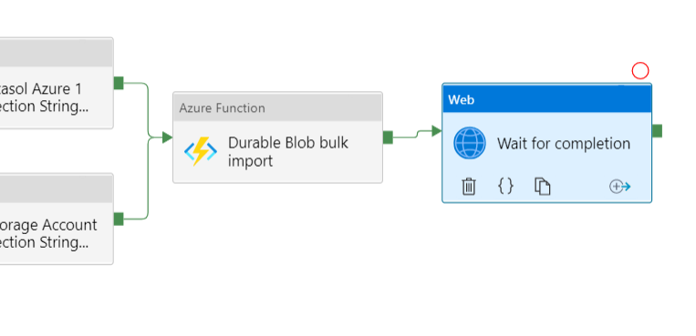

# Introducing Azure Data Factory Functions For Exasol. 

## Background

In this article we're introducing Azure Data Factory Functions For Exasol.

## Explanation

Azure Data Factory Functions For Exasol was created to assist in complex Azure Data Factory ETL flows to Exasol.

Currently we're offering a blob storage CSV bulk import function and a query function for use in your ETL pipelines.

The functions are Azure Functions and are thus easily hosted on the Azure platform and integrate well within Azure Data Factory.

We're planning on expanding this offering based on demand.

Customers are also free to modify and expand the existing functions or create new functions based on the existing ones themselves.

The project can be found on GitHub here: 

<https://github.com/exasol/azure-data-factory-functions>

And a user guide is available here:

<https://github.com/exasol/azure-data-factory-functions/blob/main/doc/user_guide.md>

We hope you get great use out of this product.

