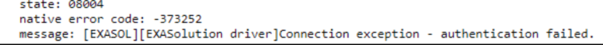

# LDAP Authentication Failed for Distinguished Names containing Spaces 
## Scope

Sometimes a user may encounter 'Authentication Failed' error when trying to login to Exasol using LDAP authentication.

## Diagnosis

An Authentication Failed error may look like one of the following screenshots:

  


## Explanation

In general, the authentication error means that the user name or password is not correct.

But in case when you authenticate a user with LDAP and if the user’s distinguished name contains spaces, then you might also get the ‘Authentication Failure’ error because the distinguished name is not set up correctly and it cannot handle the spaces.

You can check in the exa_dba_audit_sessions table that the session_id is null and the error_code , error_text column would be 08004 , ‘Connection exception – authentication failed’ respectively. 


```sql
select session_id, user_name, error_code, error_text from exa_dba_audit_sessions where  success is false order by login_time desc;
```


|  |  |  |  |
| --- | --- | --- | --- |
| SESSION_ID | USER_NAME | ERROR_CODE | ERROR_TEXT |
| (null) | user1 | 08004 | Connection exception - authentication failed. |

## Recommendation

Please recreate the LDAP user with double quotes ( “ “ ) to handle the spaces. For example :


```markup
CREATE USER firstname_lastname IDENTIFIED AT LDAP AS 'cn="firstname lastname”,dc=authorization,dc=exasol,dc=com'; 
```
You can check this in the DISTINGUISHED_NAME of the EXA_DBA_USERS table.

## Additional References

<https://docs.exasol.com/sql/create_user.htm#Authenti3>

<https://exasol.my.site.com/s/article/Manual-LDAP-Connection-Test>

