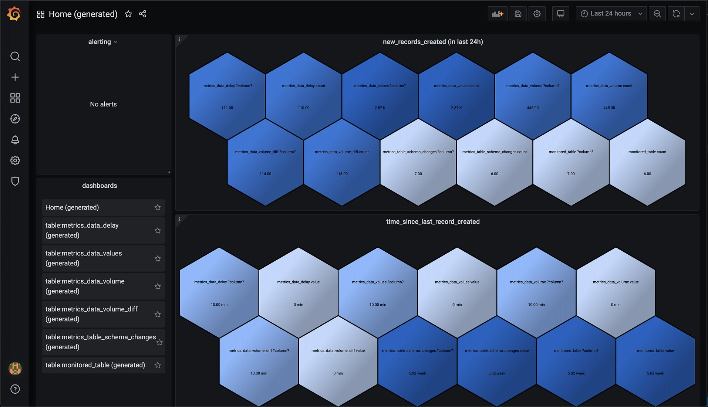

# Monitor your data in Exasol with Redata 
As described in the [README](https://github.com/redata-team/redata/blob/master/README.md) of the project, [Redata](https://github.com/redata-team/redata) is aimed at monitoring the data *in* your database, rather than the database itself:

*"Monitoring system for data teams. Computing health checks on data (via Airflow jobs), visualizing them over time, and alerting on them in Grafana."*

**Overview**

Redata runs scheduled checks that compute health metrics for your data, containing information like: 

* time since last record was added
* number of records added in last (hour/day/week/month)
* schema changes that recently happened
* number of nulls in columns over time
* other checks specific to columns in data and their types

As a result, you get automatically generated dashboards in Grafana.

For example, an overview of all tables with some brief ingestion and freshness statistics:

Additionally, a detailed dashboard for each table, similar to this: 

**Project Status**

Redata is still in a very early pre-release stage, yet already usable thanks to relying on well-known tools like Airflow for scheduling checks, and Grafana for presenting dashboards.

There are of course limitations; each data source can only monitor one schema, for example (though you could set up different schemas as different data sources that each indicate a different default schema). It's also likely that change will come frequently in the beginning. To us, the usefulness makes it well worth taking on some risk of having to manage these types of changes.

**Exasol Support**

Basic Exasol support is in place, using [PyEXASOL](https://github.com/badoo/pyexasol) to avoid dependencies on ODBC drivers and configuration.

On my part, I'll be working on continuously to improve this integration when it comes to performance etc, as we deploy Redata at work to get better awareness of the quality of our data, problems with missing or delayed data from source systems, and assumptions that may no longer hold true. Our experience is that most of the issues we've had with our data flows would be detectable with a tool like this, and some simple alerting on when statistics start to fall outside their regular weekly rhythm.

The difference to our regular data quality monitoring is, that this type of approach is scalable. It can check every table, all of the time. It doesn't always replace other types of checks, that are perhaps customized to work with very specific business knowledge about the data, but it can take care of the 80% you probably wouldn't reach otherwise.

*Finally, if you're curious about Redata, do try it out -- and definitely feel free to suggest (or contribute) changes to improve the Exasol integration, or the Redata functionality in general!  
You can find me on the Redata Slack (see [invite link in README](https://github.com/redata-team/redata#community) ), or here of course.*

