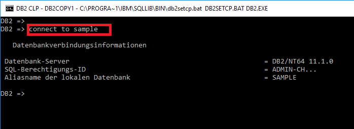
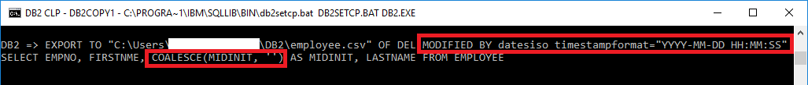
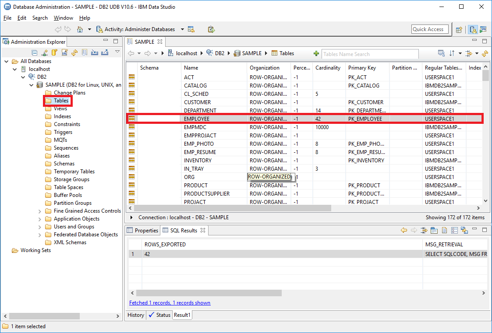
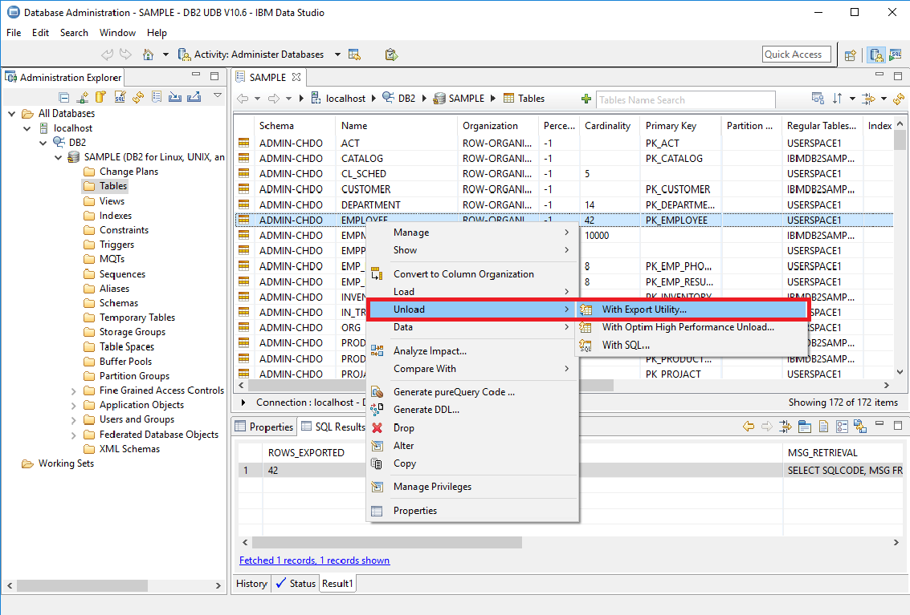
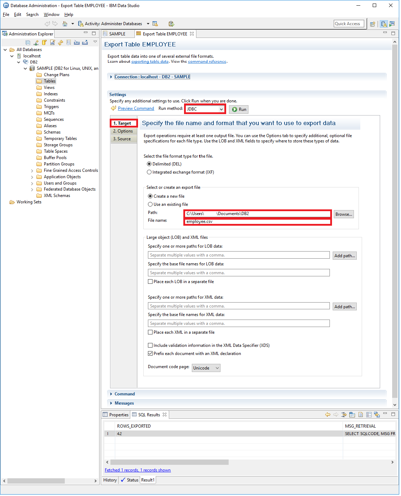
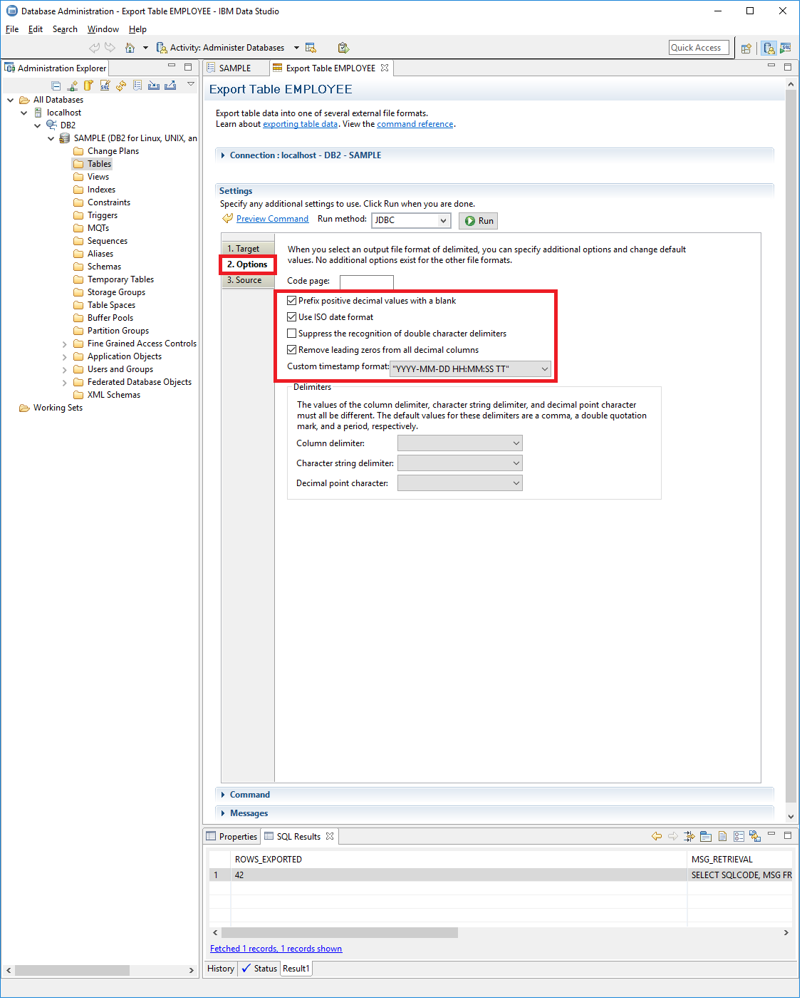
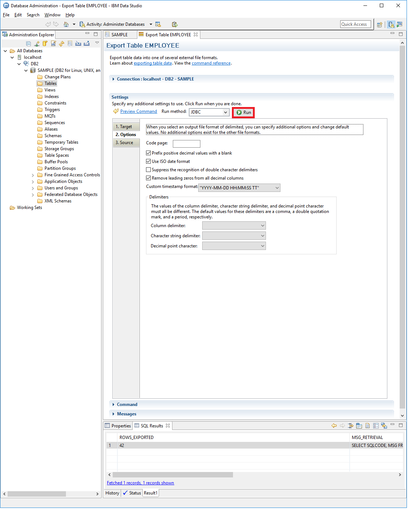

# Proper csv export from IBM DB2

We want to show you how to export CSV files from IBM DB2. Use one of the following options.

## Option 1: Using the IBM command line processor

* Connect to the database you want to export.

* Use the ***EXPORT TO***-command combined with a ***SELECT*** query to export a table  
(Documentation: [EXPORT command](https://www.ibm.com/docs/en/db2/12.1.x?topic=commands-export))
* We recommend applying the following parameters to ensure compatible formatting for your exported csv file:  
o ***MODIFIED BY dates***  
-> exports dates in ISO format (YYYY-MM-DD)  
o ***MODIFIED BY timestampformat=”YYYY-MM-DD HH:MM:SS”***  
-> exports timestamps in the selected format  
o ***COALESCE(column,’’)***  
-> checks if the content of the data field equals ***NULL*** and replaces it with “” (empty string) if necessary.  
This addition is needed for every selected column that allows ***NULL*** values.

Example:

Additional Notes:

* ***IBM command line processor*** automatically masks double quotes ("Example" -> ""Example"")

## Option 2: Using the ***IBM Data Studio***

* Connect to the database you want to export
* Select the table you want to export  

* Open context menu by right-clicking on the table
* Select the option ***Unload*** -> ***With Export Utility*** to open the integrated export tool  

* Select ***JDBC*** as ***Run method***
* Pick your path and file name for the csv file  

* To specify additional options, select the tab called ***Options*** (top left)
* To ensure a compatible format for your csv file, you should check the available control boxes as follows  

* Click ***Run*** to start exporting the table  

* You will find the csv file in your selected path

Additional Notes:

* ***IBM Data Studio*** automatically converts ***NULL*** to "" (empty string)
* ***IBM Data Studio***a utomatically masks double quotes ("Example" -> ""Example"")

*We appreciate your input! Share your knowledge by contributing to the Knowledge Base directly in [GitHub](https://github.com/exasol/public-knowledgebase).*
