# Proper csv export from MySQL 
## Background

As of the time of this article's last update, MySQL had moved from 5.7 to 8.0. We leave in the MySQL 5.7 documentation for archive purposes, but consider it deprecated. We will first present how to extract the CITY table data into a CSV using the DB client DB_Visualizer, followed by using the MySQL 8.0 Workbench to export CSV files, followed by the original article content.

## Prerequisites

Check the version of MySQL you are using. You can simply log in from the command line and see the pertinent version information. 

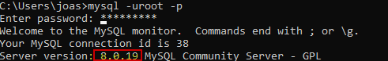

For purposes of using DB_Visualizer, the assumption is you already have set up the MySQL connection in DB_Visualizer. If not, there here is a brief guide using DB_Visualizer to set up a MySQL Connection. If you are not going to use DB_Visualizer, you can skip to the section, ***Using MySQL Server 8.0 Workbench to export a CSV***.

### Step 1. Choose Create Database from the Database Menu Selection.

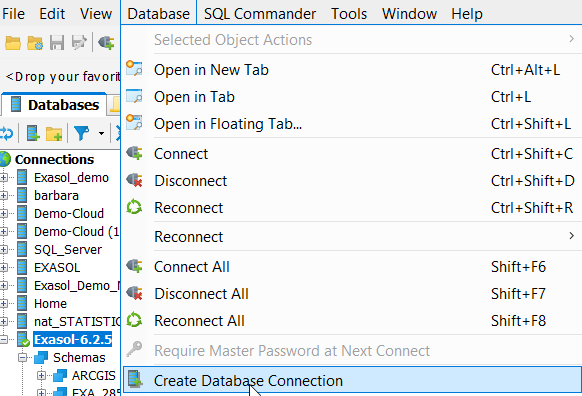

### Step 2. Name the new connection


### Step 3. Choose MySQL from the Select Database Driver pulldown menu

### Step 4. Specify Connection credentials

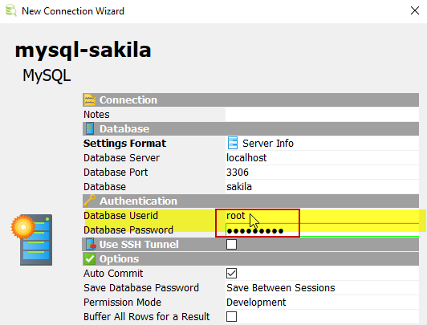

### Step 5. Connect to the new MySQL instance in DB_Visualizer.

## How to export CSVs from MySQL

## Using DB_Visualizer to export MySQL data to a CSV file

### Step 1. Choose the appropriate Database, schema, and table from the Database Explorer window

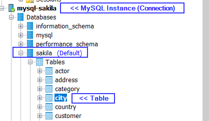

### Step 2. Right click and choose Export Table

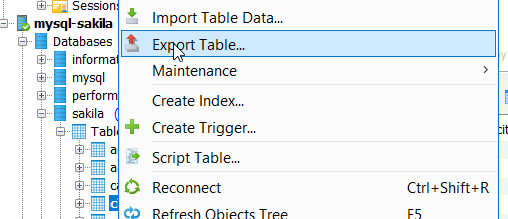

### Step 3. Set Output Format to CSV


### Step 4. Export CSV

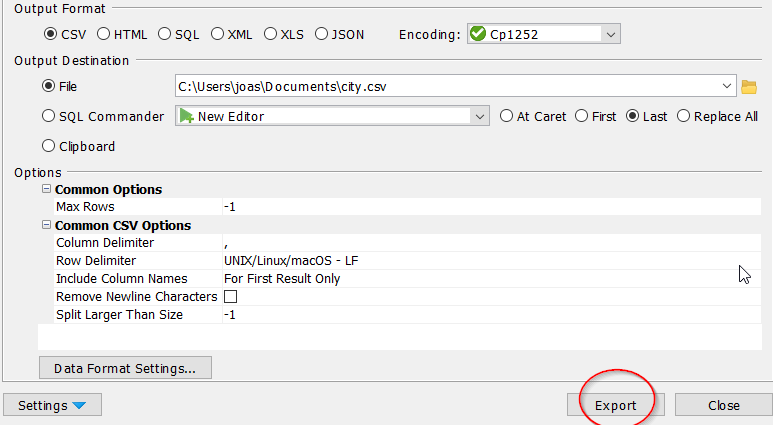

## Using MySQL Server 8.0 Workbench to export a CSV

### Step 1. From the Workbench, choose Data Export from far left under Navigator

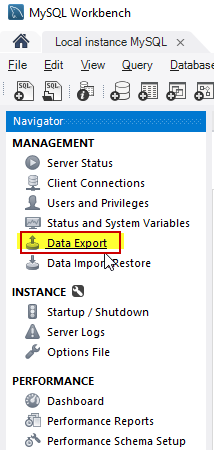

### Step 2. Choose Schema and Table

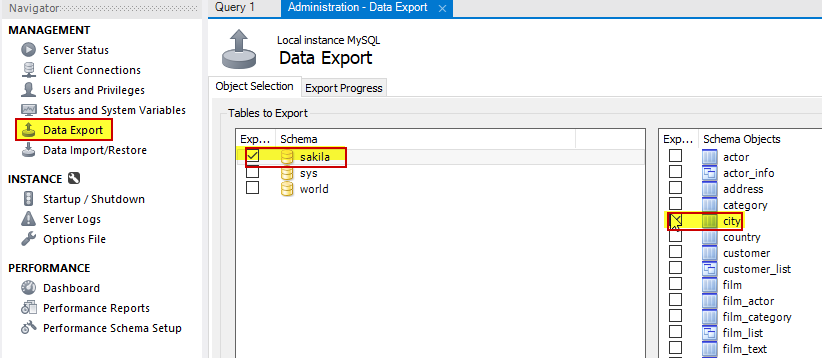

### Step 3. Set your Export

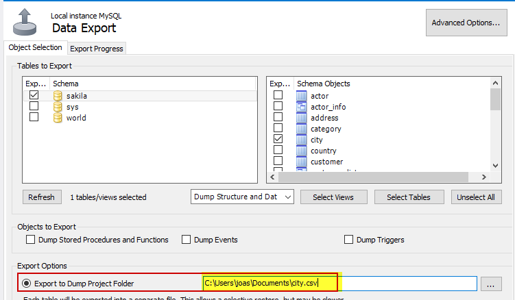

### Step 4. Export

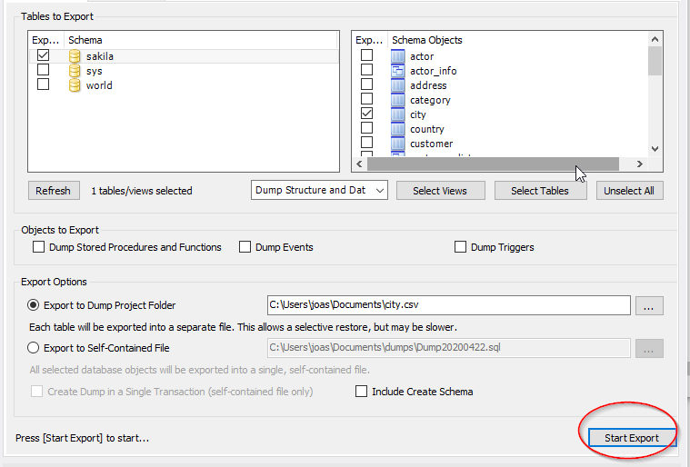

## Using MySQL 8.0 to export a CSV

Use ***SQL Query - SELECT … INTO…:***  
(Documentation <https://dev.mysql.com/doc/refman/8.0/en/select-into.html>) 

For additional information about this query see below the paragraph, "option 2" under the section, ***How to export a CSV using MySQL Server 5.7***


```"noformat
SELECT CITY_ID, IFNULL(CITY, ''), IFNULL(Country_ID,0), IFNULL(IF(last_update = '0000-00-00', '', last_update), '') 
 INTO OUTFILE 'C:/users/joas/downloads/city4.csv' 
 FIELDS TERMINATED BY ',' 
 OPTIONALLY ENCLOSED BY '"' ESCAPED BY '\"' 
 LINES TERMINATED BY '\n' FROM city WHERE 1; 
```
## How to export a CSV using MySQL Server 5.7

## MySQL Server 5.7

### Option 1)

Use the ***MySQL Workbench***:

* Connect to your Database
* Right click on the table you want to export and open the ***Table Data Export Wizard***  
   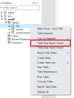
* Check the needed columns. If you have “***Date***”- type columns, proceed with step ***B*** by clicking Advanced. Otherwise, continue with ***A*** by clicking Next.  
   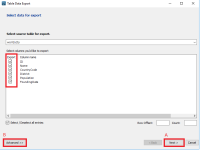

**B) This step is optional and only needed, if you export “*Date*”-type columns:**

* Here you can see the query that will be used as a base for export.  
To prevent invalid entries in “Date”-columns (‘0000-00-00’), you have to add an ***if statement*** to the query. It will check if the content is valid or not and will replace it with "" (empty string) if necessary. You can modify the replacement string of course (e.g. with the function ***CURDATE()*** to fill in the current date).  
   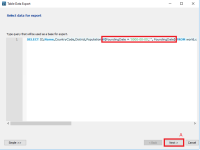

   
After you are done adjusting the query you can continue with step ***A*** by clicking Next.

***A)***

* Here you can set the file path for the csv file and some additional options
* Finish the configuration by clicking Next  
   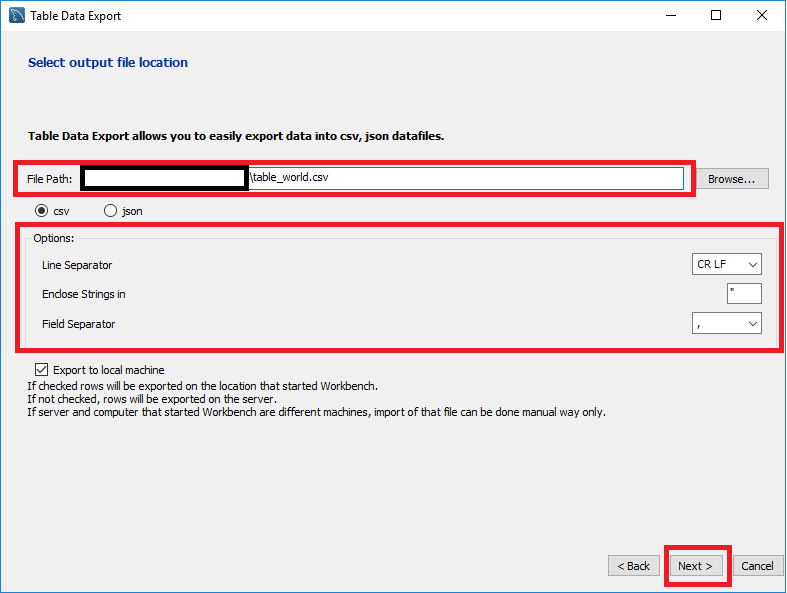
* You are now ready to export your data into a new .csv file
* Click Next to start the process  
   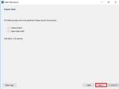
* The CSV file is stored in the selected location

Notes:

* The ***Table Data Export*** tool enables you to export only one table at a time. You will have to repeat the procedure for every needed table.
* NULL will automatically be converted to "" (empty string).
* Double quotes will automatically be masked with double-quotes.
* ***MySQL Workbench*** limits the size of the result set to 1000 by default.  
To change that, you have to set the option to your needed size as follows:

## Option 2)

Use ***SQL Query - SELECT … INTO…:***  
(Documentation <https://dev.mysql.com/doc/refman/8.0/en/select-into.html>)

Example:


```"code
SELECT ID, IFNULL(Name, ''), IFNULL(CountryCode, '') IFNULL(IF(FoundingDate = '0000-00-00', '', FoundingDate),'') 
 INTO OUTFILE 'C:/ProgramData/MySQL/MySQL Server 5.7/Uploads/city.csv' 
 FIELDS TERMINATED BY ',' 
 OPTIONALLY ENCLOSED BY '"' 
 ESCAPED BY '\"' 
 LINES TERMINATED BY '\n' FROM city WHERE 1; 
```
This query will export all selected columns from the table ***city*** to the file ***city.csv***.

* As you can see it is very important to make proper use of the MySQL function ***IFNULL()***. This way it is guaranteed, that potential NULL values are replaced by "" (empty string).  
Note: Only needed if option ***“NotNull”*** is disabled for affected columns.
* To prevent invalid entries in “***Date***”-columns (‘0000-00-00’), you have to add an ***if statement*** to the query. It will check whether the content is valid or not and will replace it with "" (empty string) if necessary. You can modify the replacement string of course (e.g. with the function ***CURDATE()*** to fill in the current date).  
Depending on your settings (e.g. option ***“NotNull”*** is disabled), you might have to combine ***IFNULL()*** with an additional ***if statement*** as shown in the example.
* The option ***ESCAPED BY*** is required to make sure, that double quotes are converted correctly ("Example" -> ""Example"")  
To export multiple tables at once just combine the customized SQL statements.

Example:


```"code
SELECT ID, IFNULL(Name, ''), IFNULL(CountryCode, '') IFNULL(IF(FoundingDate = '0000-00-00', '', FoundingDate),'') 
 INTO OUTFILE 'C:/ProgramData/MySQL/MySQL Server 5.7/Uploads/city.csv' 
 FIELDS TERMINATED BY ',' 
 OPTIONALLY ENCLOSED BY '"' 
 ESCAPED BY '\"' 
 LINES TERMINATED BY '\n' FROM city WHERE 1;  
SELECT Code, IFNULL(Name, ''), IFNULL(Continent, ''), IFNULL(Region, '') 
 INTO OUTFILE 'C:/ProgramData/MySQL/MySQL Server 5.7/Uploads/country.csv' 
 FIELDS TERMINATED BY ',' 
 OPTIONALLY ENCLOSED BY '"' 
 ESCAPED BY '\"' 
 LINES TERMINATED BY '\n' FROM country WHERE 1;  
SELECT CountryCode, IFNULL(IsOfficial, ''), Language, IFNULL(Percentage, '') 
 INTO OUTFILE 'C:/ProgramData/MySQL/MySQL Server 5.7/Uploads/countrylanguage.csv' 
 FIELDS TERMINATED BY ',' 
 OPTIONALLY ENCLOSED BY '"' 
 ESCAPED BY '\"' 
 LINES TERMINATED BY '\n' FROM countrylanguage WHERE 1;
```
