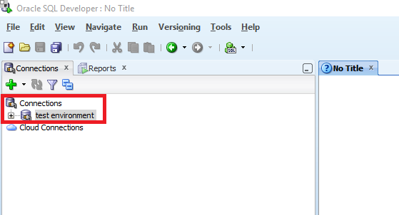
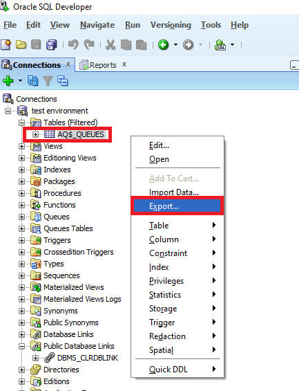
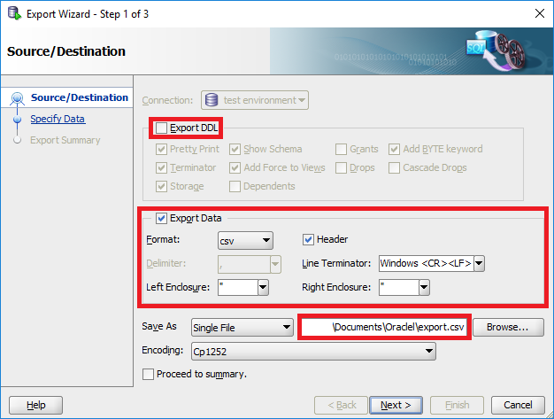
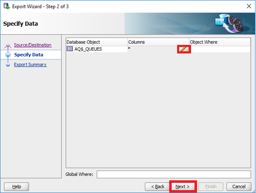
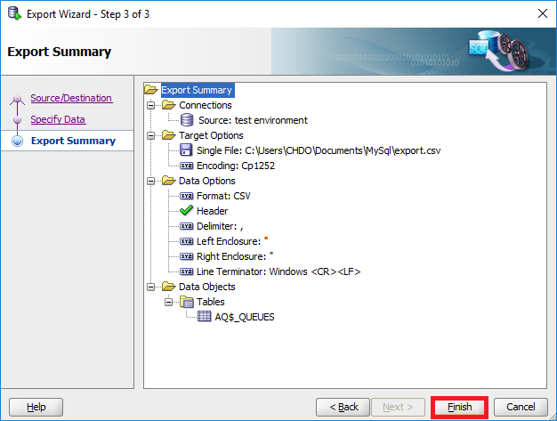
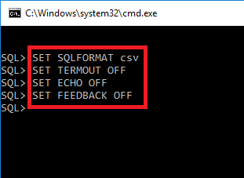
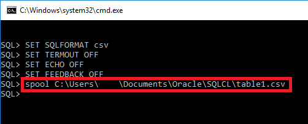
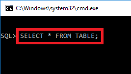
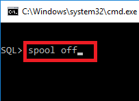

# Proper csv export from Oracle 
We want to show you how to export CSV files from Oracle DB. Use one of the following options.

## Option 1: Using the Oracle SQL Developer

* Connect to the database you want to export  

* Select the table you want to export
* Open context menu by right-clicking on the table
* Select***Export***to start the integrated*****Export Wizard*****
* To guarantee a proper export, you should deselect the option***Export DDL***
* Change format to csv and set the path for the exported file
* Click***Next***to continue  

* The following screen allows you to specify the columns you want to export (SELECT *… by default)
* Use the***Edit-Button***to change settings - otherwise, you can proceed by clicking*****Next*****
* Finally, you will receive a summary of the export process
* Make sure that your settings are valid and complete the export by clicking*****Finish*****

Notes:

* ***Oracle SQL Developer***automatically converts NULL to "" (empty string)
* ***Oracle SQL Developer***automatically masks double quotes ("Example" -> ""Example"")

## Option 2):Using***SQLcl***: ***SQLcl***is a free tool provided by Oracle.

* Download:<http://www.oracle.com/technetwork/developer-tools/sqlcl/overview/index.html>
	+ Short documentation about how to get started and some of its features: <https://mikesmithers.wordpress.com/2015/04/12/sqlcl-the-new-sqlplus/>
* Connect to the database you want to export
* To guarantee a proper export of your data, you have to change some of the system variables of***SQLcl***:  
o***SET SQLFORMAT csv***(automatic conversion into proper csv)  
o***SET TERMOUT OFF***(suppresses output on display - this option is only necessary when using scripts)  
o***SET FEEDBACK OFF***(suppresses displaying the number of records returned by a query)
* To apply each option, just press***ENTER***after every single command  
Note: These options have to be set every time***SQLcl***is started!  

* Use the integrated spooler with the appended file path to start the process  

* ***SQLcl*** will write the result set of your ***SELECT-statement*** to *****table1.csv*****
* To finish the process, you have to stop the spooler by using the command: *****spool off*****

Notes:  
o You are not able to access the exported csv file until you stopped the spooler  
o ***SQLcl*** automatically masks double quotes (“Example” -> “”Example””)  
o ***SQLcl*** automatically converts NULL to “” (empty string)

Do you have feedback about this article? Feel free to leave a comment for us!

