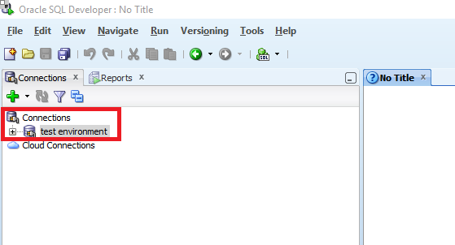
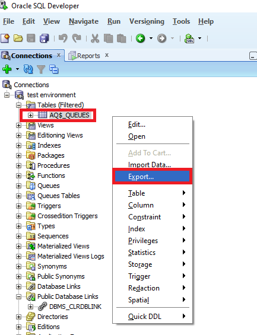
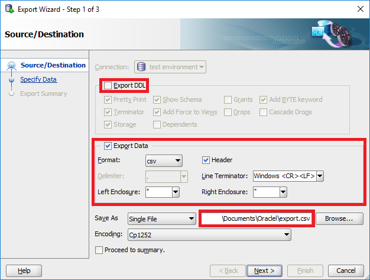
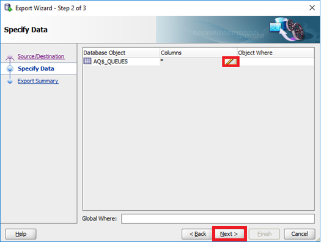
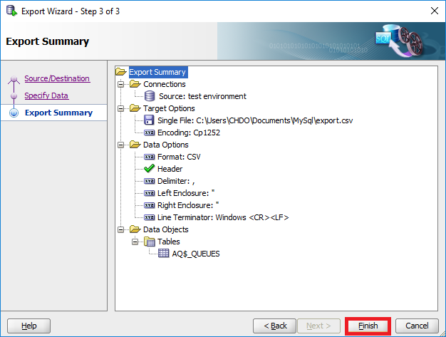
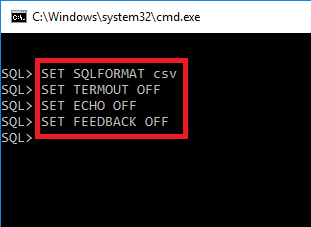
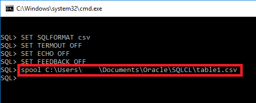
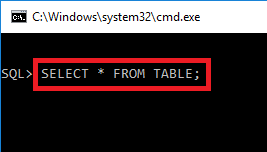
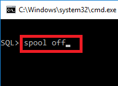

# Proper csv export from Oracle

We want to show you how to export CSV files from Oracle DB. Use one of the following options.

## Option 1: Using the Oracle SQL Developer

* Connect to the database you want to export  

  

* Select the table you want to export
* Open context menu by right-clicking on the table
* Select ***Export*** to start the integrated *****Export Wizard*****

  

* To guarantee a proper export, you should deselect the option ***Export DDL***
* Change format to csv and set the path for the exported file
* Click ***Next*** to continue
 
  

* The following screen allows you to specify the columns you want to export (SELECT *… by default)
* Use the ***Edit-Button*** to change settings - otherwise, you can proceed by clicking *****Next*****

  

* Finally, you will receive a summary of the export process
* Make sure that your settings are valid and complete the export by clicking *****Finish*****

  

Notes:

* ***Oracle SQL Developer*** automatically converts NULL to "" (empty string)
* ***Oracle SQL Developer*** automatically masks double quotes ("Example" -> ""Example"")

## Option 2 : Using ***SQLcl***, a free tool provided by Oracle

* Download: [Oracle SQLcl](https://www.oracle.com/database/sqldeveloper/technologies/sqlcl/)
	* Short documentation about how to get started and some of its features: <https://mikesmithers.wordpress.com/2015/04/12/sqlcl-the-new-sqlplus/>
* Connect to the database you want to export
* To guarantee a proper export of your data, you have to change some of the system variables of ***SQLcl***:  
  * ***SET SQLFORMAT csv*** (automatic conversion into proper csv)  
  * ***SET TERMOUT OFF*** (suppresses output on display - this option is only necessary when using scripts)  
  * ***SET FEEDBACK OFF*** (suppresses displaying the number of records returned by a query)
* To apply each option, just press ***ENTER*** after every single command  
Note: These options have to be set every time ***SQLcl*** is started!  

  

* Use the integrated spooler with the appended file path to start the process  

  

* ***SQLcl*** will write the result set of your ***SELECT-statement*** to *****table1.csv*****

  

* To finish the process, you have to stop the spooler by using the command: *****spool off*****

  

Notes:  

* You are not able to access the exported csv file until you stopped the spooler  
* ***SQLcl*** automatically masks double quotes (“Example” -> “”Example””)  
* ***SQLcl*** automatically converts NULL to “” (empty string)

*We appreciate your input! Share your knowledge by contributing to the Knowledge Base directly in [GitHub](https://github.com/exasol/public-knowledgebase).*
