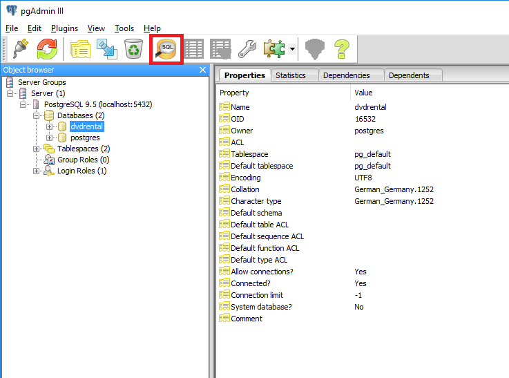
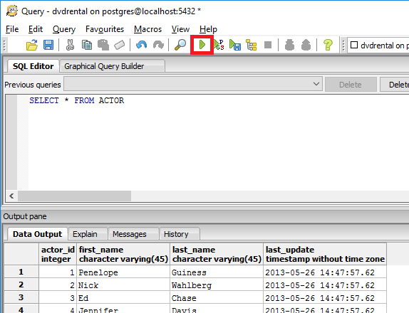
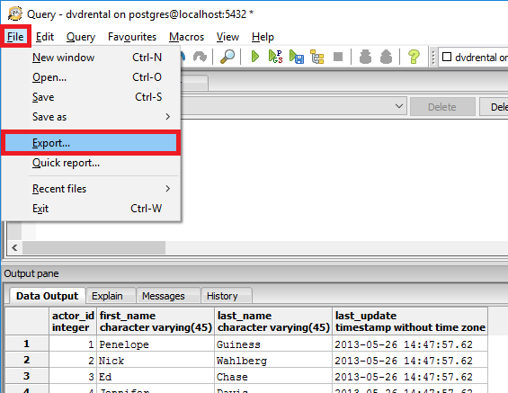
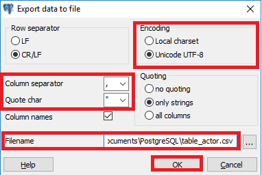
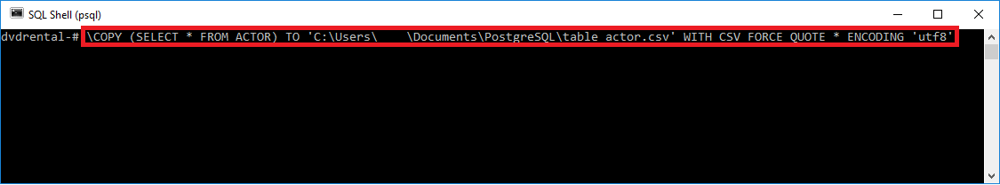
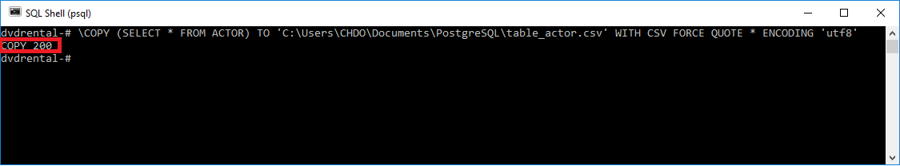

# Proper csv export from PostgreSQL 
## Background

To export CSV files from PostgreSQL

### Options to export csv fromPostgreSQL

#### Option 1:

Using***pgAdmin III***:

* Connect to the database you want to export
* Open the***SQL Editor***by clicking the*****SQL-Button*****
* Select the tables individually with separate***SELECT Statements***
* To run the query press***F5***or use the associated button  

* When the task is finished you can continue the export with opening the integrated***Export data to file***tool
* To do so, open the***File***menu on the top left and proceed with***Export***from there  

* Now you are able to make some adjustments for your csv format
* To guarantee a proper csv file we recommend the following settings
* Select your desired filename and start the process by clicking*****OK*****
* You will receive a message about the successful export  

Notes:

* ***pgAdmin III***automatically converts NULL to "" (empty string)
* ***pgAdmin III***automatically masks double quotes ("Example" -> ""Example"")

#### Option 2)

Using***PSQL***:

* Connect to the database you want to export
* Use the***\COPY[table_name | query]TO[filename]WITH CSV***command  
(Documentation:<https://www.postgresql.org/docs/current/static/sql-copy.html>)
* Add the following parameters to export a proper csv file:  
o***FORCE QUOTE ****(all values will be quoted)  
o***ENCODING ‘utf8’***(specifies encoding option)

Example:

* Start the export by pressing***Enter***
* You will receive a confirmation about the number of rows that have been exported  

Notes:

* ***PSQL***automatically converts NULL to "" (empty string)
* ***PSQL***automatically masks double quotes ("Example" -> ""Example"")
