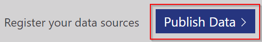
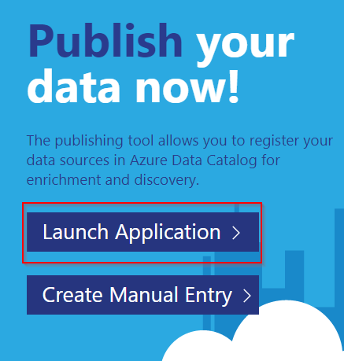
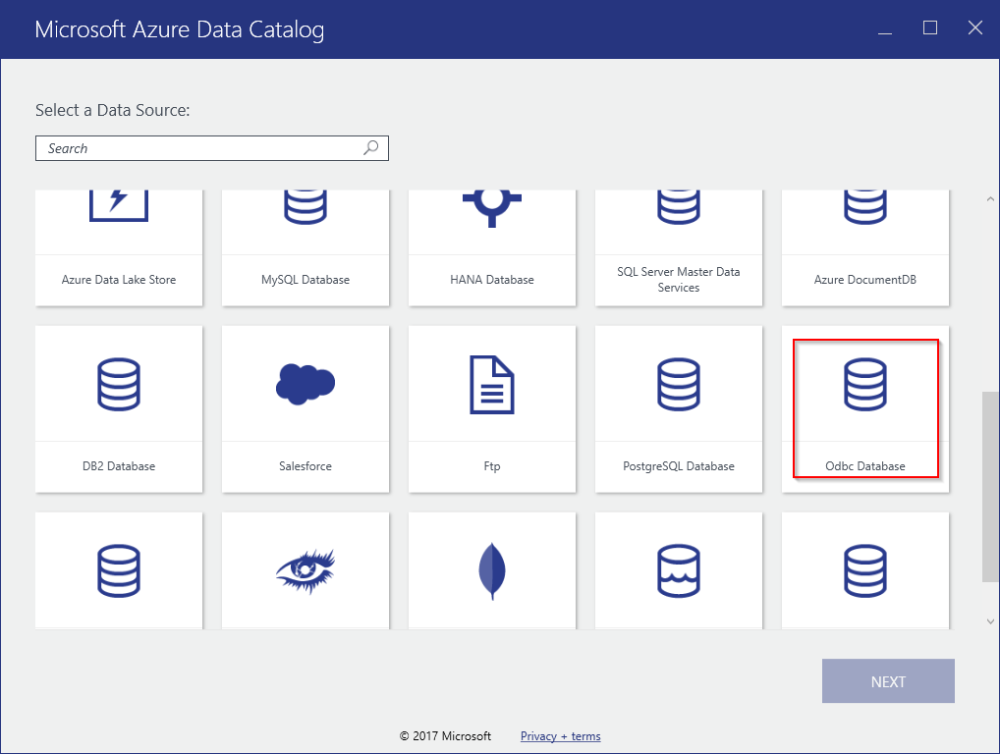
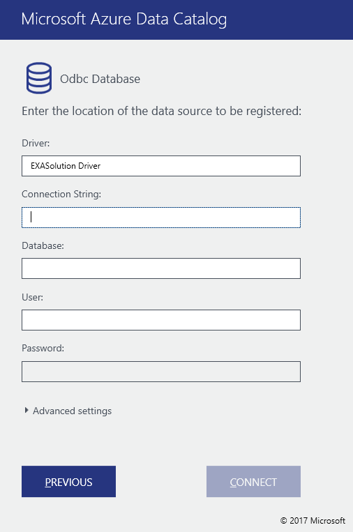
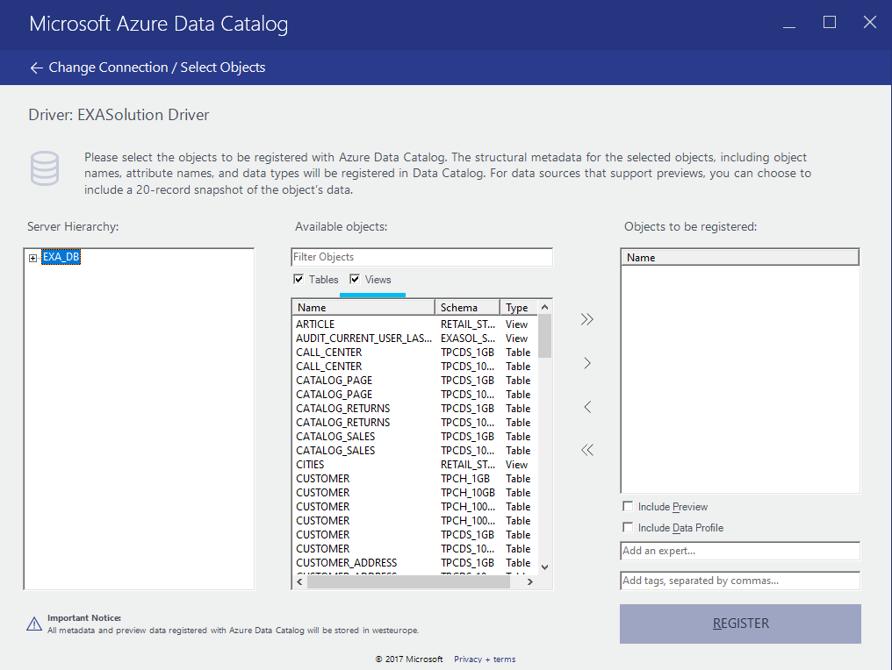
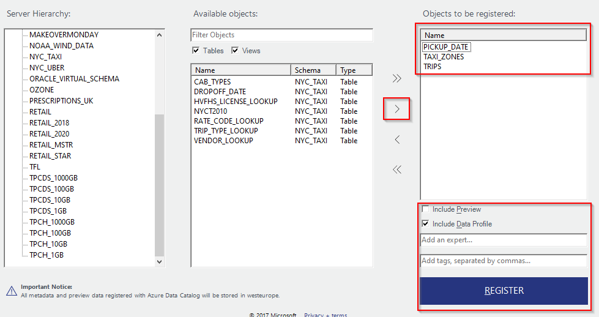
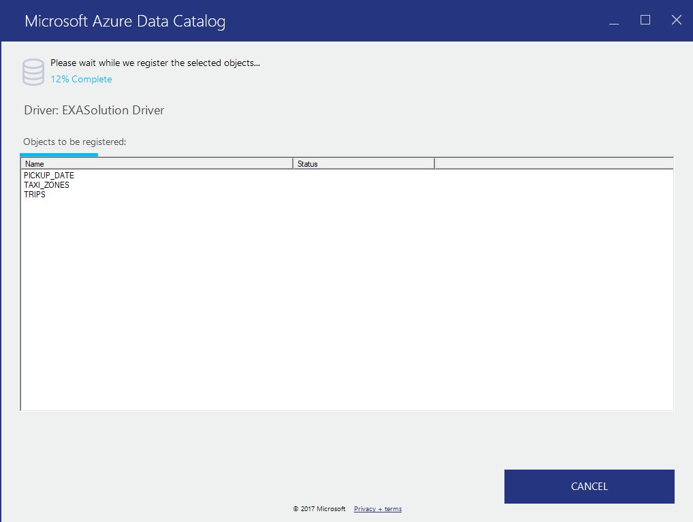
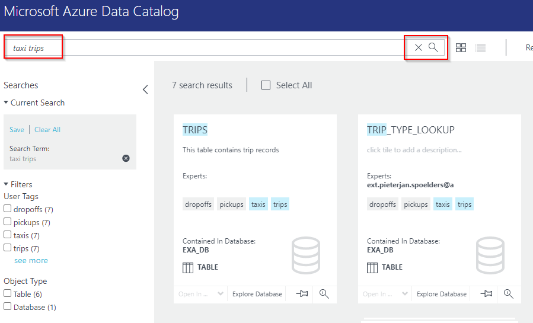
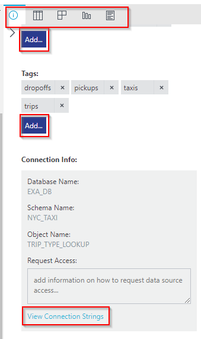
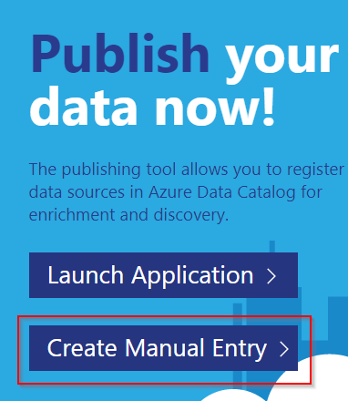

# Register your Exasol data sources in Azure Data Catalog 
In this tutorial, our main aim will be to demonstrate how to register Exasol data sources within Azure Data Catalog.

## Background

Azure Data Catalog is a cloud service where users can register their data sources and their data sources' metadata. Users can also append additional metadata and annotations to the data objects they register. 

Next to the functionality for registering and cataloging data sources Data Catalog also includes a powerful search option. The product's main aim is to increase data discoverability. 

  
More info on Azure Data Catalog can be found here: 

<https://docs.microsoft.com/en-us/azure/data-catalog/overview> 

## Prerequisites

You'll need:

- An Azure subscription

- A Data Catalog set up within your organization's subscription

- One or more Exasol Databases

- Exasol ODBC Drivers (only if you'll be using the publishing tool)

## Registering your Exasol data sources in Azure Data Catalog.

  
Navigate to the Azure data catalog hub and download the publishing tool. Go to <https://www.azuredatacatalog.com/>

You might be prompted to log in. Do so. Navigate to the "Publish Data" page.

Click "Launch Application".

Your browser will download a "RegTool.application" file. Run it and follow the installation steps.

#### Using the publishing tool

Launch the application if it did not open after installation. (The tool is called "Microsoft Azure Data Catalog".)

You'll be prompted to sign in to the tool. Do so with your azure account credentials.

Next, you'll see a supported data source overview:

We'll use the "Odbc Database" option to connect to our Exasol Database.

Select "Odbc Database" and click "NEXT".

The next screen will prompt us for the right settings to connect to our database through the ODBC drivers we have installed.

Let's configure the data source:

- Driver : `EXASolution Driver`

- The connection string:

`EXAHOST=192.168.56.117/E625D0BDD8A975CBC7001B842EAEFB56CDCC664459AE21BFAFCA13D9495D4D77`

The format is`EXAHOST= hostname/fingerprint` when using a fingerprint or just `EXAHOST=hostname`.

 - The default name of the database is `EXA_DB`. 
 - Username and password of the database user. 
 Use your credentials.

Finally, click "Connect".

You're now seeing the screen where you can navigate and register data source objects.

Click open "EXA_DB" to see a list of schemas, you can then drill down into tables and views.

Let's register some tables.

To the right you find options to include the data profile as well as a data preview.

You can also add a contact with expertise and you can add a number of relevant tags on the database objects you register. 

NOTE: Keep in mind that this tool is still in early development and the registrations might fail. In my personal experience, I mainly had issues with the 'Include Preview' option. Once I left this option unchecked I experienced fewer issues.

After clicking register you'll see a progress window keeping you informed of the registration process we started.

When the registration is done you can choose to register more objects or to view the portal and inspect the data objects' metadata and annotations you just registered.

#### Inspecting our registered information

Let's go to the portal and search for some of the objects we registered:

As you can see, we easily find back the data objects we registered (in my case I used the labels: taxi, trips, ...)

You can now further add metadata or alter metadata and annotations on these objects as well in the portal.Select an object and pick the right action in the action pane to the right:

 
 
 #### Using discovered data

If you're discovering data and decide you want to work with a certain data source you can easily get the database connection string via the UI: this option is also available in the pane to the right. Click "View Connection Strings". A modal pops up and you can easily copy the connection string.

### Manual entries

You can also manually register database objects.

We would in general not recommend this because it is way more time-consuming and error-prone than using the publishing tool.

If you want to do it, however, it's available on the publish page in the Data Catalog Portal. The process is very similar to using the publishing tool.

*We appreciate your input! Share your knowledge by contributing to the Knowledge Base directly in [GitHub](https://github.com/exasol/public-knowledgebase).* 