# Run your ETL jobs with Azure Data Factory and Exasol

## Background

This tutorial shows you how to use the Exasol database with the ETL Tool Azure Data Factory.

We'll go over a few topics in this tutorial:

- Enabling access to your Exasol database

- Load csv files (or parquet) from Azure blob storage to Exasol

- Export tables from Exasol to Azure blob storage

- Calling stored procedures (or scripts as we call them) from azure data factory.

We'll sketch out the bigger picture, go over some steps in more detail and link to more information wherever it's relevant.

## Prerequisites

- An Exasol database with network connectivity from the self hosted integration environment

- An azure subscription with sufficient administrator privileges.

- A machine or VM for hosting an integration runtime.

## Setting up the Azure data factory environment

## Creating an Azure data factory

The first thing we'll need to do is set up an an azure data factory to transform and copy our data.

Next to that we'll also need a blob storage and attach this as a linked service:

For getting started with data factory I recommend the official Microsoft tutorial:

<https://docs.microsoft.com/en-us/azure/data-factory/quickstart-create-data-factory-portal>

## Enabling ODBC Connectivity to the Exasol database

## Setting up a self-hosted integration runtime

After we've set up our azure data factory it's time for the next step.

In our case we'll want to transfer data to and from the Exasol database. For this we'll need to establish a connection via ODBC. The way this is accomplished is via a self-hosted integration runtime. We'll need to install this runtime on a separate machine of your choice.

### Register, install and configure an integration runtime on a resource of your choice (a machine or VM on-premise, or a machine or VM in the cloud)

There are plenty of ways to accomplish this, as described in <https://docs.microsoft.com/en-us/azure/data-factory/create-self-hosted-integration-runtime>

Documented below is my preferred method of doing so:

Let's navigate to the azure data factory UI and add a new integration runtime there:

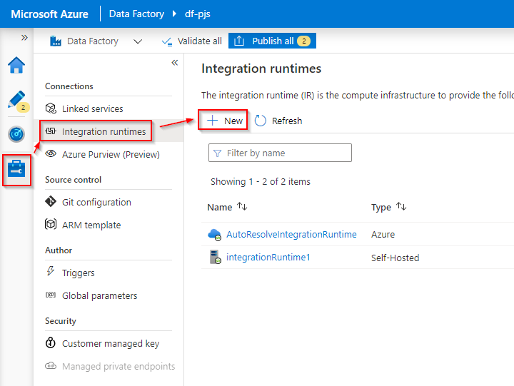

Then we pick "Azure, Self-Hosted",

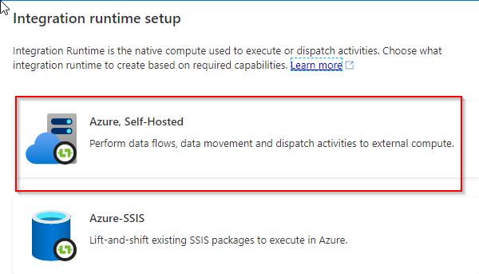

Then "Self-Hosted"

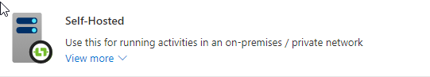

Let's pick a  good recognizable name and then press "Create"
(You won't be able to change this name later so that's why I specifically mention this here).

This will open another pop-up menu:

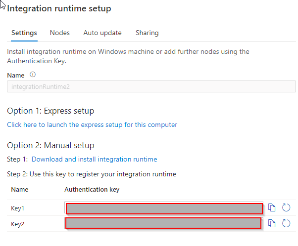

Here we get the option to download an express setup installer or a default installer.

The express setup installer takes care of everything.

If you choose to use the manual setup / default installer instead then there's just one extra installation step where you need to register the integration runtime via the authentication keys shown (see screenshot) after you've installed it on the machine or VM set up to host the integration runtime.

You'll also need to make sure to install the 64-bit Exasol ODBC driver and the Visual Studio 2015-19 C++ redistributables on the machine hosting this self-hosted integration runtime. Install the redistributables before the driver.

(Driver here: <https://downloads.exasol.com/clients-and-drivers/odbc> and redistributables here : <https://support.microsoft.com/en-us/topic/the-latest-supported-visual-c-downloads-2647da03-1eea-4433-9aff-95f26a218cc0> )

Next we'll set up a linked service using this integration runtime.

### Setting up a linked service using the integration runtime

On the 'Manage' tab (we should still be on this tab) we need to create a linked service.

Click on 'Linked Services', under 'Connections', there click 'New'

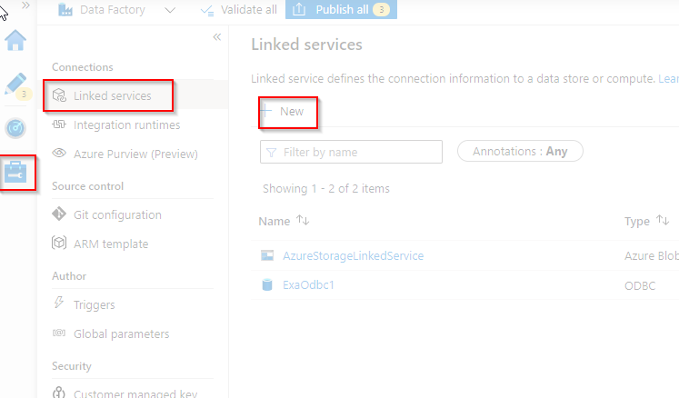

A new menu pops up where we'll have to do further configurations:

Let's pick the integrated runtime we've just created under 'connect via integration runtime'.

Enter the connection string: In our case it looks like this.

`DRIVER=Exasol Driver;EXAHOST=exasol-pjs-adf-tutorial.westeurope.cloudapp.azure.com;`

The `DRIVER` name is important since it needs to know which ODBC driver to use (in our case the Exasol ODBC driver we've installed earlier).

The `EXAHOST` part should contain the address of our actual Exasol database.

The next step is to enter the credentials of the database account we plan to access the database with.

The end result will look something like this:

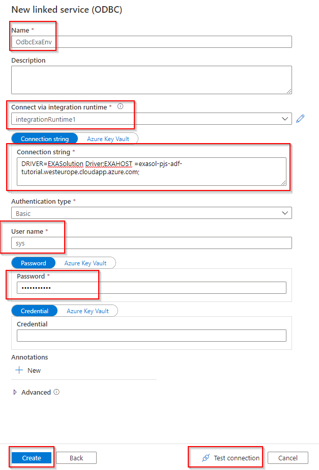

We  can test whether our linked service is correctly configured by clicking on 'Test Connection'.

We've now successfully established a connection to the Exasol database.

Our next steps will be creating actual datasets  that utilize this linked service and then pipelines that utilize these datasets so that we can send and extract data to and from our Exasol database.

## Transferring data to the Exasol database

Next up we'll set up an ODBC dataset using the linked service we've just created.

ODBC datasets can be used by the 'Copy' and 'Lookup' activities in Azure Data Factory.

## Creating an ODBC dataset

Let's move back to the 'Authoring' tab in Azure Data Factory.

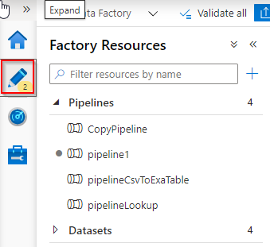

Next to dataset click the dotted line ('...').

Pick 'Create new dataset'.

Search for 'odbc', select the right result and press 'Create'.

Pick the linked ODBC service we've created in the previous step, to select a table.


For this example I've added a very simple table to my database containing just a first name and last name column.

Here's the script:

```sql
CREATE SCHEMA "adf";
ALTER SCHEMA "adf" CHANGE OWNER SYS;

-- "adf".PERSON definition

CREATE TABLE "adf".PERSON (
FIRSTNAME VARCHAR(50) UTF8,
LASTNAME VARCHAR(50) UTF8
);
```

This is what our dataset should look like then:

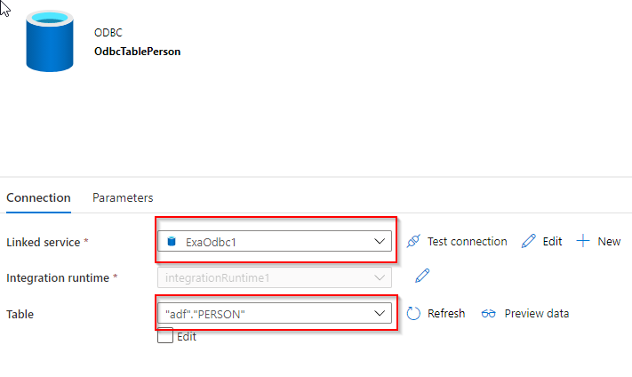

## Adding an azure blob storage dataset

We'll also need an azure blob storage dataset for this tutorial.

This article goes over setting up an azure blob storage dataset in more detail:

<https://docs.microsoft.com/en-us/azure/data-factory/quickstart-create-data-factory-portal>

For the tutorial we've added a very simple csv file to the blob storage we'll use that has the following contents:

`John, Doe`  
`Jane, Doe`

Now let's create a new dataset:

Search for 'blob', pick 'Azure Blob Storage'

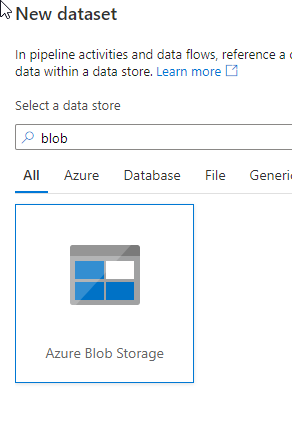

Pick 'DelimitedText' as the format:

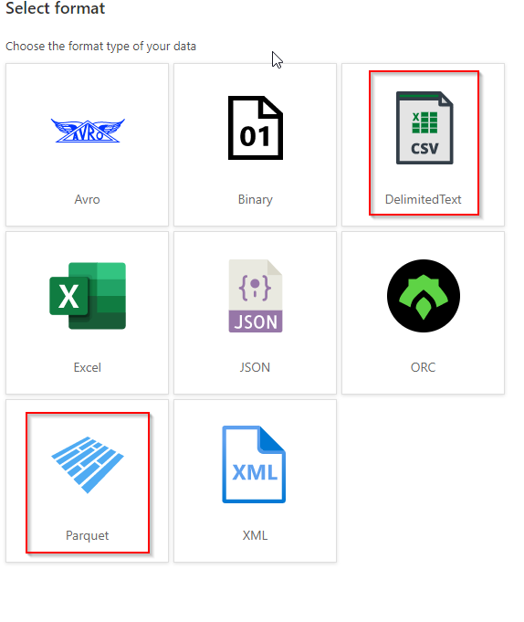

We're picking the "DelimitedText" option, because this allows us to configure how to extract comma separated values from our CSV file out of the box.
For Parquet files or other files we'd pick one of the other corresponding options.

Then we'll need to configure the filepath so it points to the right csv file(s) in our blob storage. There's a handy file browser you can use for this.

Our configured blob storage dataset should look like this:

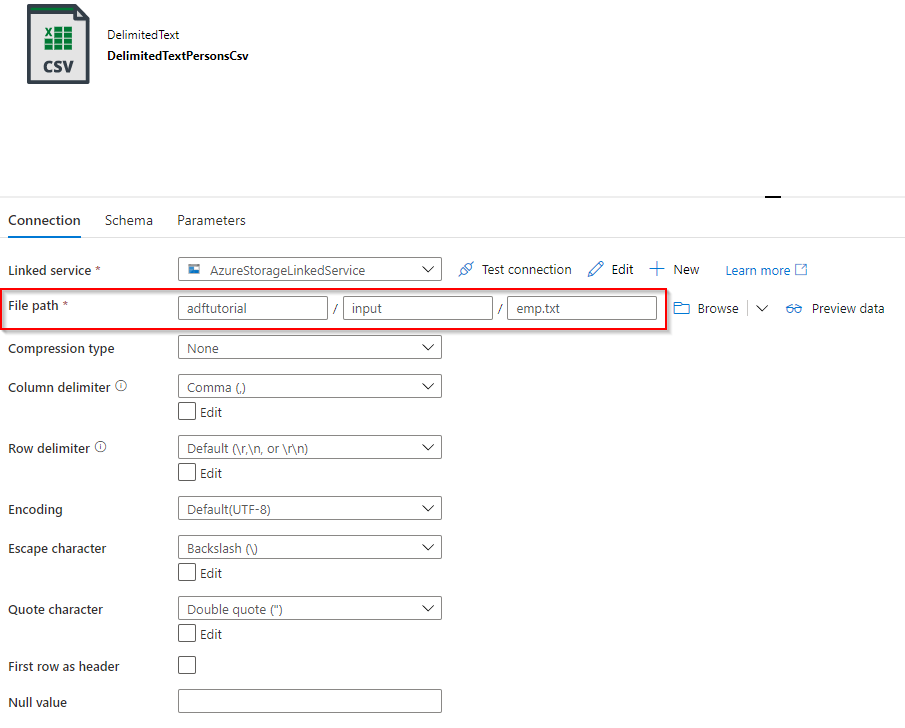

## Creating a pipeline and transferring data to the database

Now for the final step we'll create a pipeline, add a copy activity to this pipeline, configure sink and source of the copy activity, validate our pipeline, and finally, run the pipeline and transfer our data to the database!

Let's create a new pipeline first.

Add a 'Copy data' activity:

Set the csv file dataset we've created as the source.

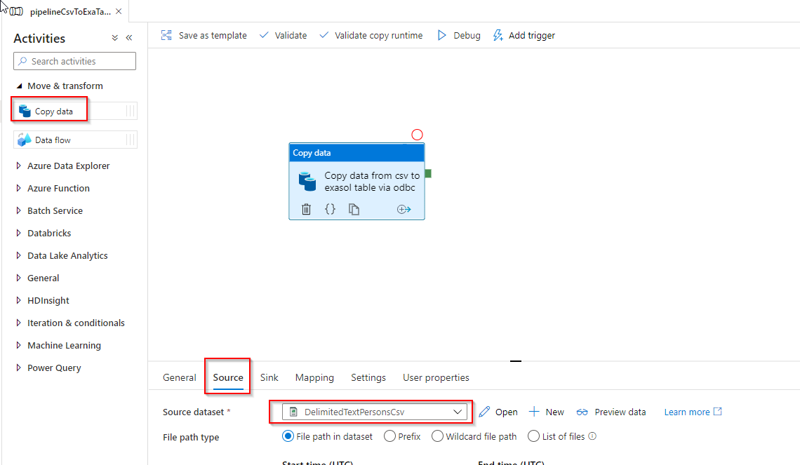

Pick the ODBC table dataset we've created as the sink.

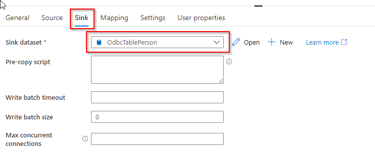

If your source CSV file has no header, like in our case, we need to explicitly configure the mapping (as the source doesn't contain column names).

If you want more information on this you can read: <https://docs.microsoft.com/en-us/azure/data-factory/copy-activity-schema-and-type-mapping>

Let's add the mapping shall we:

Navigate to the 'Mapping' tab of the activity.

Take note: We'll need to enter the database column names manually.

In our case the first csv value maps to the first name column in the database and the second csv value maps to the last name so the process is very straightforward:

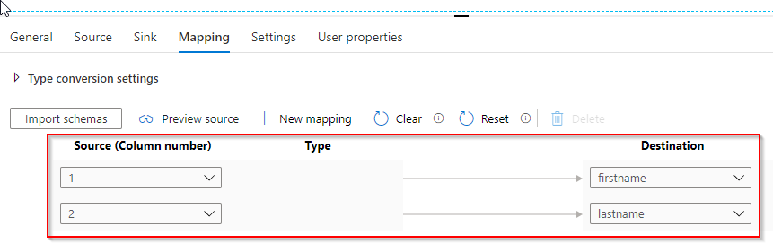

And we're good to go!

Next we'll validate the pipeline to see if everything's OK and then publish it.

After this we'll manually trigger the pipeline and we will see that our data from the csv file will have been successfully transferred to the database!

And that's it, we're done!

## Exporting data from the database

Exporting data from the Exasol database is also quite simple:

We can simply set any ODBC datasets we create(d) as the source.

The ODBC dataset could also be a view.

Another possibility is a custom query, we can set this option in the activity source tab:

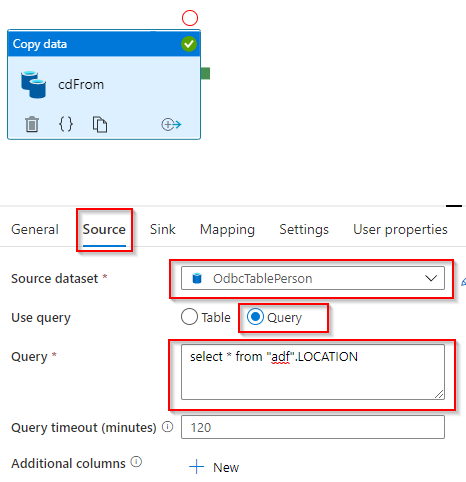

## Calling a stored procedure or script

We can also call a stored procedure (or 'script' as we call them) that returns a table.

Using this approach you could call the [Exasol bulk loader](https://docs.exasol.com/loading_data/loading_from_file.htm) and run complex transformation logic directly in the database.

The following script shows a simplified example:

```lua
--/
CREATE OR REPLACE SCRIPT "adf"."hi"(name) RETURNS TABLE AS
greeting = "Hello, "
concatStr = greeting .. name
local result_table = {{concatStr}}
exit(result_table, "greeting varchar(50)")
/
```

Which returns a custom table with a greeting to whatever name you've passed in as a parameter.

We can easily execute this script and get the results:

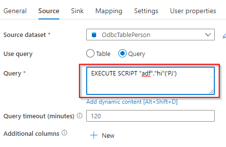

In some cases you'd probably also want to call a script without defining a data sink.

You can accomplish this by using a 'Lookup' activity instead of the 'Copy data' activity we've been using before.

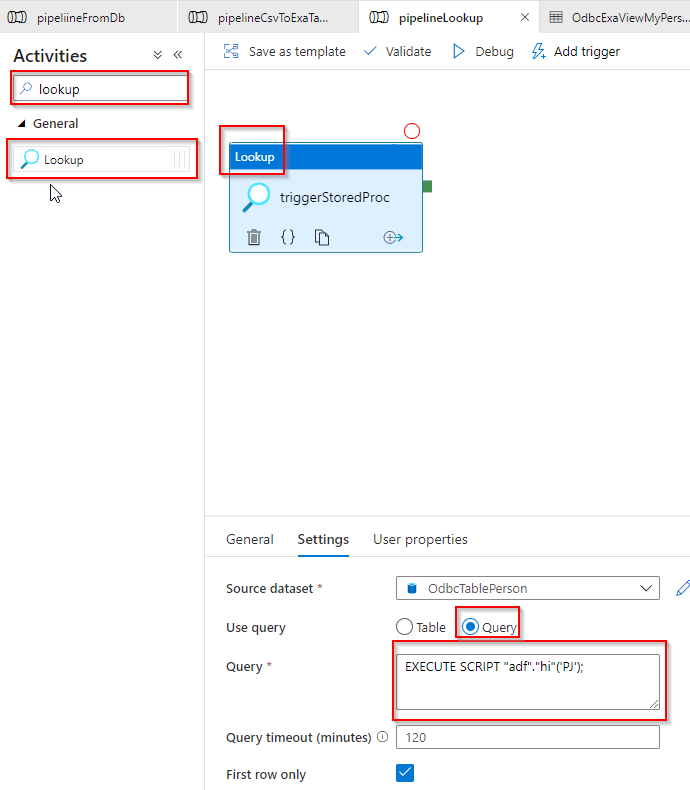

## Conclusion

As you can see the setup and workflows for using the Exasol database in Azure Data Factory are quite straightforward.

We hope you've enjoyed reading this article.

*We appreciate your input! Share your knowledge by contributing to the Knowledge Base directly in [GitHub](https://github.com/exasol/public-knowledgebase).*
