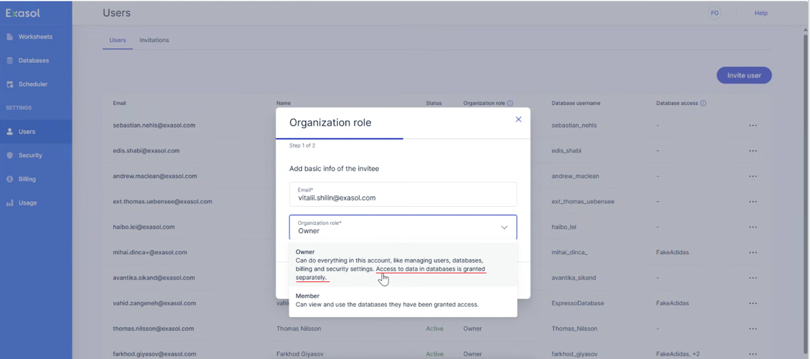
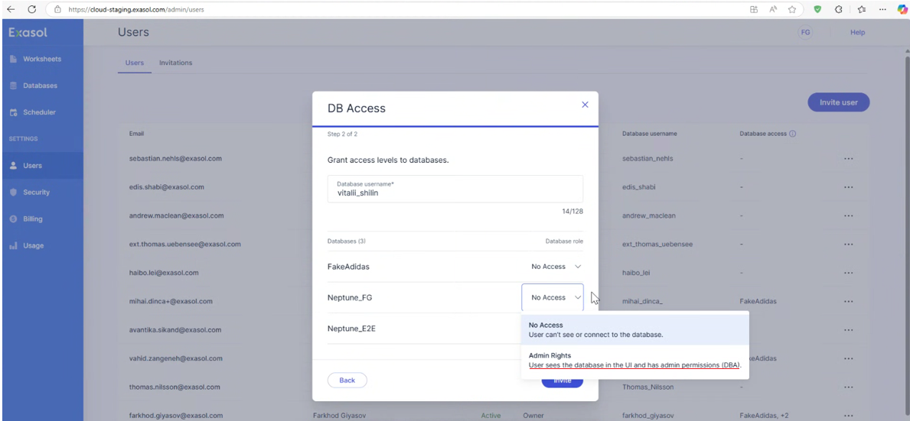

# SaaS Access Management - Owner Role and Database Data Access Control

## Question

Why does an invited user as "Owner" have full access to the data in the database by default?
How can I restrict an invited "Owner" from having full DBA privileges?

Current behavior:
Invited user as OWNER is having full access to the DB.

Expected behavior:
According to the description in SaaS web console (see screenshots), the access to the DB must be limited. "Access to data in databases is granted separatley"

Steps to reproduce:
Invite a User as Owner to be able to see the DB. You will get a pop-up window saying that you need to grant privileges to the invited user. However, he already has all privileges.

## Answer

When a user is invited as "Owner", the inviter presented with a web console option on the next screen to grant access to specific databases they own. The system allows the inviter to select which databases the user will have access to as a DBA.

Currently the only way do prevent a new Owner from having DBA access to the data, would be to manually downgrade that user from DBA to something else.

## Additional References

[Exasol SaaS: Administration &gt; Access Management](https://docs.exasol.com/saas/administration/access_mngt/access_management.htm)

*We appreciate your input! Share your knowledge by contributing to the Knowledge Base directly in [GitHub](https://github.com/exasol/public-knowledgebase).*
