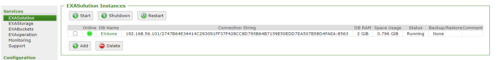
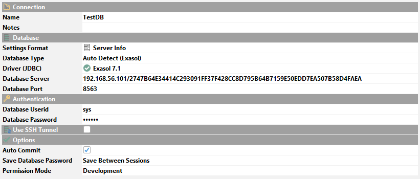
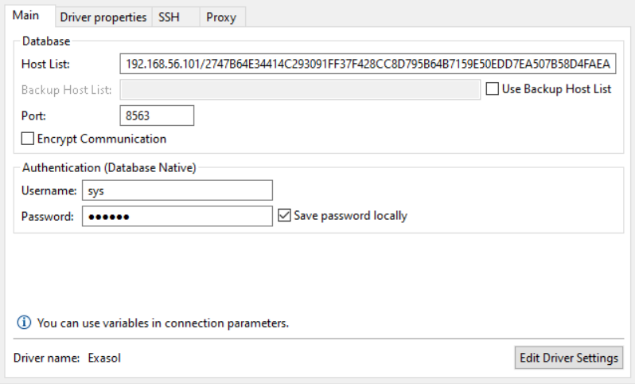

# TLS connection fails 
## Scope

This article will describe how to resolve the issue when you are using version 7.1 of the Exasol driver and your existing connections no longer work. This article is relevant for driver version 7.1.0+ and database versions 7.1.0+, 7.0.10+, and 6.2.15+. Other database and driver combinations are not affected. 

[exasol-7-1-connection-security-changes](https://www.exasol.com/resource/exasol-7-1-connection-security-changes/)   
Here is the original changelog documentation: [EXASOL-2936](https://www.exasol.com/support/browse/EXASOL-2936 "Explanation") 

## Diagnosis

When connecting to your database, you will get an error message similar to this: : 


```sql
java.io.IOException: TLS connection to host (192.168.56.101) failed: 
PKIX path building failed: sun.security.provider.certpath.SunCertPathBuilderException: 
unable to find valid certification path to requested target. 
If you trust the server, connect to it using the fingerprint: 
2747B64E34414C293091FF37F428CC8D795B64B7159E50EDD7EA507B58D4FAEA.
```
## Explanation

With the release of 7.1.0, we made a big change in our drivers: JDBC, ODBC and ADO.NET are now using TLS by default to connect to the database versions 7.1.0+, 7.0.10+, and 6.2.15+. For security reasons, the drivers will only establish a connection to the database if the SSL/TLS certificate of the database can be verified. If the certificate used by the database is not signed by a publicly recognized certificate authority (CA) or if the necessary CA certificate has not been provided to the client to use for verification, the connection will fail. In these cases you will get an exception like:  


```sql
TLS connection to host (exadb1.example.com) failed: 
unable to get local issuer certificate. 
If you trust the server, connect to it using the fingerprint: 
2747B64E34414C293091FF37F428CC8D795B64B7159E50EDD7EA507B58D4FAEA.
```
**If another certificate has not been uploaded using EXAoperation, a self-signed certificate is used by Exasol per default. Since this certificate is self-signed, TLS connections to Exasol will fail by default.**

For an in-depth explanation of this change, see [EXASOL-2936](https://www.exasol.com/support/browse/EXASOL-2936 "Explanation") 

## Recommendation

## Immediate Mitigation

To re-establish connection to your database using the latest driver, there are 3 short-term solutions:

### **Option 1. Use the fingerprint**

The error message provides you a fingerprint that you can append to your hostname when connecting to the database. The fingerprint looks like: `2747B64E34414C293091FF37F428CC8D795B64B7159E50EDD7EA507B58D4FAEA`. You can also see this fingerprint in Exaoperation (if your DB is on version 7.1 or newer):



In your client or driver, change the server or host field to follow this format: &lt;ip address&gt;/&lt;fingerprint&gt;:8563

For example: `192.168.56.101/2747B64E34414C293091FF37F428CC8D795B64B7159E50EDD7EA507B58D4FAEA:8563`

The below screenshots show what the connect box should look like in DbVisualizer and DBeaver. 


 
###  **Option 2. Deactivate the certificate check using a driver parameter (not recommended)**

The TLS Certificate check can be disabled using the following driver parameters.

* JDBC: validateservercertificate=0
* ODBC: SSLCertificate=SSL_VERIFY_NONE
* ADO.NET: SSLCertificate=VERIFYNONE

A JDBC connection string would now look like this: `jdbc:exa:exadb1.example.com:8563;validateservercertificate=0`

If you are connecting using a tool, it may not be possible to change the driver parameters very easily. For information on this, see the documentation of your tool. 

### **Option 3. Use previous drivers**

 In case you don't want to change the client connection string and could not timely configure the certificate on the database side you might consider downgrading the driver from version 7.1 to the latest available driver of version 7.0 (see [DOWNLOAD/7.0](https://www.exasol.com/portal/display/DOWNLOAD/7.0) ) as a temporary workaround. ## Long-term solution

If you are able to use a CA-signed certificate, it can be uploaded to Exaoperation as described in our [documentation](https://docs.exasol.com/administration/on-premise/access_management/tls_certificate.htm). The necessary certificate must also be provided to the client. 

## Additional References

* [exasol-7-1-connection-security-changes](https://www.exasol.com/resource/exasol-7-1-connection-security-changes/)
* [Upload TLS Certificate](https://docs.exasol.com/administration/on-premise/access_management/tls_certificate.htm)
* [ODBC Documentation](https://docs.exasol.com/connect_exasol/drivers/odbc/using_odbc.htm)
* [JDBC Documentation](https://docs.exasol.com/connect_exasol/drivers/jdbc.htm)
* [ADO.NET Documentation](https://docs.exasol.com/connect_exasol/drivers/ado_net.htm)
