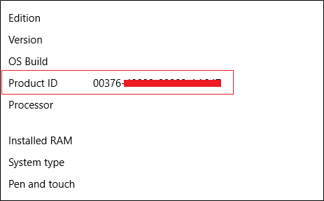
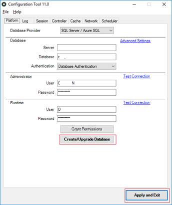
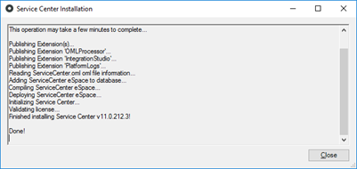
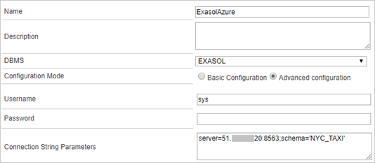
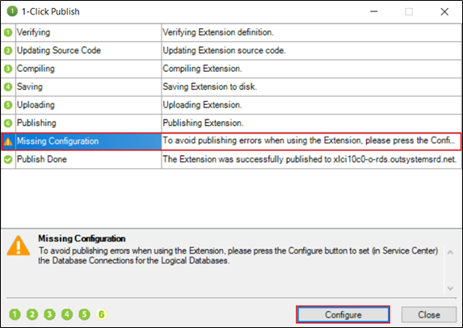
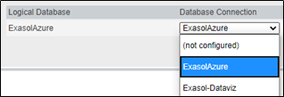
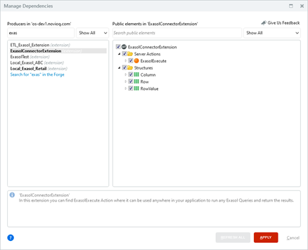
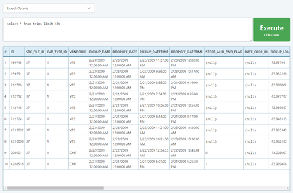

# Use Exasol with the OutSystems low-code platform 
## Background

The *Exasol database connector for OutSystems* component allows the OutSystems low-code application development platform to natively connect to the Exasol high-performance analytical database.  

Using Exasol with OutSystems enables companies to speed up their digital automation strategy and quickly implement low-code data driven business applications using Analytics, Artificial Intelligence, Predictive Modelling and Machine Learning techniques. 

The connector component exists of two parts: an ExasolDatabaseProvider.dll you can download at<https://dev.azure.com/NovioQPublic/OutSystemsExasolConnector>and an Execute function component you can download from the OutSystems Forge at <https://www.outsystems.com/forge/component-overview/8697/exasol-connector>. 

After the .dll has been installed, you can add a database connection to Exasol the ‘standard’ way, so by creating a Database Connection in Service Center and then importing tables using Integration Studio. All typical OutSystems Entity actions and Aggregates will be available.

All Exasol queries and commands not supported by OutSystems’ Aggregates and Advanced queries can be executed using the Execute function provided in the module. 

A Demo Application is available in the OutSystems Forge that describes how to use this Execute function, please see the documentation for more information on how to install the .dll.

**Core capabilities**

* Connect the on-premise OutSystems platform to the Exasol database natively (like current SQLServer, Oracle, iDB2 and MySQL).
* Add Exasol tables and views as external entities using Integration Studio.
* All typical OutSystems Entity (CRUD) actions, Aggregates and Advanced SQL are natively available.
* Use the embedded ExasolExecute extension for exceptional or custom queries and execute direct database commands (all DQL, DDL, DML, DCL available).
* The OutSystems Component and Documentation are available for download in [OutSystems Forge](https://www.outsystems.com/forge/component-overview/8697/exasol-connector)& [Azure DevOps](https://dev.azure.com/NovioQPublic/OutSystemsExasolConnector)

## Prerequisites

* Download the latest **Exasol ADO.NET Driver** from:[https://www.exasol.com/portal/display/DOWNLOAD](https://www.exasol.com/portal/display/DOWNLOAD/)/ and install it on your Windows Server where OutSystems is installed.
* Download the file **ExasolDatabaseProvider.dll** from: <https://dev.azure.com/NovioQPublic/OutSystemsExasolConnector>.
* To get a free evaluation licence, send us an email at:[support@novioq.com](mailto:support@novioq.com) with your **Windows Server Product ID**, which you can find in ****Settings > System > About****  

## How to get started

## Step 1: Installing the Exasol database Connector

1. **(Note: Make sure you save all the work being done on your OutSystems Environment before doing this step)**Go to your windows server where OutSystems is installed, open services and stop the following services:  
- World Wide Web Publishing Service  
- OutSystems Deployment Controller Service  
- OutSystems Deployment Service  
- OutSystems Scheduler Service  
- OutSystems SMS Connector Service
2. After you have sent us an email, you will receive a .lic file,
3. Copy the .lic file, the **EXADataProvider.dll** which you can find in where you installed **Exasol ADO.NET Driver,** and **ExasolDatabaseProvider.dll** file you downloaded, to this path: **“\OutSystems\Platform Server\plugins\database”**
4. After you copy the files, start the following services again:  
- World Wide Web Publishing Service  
- OutSystems Deployment Controller Service  
- OutSystems Deployment Service  
- OutSystems Scheduler Service  
- OutSystems SMS Connector Service
5. Go to **“ \OutSystems\Platform Server”** and open ****ConfigurationTool.exe****  
  
     First click on **Create/Update Database** Button (click Yes on new pop ups if needed) then click on **Apply and Exit** Button (click Yes on new pop ups if needed), the server will run some commands and then you will see if it’s “done”, and that’s it.      
  

## Step 2: Setup and use the connector in OutSystems

1. **Exasol prerequisites**
	1. Create your data model in Exasol.  
	*Please note the Known Limitations  section in the documentation provided with the connector files at*<https://dev.azure.com/NovioQPublic/OutSystemsExasolConnector>
	2. Create a user in Exasol that has all privileges you need in your OutSystems application.
		* The database user must have permissions to:
			+ List the necessary tables and views on the external database.
			+ Perform the operations Create, Read, Update, and Delete on those tables and views.
1. **Define a Connection to the External Database**
	1. Set up a connection to your database in Service Center:
		1. Open **Service Center** and go to **Administration > Database Connections**  
		
		2. Click **New Database Connection** and fill in the form. Parameters you need for the Connection String:
			1. IP Address of the Exasol Server
			2. Port Number where you can connect to Exasol Client e.g 8563
			3. Username and Password
			4. Name of the schema you want to connect to (Optional)  
			**You still can connect to other schemas as long as you have privileges for them**  
			
	2. Click **Test Connection** to check if the connection is working properly, then click **Create** to create the Database Connection.
2. **Map Tables or Views to Entities in an Extension Module**
	1. Open **Service Studio**, create a new application and add an Extension module to this application.
	2. Clicking on Create module will open **Integration Studio**. Connect to your OutSystems environment.
	3. Right-click the Entities folder in the Extension Tree and select Connect to External Table or View.  
	  
	  
	
	4. After closing the wizard, review the imported entity names, descriptions and data types for each attribute.
	5. Click **1-Click Publish** to publish the Extension Module.
	6. After publishing the extension, OutSystems warns you that you still need to configure which database connection the extension will use.
	7. In the **1-Click Publish** summary window, select the **Missing Configuration** warning and then select **Configure**  
	
1. **Configure the Extension to Use a Database Connection**
	1. In Service Center, make sure you are in the **Operation** tab of **Factory > Extensions > <your extension name>**.
	2. Associate the logical database name of the extension to the database connection that the extension will use in runtime.  
	  
	
2. **Using the entities in your application**
	1. In your application, click **Manage Dependencies** ....
	2. Add a dependency to the Extension and select the Entities that you will use in your application.  
	<https://success.outsystems.com/Documentation/11/Extensibility_and_Integration/Integrate_with_an_External_Database>for more screenshots and a general description of how to set up a connection to an external database.   
	  
	
3. **Using custom queries in your application**  
For custom queries, we have built an extension in OutSystems where you can find a function that can execute any query directly to Exasol Server:
	1. After installing the Forge Component, the extension **“ExasolConnectorExtension”** will be available in the Dependencies. In this extension you can find an action called “**ExasolExecute**”
	2. Add this Action to your application via "Manage Dependencies"  
	  
	
	3. This “**ExasolExecute**” action takes two parameters; SQL Query (Query to be executed) and Connection Name (Exasol Connection Name that’s installed on your OutSystems Server in Service Center), and it returns the result set in Rows, Columns, Count, and Affected Rows.
	4. You will find in our demo app how to use it properly.      
	

For more information or help visit [novioq.com](https://www.novioq.com/outsystems-exasol-connector/) or mail directly to [support@novioq.com](mailto:support@novioq.com) 

## More Information

*Visit the [OutSystems Forge](https://www.outsystems.com/forge/component-overview/8697/exasol-connector) for more extensive documentation and and [the NovioQ instruction page](https://novioq.com/outsystems-exasol-connector/) to watch step by step recordings on how to install and use this connector.*

