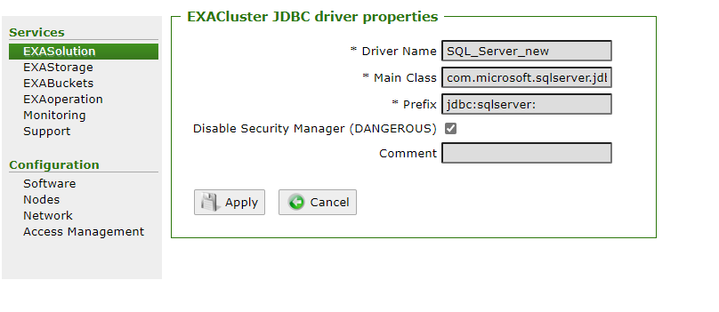

# Windows Authentication with SQL Server 
## Background

Sometimes, you want to set up a JDBC connection to your SQL Server database, but the SQL Server database only allows Windows Authentication (or the user you are trying to use is configured for Windows authentication). Windows authentication lets you use your Windows username and password to login, instead of using a different SQL Server password. You can read more about this authentication mode in [Microsoft's documentation](https://docs.microsoft.com/en-us/sql/relational-databases/security/choose-an-authentication-mode?view=sql-server-ver15). This article will show you how to configure your JDBC connection to use Windows authentication. 

## Prerequisites

The SQL Server JDBC driver needs to be configured in Exaoperation. There are two popular SQL Server drivers available:

* Official Microsoft JDBC Driver
* JTDS Driver (open source)

Both of these drivers can be used to connect Exasol and SQL Server. The JTDS Driver generally has better performance over the official SQL Server driver, but your results may vary based on the specific use case. You can find more details in the [Best Practices for IMPORT/EXPORT with SQL Server](https://community.exasol.com/t5/connect-with-exasol/best-practices-for-import-export-with-sql-server/ta-p/215) article.

You will find instructions to setup and configure the drivers in our [documentation](https://docs.exasol.com/loading_data/connect_databases/sql_server.htm)

## Windows Authentication with the Official SQL Server Driver

## Step 1: Disable Security Manager

To enable Windows authentication to work properly, you need to check the "Disable Security Manager" box in EXAoperation. SQL Server requires this so that it can find some additional libraries. However, these libraries are not needed and you **do not need to upload the mssql-jdbc_auth-9.2.1.x64.dll file.**

To disable the security manager, go to the "Software" Tab in Exaoperation and open the JDBC Drivers tab. Click your SQL Server JDBC driver which you installed and check the box to "Disable Security Manager":


Afterwards, click "Apply" to save the changes. 

## Step 2: Create Connection

Now you need to create the JDBC connection. The connection string will probably look different for each server based on its configuration, and may require additional parameters. What's important is that the following parameters are present: 

* domain=<domain_name>
* integratedSecurity=true
* authenticationScheme=NTLM

A full connection string would look like:


```sql
create or replace CONNECTION JDBC_SQLSERVER TO 'jdbc:sqlserver://<server host>:<port>;
 DatabaseName=<name>;
 domain=<domain>;
 integratedSecurity=true;
 authenticationScheme=NTLM' USER '<Windows User>' IDENTIFIED BY '<Windows Password>'; 
```
For example, my connection string is:


```markup
CREATE OR REPLACE CONNECTION JDBC_SQLSERVER to 'jdbc:sqlserver://192.168.56.113:1433;
 DatabaseName=TEST;
 domain=WINDEV2101EVAL;
 IntegratedSecurity=True;
 authenticationScheme=NTLM;
 ' USER 'test' IDENTIFIED BY 'test';
```
Note: Depending on your SQL Server settings, additional parameters may be needed.

For the User field, do not include the domain before your username. If your user looks like 'AD\user', then you will receive an error like:


```markup
[Code: 0, SQL State: ETL-5]  JDBC-Client-Error: 
Connecting to 'jdbc:sqlserver://192.168.56.113:1433;
DatabaseName=TEST;domain=WINDEV2101EVAL;IntegratedSecurity=True;
authenticationScheme=NTLM;' as user='WINDEV2101EVAL\test' failed: Login failed. 
The login is from an untrusted domain and cannot be used with Integrated authentication.
```
## Step 3: Test your connection

You can test your connection now and verify that it works:


```markup
import from jdbc at sqlserver_jdbc statement 'select 1';
```
## Windows Authentication with JTDS driver

## Step 1: Create Connection

Once the driver is installed, you need to create the JDBC connection. The connection string will probably look different for each server based on its configuration, and may require additional parameters. What's important is that the following parameters are present: 

* domain=<domain_name>
* useNTLMv2=true

A full connection string would look like:


```markup
create or replace CONNECTION JTDS_SQLSERVER TO 'jdbc:jtds:sqlserver://<server host>:<port>;
 DatabaseName=<name>;
 domain=<domain>;
 useNTLMv2=true;
 ' USER '<Windows User>' IDENTIFIED BY '<Windows Password>'; 
```
For example, my connection string is:


```markup
CREATE OR REPLACE CONNECTION JTDS_SQLSERVER to 'jdbc:jtds:sqlserver://192.168.56.113:1433;
 DatabaseName=TEST;
 domain=WINDEV2101EVAL;
 useNTLMv2=true;
 ' USER 'test' IDENTIFIED BY 'test';
```
Note: Depending on your SQL Server settings, additonal parameters may be needed.

## Step 2: Test your connection

You can test your connection now and verify that it works:


```sql
import from jdbc at jtds_sqlserver statement 'select 1';
```
## Troubleshooting

If you receive the following error message, then the Security Manager needs to be disabled for your JDBC connection in EXAoperation:


```markup
[Code: 0, SQL State: ETL-5]  JDBC-Client-Error: 
Internal failure: access denied ("java.lang.RuntimePermission" "loadLibrary.mssql-jdbc_auth-9.2.1.x64.dll") 
(Session: 1694589929857417216)
```
## Additional References

* [SQL Server IMPORT/EXPORT Best Practices](https://community.exasol.com/t5/connect-with-exasol/best-practices-for-import-export-with-sql-server/ta-p/215)
* [Set up SQL Server driver](https://docs.exasol.com/loading_data/connect_databases/sql_server.htm)
