# Working with Exasol geospatial data in Power BI 
## Background

This post is a short guide on using geospatial data in Power BI.

In particular we will:

* Convert the Exasol geospatial data in Power BI to allow us to use this data in power BI visualisations.
* Extract longitude and latitude from geospatial data and use this to render some locations on a standard map.
* Use geospatial data in its Well Known Text form to draw polygons on a third party visualization called icon-map, which is the current go to for rendering geospatial data in Well Known Text format (WKT)

## Prerequisites

* An Exasol database environment.
* Power BI Desktop and Exasol ODBC driver

## Getting geometry column data into useable form in Power BI

As you may have noticed Exasol's `geometry` columns generally don't show up immediately in Power BI after we load this datatype.

This is because they're currently mapped to a binary type, which is hidden by default in Power BI.

Let's have a look at a simple example:

Create some geometry data in a table.


```sql
CREATE TABLE cities(name VARCHAR(200), geo GEOMETRY(4326)); 
INSERT INTO cities VALUES('Berlin', 'POINT (13.36963 52.52493)'); 
INSERT INTO cities VALUES('London', 'POINT (-0.1233 51.5309)');
```
Let's quickly get this data via 'Get data', pick the Exasol connector, connect to the data source and then by using the navigator and selecting the right table:

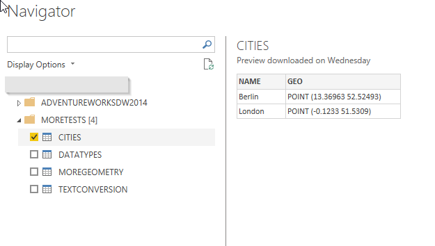When we fetch this data using the Exasol connector, we can see it's not showing up (yet) in the Fields we can use in our visualisations.

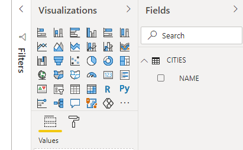 Let's quickly amend this!

## Edit the query using the Power Query Editor

Right mouse click on our query, in this case 'CITIES' and select 'Edit query'.

The Power Query Editor will pop up and we'll see both columns.

Let's change the column type to 'Text' by right mouse clicking on the 'geo' column header

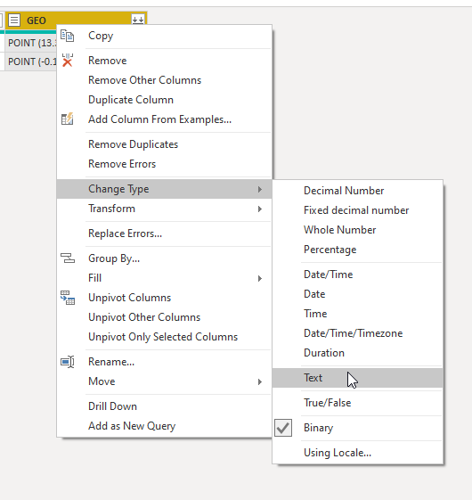Immediately after, at the top left right, press 'File' and then 'Close & Apply'

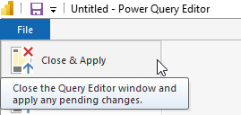 The geo field is now useable in any visualisation! That's it!

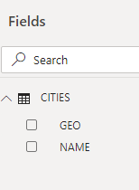## Extracting longitude and latitude from Well Known Text (WKT) data.

Let's continue from our example above. We now have a `geometry` column we could use straight away, but there's a challenge:

All standard map visualisations expect longitude and latitude coordinates. We have data in the form of `POINT( x y)`. 

How do we get this data out?

Luckily Power BI rather recently introduced some new helper functions that make these conversions and/or extractions a trivial task: ( `Geography.FromWellKnownText, Geography.ToWellKnownText, GeographyPoint.From, Geometry.FromWellKnownText, Geometry.ToWellKnownText, GeometryPoint.From` )

In our use case we'll use  `Geography.FromWellKnownText` .

This function will create a Geography record from our Well Known Text.

Let's edit our query again: I'm going to add a new column that will contain the new generated geography records:

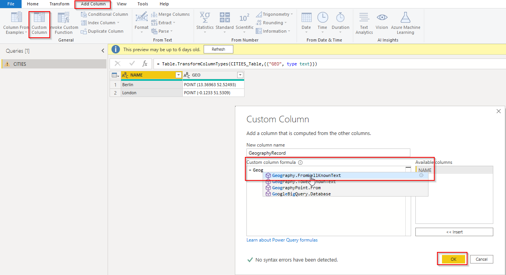

Navigate to the 'add column' tab, pick 'custom column', a wizard window will pop up and choose a name for your new column.  
To generate a new Record using our WKT data and the helper function in my case I write:

`Geography.FromWellKnownText([GEO])`

 Where GEO is the column name that contains my geometry data in WKT format.

This is the result in the power query builder:

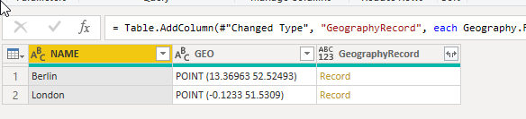

Finally, let's extract the latitude and longitude fields from this record column into new columns so we can use them in any map visuals we like.

Add 2 more custom columns:

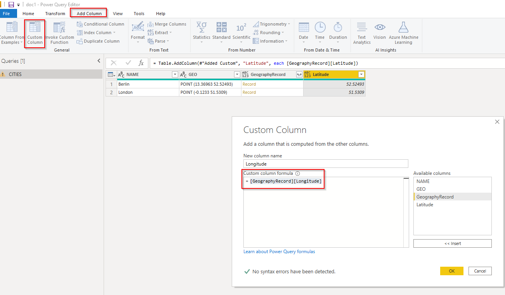

We'll use `[GeographyRecord][Longitude]` and`[GeographyRecord][Latitude]` as the column formulas.

Let's apply our changes and go back to the visualisation view.

After dragging our new latitude and longitude columns to the right map slots both cities appear on their respective locations.

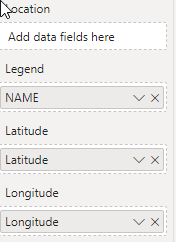


## Use geospatial data in its Well Known Text form on icon-map

For this third and final example we'll use a custom visual called "Icon Map".

Icon map is currently one of the only map visuals that allows to draw complex shapes from Well Known Text (WKT) as it is found in our geometry columns, as well as custom graphics, icons, SVGs, etc.

You can find icon map here as well as installation instructions: <https://icon-map.com/>

In this example we'll display New York's taxi zones on a map using their WKT representation stored in another exasol `geometry` column. In this case they're `MULTIPOLYGONS` instead of `POINTS`.  The sql scripts to generate the table and data are attached to this tutorial.

As we did in the first example, we'll first convert our `geometry` column to `Text` so we can use it in the icon map or other visuals.

From then on all we need to do is slot in the right fields in the visual.

In our case the POLYGON field is the converted geometry column.

We also need to fill in the category and the size (this can just be a custom column with size 1 in the case of WKT).

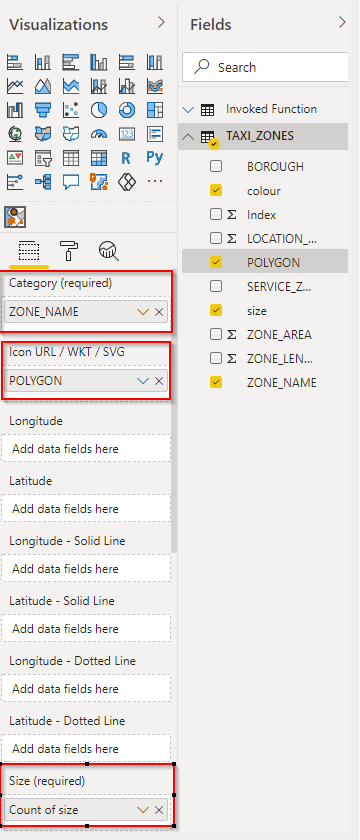

I've added some custom colour as well. The final result is this beautifully rendered map of the New York taxi zones.

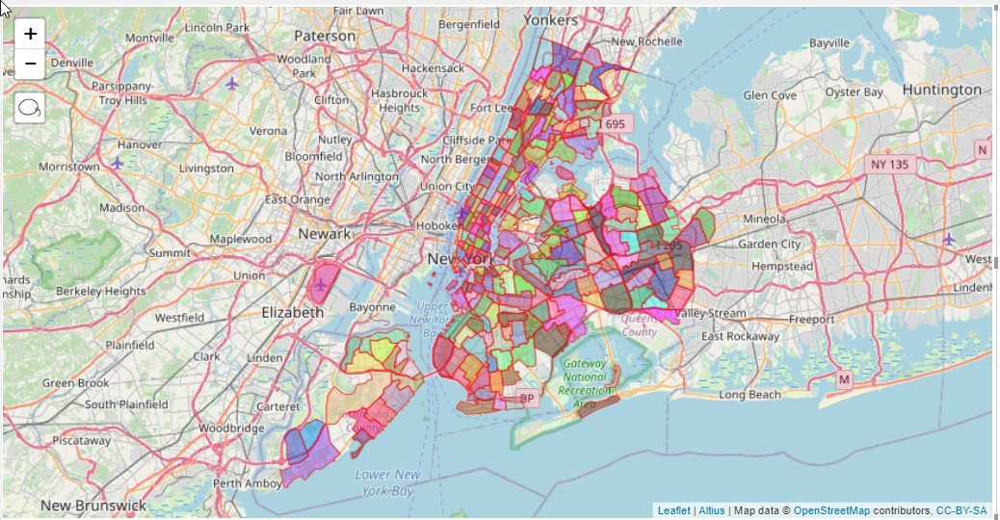

And this concludes our short tutorial.   
I hope you've found this helpful.

For more information on all topics I'd advise you to read the links under additional references.

## Additional References

Exasol's SQL reference section on geospatial data:  
[https://docs.exasol.com/sql_references/geospatialdata/geospatialdata_overview.htm](https://docs.exasol.com/sql_references/geospatialdata/geospatialdata_overview.htm?tocpath=SQL%20Reference%7CGeospatial%20Data%7C_____0)  
A how to on icon-map by the author himself:  
<https://powerbi.jamesdales.com/how-to-use-icon-map/>

A post by Microsoft's Chris Webb on recent additions to Power BI for working with WKT types which goes over the Geography/Geometry/WKT conversion functions in more detail:  
<https://blog.crossjoin.co.uk/2020/08/16/power-query-geography-and-geometry-functions-in-power-bi-and-excel/>

The wikipedia entry on Well Known Text:  
<https://en.wikipedia.org/wiki/Well-known_text_representation_of_geometry>

