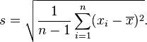

# Custom aggregate functions for large data sets 
## Background

This article demonstrates some basic principles for parallel programming within UDFs.

The task for this tutorial is to create UDF replacements for the internal functions AVG and STDDEV in the R language using UDFs that run inside the data base. Clearly, we don't expect stellar performance here, especially when compared to Exasol's built in versions. On the other hand, the provided solutions provide a blueprint for custom aggregate functions for customers.

The primary goals for our versions of AVG and STDDEV are:  
Goal 1: The UDFs should be robust enough to handle large data sets  
Goal 2: The UDFs should run in parallel as much as possible.

## Fundamentals of UDF programming

For UDF programming, there are a number of basic principles to keep in mind:

1: Scripts run in standard implementations of their respective language. This means, that UDFs in languages that have slower standard implementations will be slower than UDFs in languages that have faster implementations.

2. Resources for UDF scripts are always limited in order to avoid a UDF from freezing the machine. So, in UDFs, whenever the size of the input data is not limited, one has to take care of not storing all input data in temporary data structures as this very soon will use up all the resources which are available to the running script.

3. For scripts of type SCALAR-RETURNS or type SCALAR-EMITS, parallelism is automatically managed by Exasol if the script is invoked on a sufficiently large number of input rows.

4. For scripts of type SET-RETURNS or type SET-EMITS, parallelism is coupled to the GROUP BY clause of the SQL query which contains the script. Basically, it is guaranteed that each GROUP BY group is processed by a single invokation of the run() method of a script's instance. This allows to iterate over all the contents of a group and therefore enables users to create all kinds of aggregate functions. On the downside, one has to keep in mind that if the groups which are defined by the GROUP BY clause are too large, the script will not be able to store all data in temporary data structures. Hence, while it is possible to iterate over all the data via successive calls to ctx.next(), it is not possible to store all the data. In addition if the data to be processed is very large and the number of groups defined is very small, the number of parallel script instances also is very small, yielding suboptimal performance.

As a rule of thumb: With SET-RETURNS and SET-EMITS scripts, one should aim for medium sized groups (maybe 10000 to 100000 entries).

## Prerequisites

* R must be available as a programming language (delivered by default)

## How to create custom aggregate functions via UDFs for large data sets

## Step 1: Preparing some data


```"code-sql"
create schema r_stats; 
```
table n9 is a little helper for generating some test data.


```"code-sql"
create or replace table n9(x double); 
insert into n9 values 1,2,3,4,5,6,7,8,9; 
```
Table big contains nearly 390 million rows


```"code-sql"
create or replace table big(x double); 
insert into big select a.x from n9 a,n9,n9,n9,n9,n9,n9,n9,n9; 
```
## Step 2: First (unsuccessful) attempt

In our first attempt, we try to strictly follow the Exasol documentation which has an example like this:


```"code-sql"
--/  
CREATE or replace R SET SCRIPT r_stats(input_number DOUBLE) 
EMITS (avg DOUBLE, stddev DOUBLE) 
AS 
run <- function(ctx) { # fetch all records from this group into a single vector     
 ctx$next_row(NA)     
 ctx$emit( mean(ctx$input_number), sd(ctx$input_number) )   
} 
/ 
```
For small tables, this function is good enough.


```"code-sql"
select r_stats(a.x) from n9 a, n9; 
```
For larger tables, it fails withVM error: ...


```"code-sql"
select r_stats(x) from big; 
```
Clearly, the problem is that insider_stats(), we tried to read all the data at once which exceeded the resources available to the script instance.

## Step 3: Map-Reduce style UDFs for large data sets

For functions like AVG and STDDEV it is possible to avoid the problem above by following the MAP-REDUCE approach. Here, the computation is split into two functions:

1. A map() function that is started many times and which produces intermediate results.
2. A reduce() function that aggregates the intermediate results into a final result, which is started only a few times. As matter of fact, below we'll start the reduce() function only once, which is good enough here.

Then in SQL, a queries of the form


```"code-sql"
   SELECT reduce(...)    
   FROM (select map(...)          
   FROM ...          
   GROUP BY ...) 
```
is used to create the Map-Reduce processes. Map() functions correspond to the UDF types SET-RETURNS and SET-EMITS these functions are computed independently for each "GROUP BY" group, hence, by using an appropriate GROUP BY clause, it is possible to control the parallelism of query execution (see principle no. 4 above)

## Step 4: Map-Reduce style UDFs for AVG

First, let's focus on computing the AVG in MAP-REDUCE style The map() function is called many times in parallel. By later using appropriate GROUP BY clause, we will limit the size of the input data and therefore here we can simply read all data at once in this function


```"code-sql"
--/  
CREATE or replace R SET SCRIPT r_avg_map(input_number DOUBLE) 
EMITS (avg DOUBLE, weight DOUBLE) 
AS 
run <- function(ctx) 
{ # fetch all records from this group into a single vector     
 ctx$next_row(NA)     
 ctx$emit( mean(ctx$input_number), ctx$size()  ) 
} 
/ 
```
Our version of the reduce() function is called only once (other approaches are possible as well). This means, that there is no enforced limit on the size of the input data which means that we must loop over the data in small pieces. It is very important to avoid reading all the data at once.


```"code-sql"
--/
CREATE or replace R SET SCRIPT r_avg_reduce(tmp_avg DOUBLE, weight DOUBLE )
EMITS (avg DOUBLE) AS
run <- function(ctx)
{ 
    m <- 0
    repeat {
        if (!ctx$next_row(1000000)) break  # here, we take care read no more than 10000 rows at once
        m <- m + sum(ctx$tmp_avg * ctx$weight / sum(ctx$weight))
    }
    ctx$emit(m)
}
/
```
With map() and reduce() functions in place, we now have to create a SQL query which combines both and also has a proper GROUP BY clause in order to achieve good parallelism and not to exceed the resource limits, especially in the map() functions. By the rule of thumb above we aim to create groups of sizes about 10000 to 100000 elements. So for our queries on the table BIG, we aim to create a group by clause which produces around


```"code-sql"
select count(*) / 10000 from big; 
```
(=38742.0489) different groups of nearly identical size. This is achieved by using a dynamic group by clause like


```"code-sql"
    floor(random() * 38742.0489)  
```
The statement


```"code-sql"
select count(*) from (select 1 from big group by floor(random() * 38742.0489)); 
```
shows the number of group created and the statement


```"code-sql"
select (select count(*) from big)/38742.0489 as desired_group_size,        
avg(c) as actual_group_size, 
stddev(c) actual_group_size_stddev from 
(select count(*) as c from big group by floor(random() * 38742.0489)); 
```
shows the statistics of the group size.  
The desired value (38742.0489 above) also can be computed on the fly, yielding the following query for Map-Reduce style AVG computation:


```"code-sql"
select r_avg_reduce(m,w) from (select r_avg_map(x)       
from big       
group by floor(random() * (select count(*) / 10000 from big))) as p(m,w); 
```
On a (small and old) test cluster this took around 16 seconds As expected, this is really slow, compared to the 0.6 seconds of the internal AVG function:


```"code-sql"
select avg(x) from big; 
```
On the other hand, this is interpreted and slow generic R vs. extremely optimized C++, hence, a performance difference of two orders of magnitude is not really a big surprise.

## Step 5: Map-Reduce style UDFs for STDDEV

Now after computing the AVG function let's tackle STDDEV, again using MAP-REDUCE style. We implement the same definition of STDDEV, namely *corrected sample standard deviation*, which is implemented in Exasol.



(see also<http://en.wikipedia.org/wiki/Standard_deviation#Corrected_sample_standard_deviation>for more information)

Again, we start with the map() function. Later, via GROUP BY, we will guarantee that the input size is not too large, so we can program it rather carelessly:


```"code-sql"
--/
CREATE or replace R SET SCRIPT r_stddev_map(n DOUBLE, avg double)
EMITS (avg DOUBLE, square_diff DOUBLE, num DOUBLE) AS
run <- function(ctx)
{   ctx$next_row(NA)
    ctx$emit( ctx$avg[[1]], sum((ctx$n - ctx$avg)^2), ctx$size()  )
}
/
```
Again the reduce function is more complicated as the input size is not limited.


```"code-sql"
--/
CREATE or replace R SET SCRIPT r_stddev_reduce(avg DOUBLE, square_diff DOUBLE, num double)
EMITS (avg DOUBLE, square_diff DOUBLE, num DOUBLE) AS
run <- function(ctx)
{   
    s <- 0
    n <- 0
    m <- NA
    repeat {
        if (!ctx$next_row(10000)) break  # here, we take care read no more than 10000 rows at once
        s <- s + sum(ctx$square_diff)
        n <- n + sum(ctx$num)
        m <- ctx$avg[[1]]
    }
    ctx$emit( m, s, n)
}
/
```
When calling the above map() and reduce() functions, we have to provide some value for the average. This can be achieved by joining a scalar value to the BIG table:


```"code-sql"
select x,m from n9,(select 5 as m); 
```
actually, our map() and reduce() functions only compute the sum inside the formula above, the remainder of the formula for STDDEV is evaluated in standard SQL.  
Here is the call to compute STDDEV when the average (which for table BIG is 5) is known before:


```"code-sql"
select avg, sqrt(square_diff / (num -1))
from (select r_stddev_reduce(avg, square_diff, num)
	  from (select r_stddev_map(x, m)
			from big,
				 (select 5 as m)     -- here we provide the average
			group by floor(random() * (select count(*) from big) / 10000)));
```
Clearly, providing the average manually in the query is not nice. It is possible to combine several MAP-REDUCE computations, hence we simply can replace `(select 5 as m)` by the MAP-REDUCE computation above as a subselect:


```"code-sql"
select avg, sqrt(square_diff/(num-1))
from (select r_stddev_reduce(avg, square_diff, num)
      from (select r_stddev_map(x,m)
            from big, (select r_avg_reduce(m,w)                    -- inner MAP-REDUCE computation for the average
                       from (select r_avg_map(x)
                             from big
                             group by floor(random()*((select count(*) from big) / 10000))) as p(m,w)
                       ) as l(m)     
            group by floor(random()*(select count(*) from big) / 10000)));
```
## Additional Notes

In this solution we described basic principles for programming UDFs. With some care it is straightforward to create powerful distributed and parallel in database computations using just a few lines of R. Regarding performance, these computations cannot compete with highly optimized built-in functions of Exasol but it is well in the range of what could be desired from a parallel programming environment for languages like R, Python, or Java at a scale these languages are not inherently designed for and with the ease of simple scripting.

## Additional References

* [UDF Scripts](https://docs.exasol.com/database_concepts/udf_scripts.htm)
