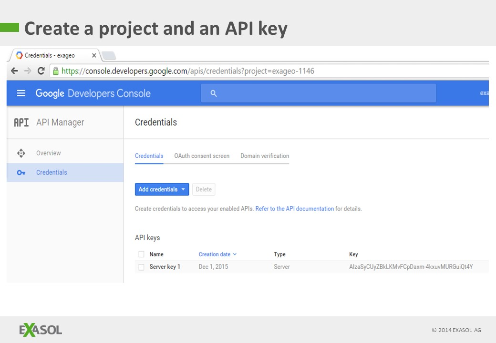
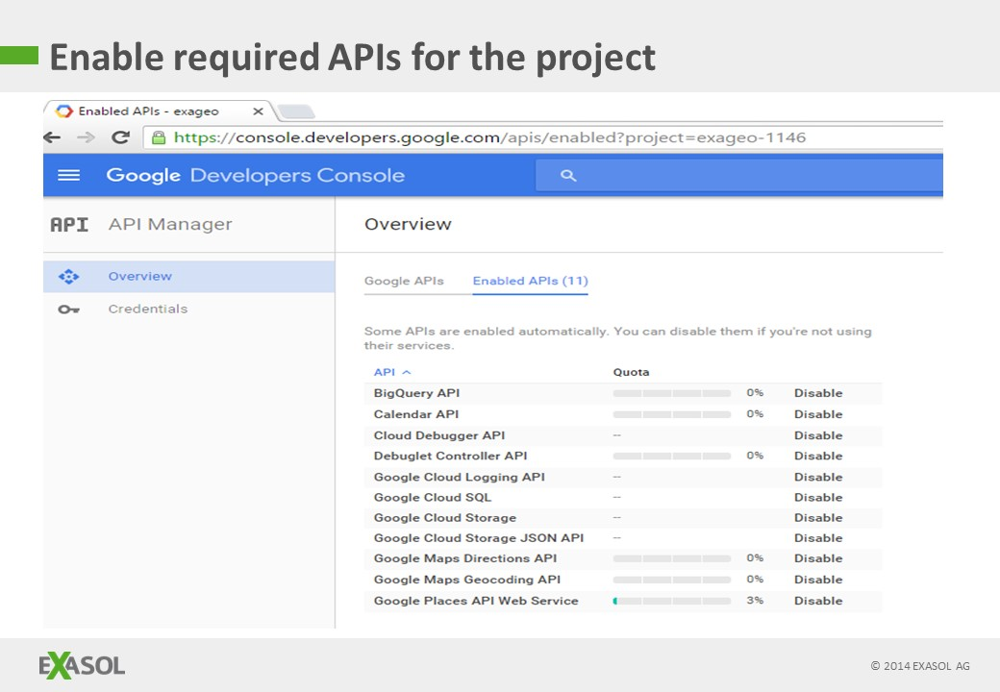
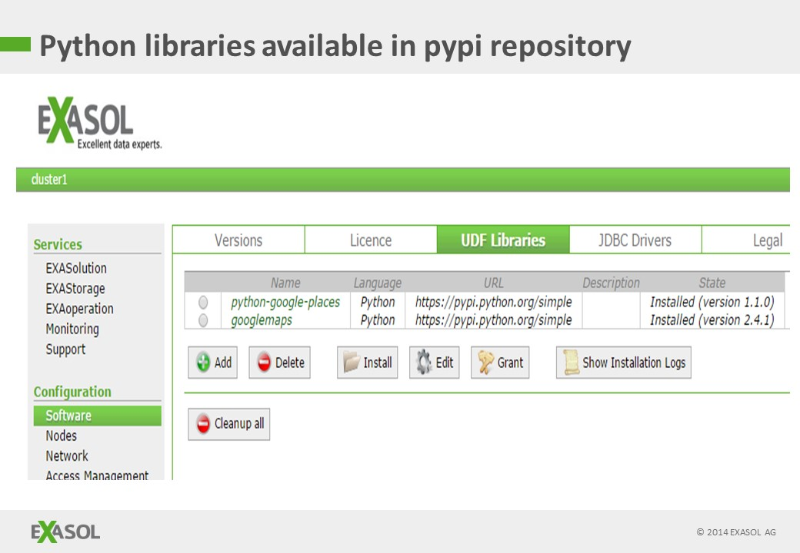
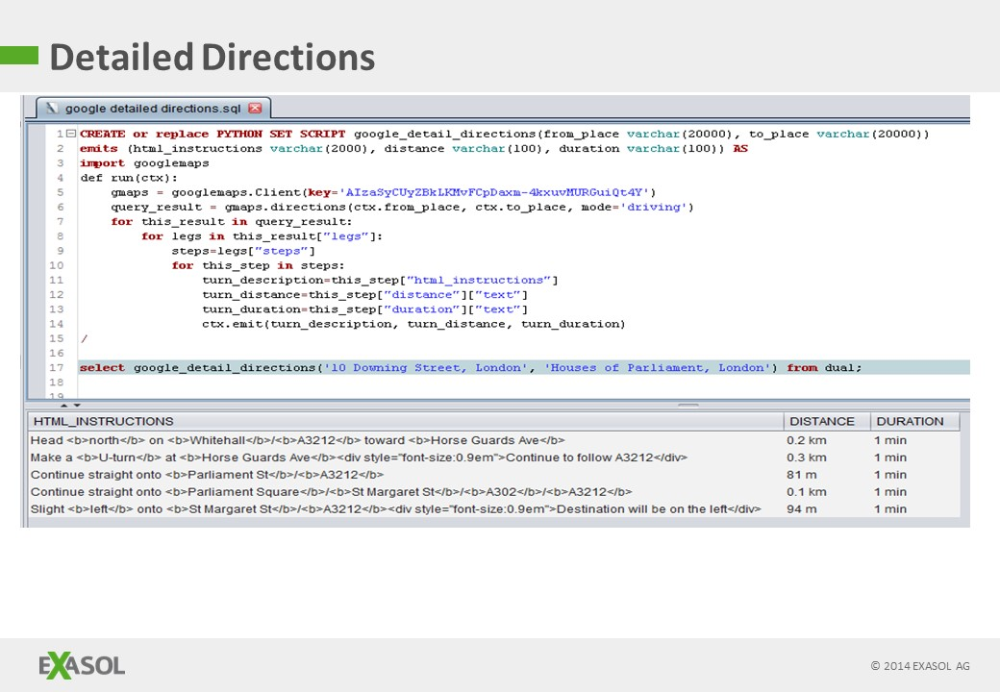

# Use Google Maps API with EXASOL 
## Background

See <https://www.youtube.com/watch?v=C3eyqTw3HsQ> for a video demonstration of this process

## Prerequisites

1. First, sign up for a developer account at Google <https://developers.google.com/>
2. Now create a Google developer project, activate the APIs you need, and most importantly, generate an API key - this will need to be used when you run your script 
3. You can now import the UDF libraries in EXAOperation in the usual way - see attached for the Python libraries 

**You should replace the API key given here with you own key**

## Using Google Maps API with Exasol

## Geocoding


```"code
--/
CREATE or replace PYTHON SET SCRIPT google_geocode(placename varchar(200)) 
emits (lat double, lng double) AS
import googlemaps
def run(ctx):
	gmaps = googlemaps.Client(key='<your-secret-key>')
	geocode_result = gmaps.geocode(ctx.placename)
	for this_place in geocode_result:
		lat=this_place["geometry"]["location"]["lat"]
		lng=this_place["geometry"]["location"]["lng"]
		ctx.emit(lat,lng)
/

select google_geocode('10 Downing Street, London, UK') from dual;
```
## Reverse Geocoding


```"code
--/
CREATE or replace PYTHON SET SCRIPT google_reverse_geocode(lat double, lng double) emits (placename varchar(20000)) AS
import googlemaps
def run(ctx):
	gmaps = googlemaps.Client(key='<your-secret-key>')
	reverse_geocode_result = gmaps.reverse_geocode((ctx.lat, ctx.lng))
	for this_result in reverse_geocode_result:
		if str(this_result["geometry"]["location_type"])=='ROOFTOP':
			ctx.emit(str(this_result["formatted_address"]))
/

select google_reverse_geocode(51.5034066, -0.1275923) from dual;
```
## Nearest Bakery to EXASOL Head Office


```"code
--/
CREATE OR REPLACE PYTHON SET SCRIPT google_nearest(address_search varchar(2000), category_search varchar(2000)) 
EMITS (placename varchar(20000), geolocation varchar(200)) AS
import googleplaces
from googleplaces import GooglePlaces

def run(ctx):
	google_places = GooglePlaces('<your-secret-key>')
	query_result = google_places.nearby_search(
	   location=ctx.address_search, keyword=ctx.category_search, rankby='distance')

	for this_place in query_result.places:
		ctx.emit(this_place.name, str(this_place.geo_location))

/

select google_nearest('Neumeyerstrasse, Nuremberg, Germany', 'Bakery') from dual;
```
## Driving distance and time between two points


```"code
--/
CREATE or replace PYTHON SET SCRIPT google_summary_directions(from_place varchar(20000), to_place varchar(20000)) 
emits (distance_metres double, duration_seconds double) AS
import googlemaps
def run(ctx):
	gmaps = googlemaps.Client(key='<your-secret-key>')
	query_result = gmaps.directions(ctx.from_place, ctx.to_place, mode='driving')
	for this_result in query_result:
		for legs in this_result["legs"]:
			distance_metres=legs["distance"]["value"]
			duration_seconds=legs["duration"]["value"]
			ctx.emit(distance_metres, duration_seconds)
/


select google_summary_directions('Buckingham Palace, Westminster, London', '10 Downing Street, London') from dual;
```
## Detailed Satellite Navigation between two points



## Additional References

<https://community.exasol.com/t5/connect-with-exasol/importing-and-exporting-data-with-google-bigquery/ta-p/1385>

[test](xml-parsing-using-java-udfs.md)

