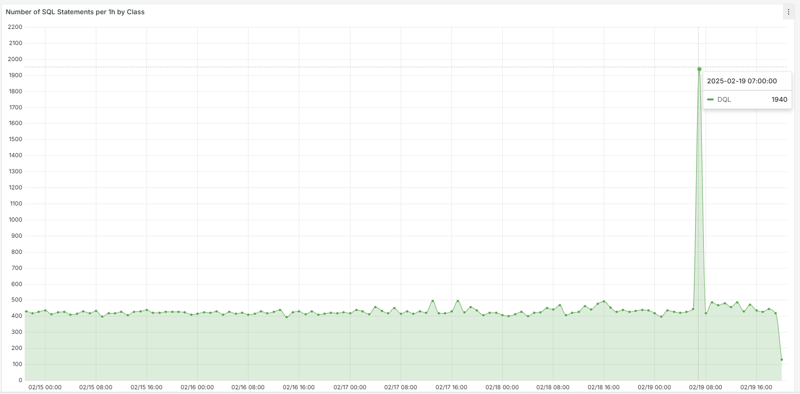

# How to search Exasols audit tables to see which users had the most SQL queries in a given period

## Problem

We have an unusual peak in our DQL queries and would like to know which user with which IP is responsible for it.



This diagram visualizes one specific metric for COMMAND_CLASS = 'DQL' from the table table [EXA_SQL_HOURLY](https://docs.exasol.com/db/latest/sql_references/system_tables/statistical/exa_dba_audit_sql.htm).

## Solution

Using the tables 
* [EXA_DBA_AUDIT_SESSIONS:](https://docs.exasol.com/db/latest/sql_references/system_tables/statistical/exa_dba_audit_sessions.htm) The system table stores all the sessions from the moment you enable [Auditing](https://docs.exasol.com/db/latest/administration/aws/manage_database/enable_auditing.htm) and start the database.

* [EXA_DBA_AUDIT_SQL:](https://docs.exasol.com/db/latest/sql_references/system_tables/statistical/exa_dba_audit_sql.htm) The system table stores all executed SQL statements from the moment you enable [Auditing](https://docs.exasol.com/db/latest/administration/aws/manage_database/enable_auditing.htm) and start the database.

we can create the following query 

```sql
SELECT
    --in case the period should be aggregated by minutes
    TRUNC(sq.START_TIME,'MI') as INTERVAL_START
   
    --in case the period should be aggregated by hours
    --TRUNC(sq.START_TIME,'HH') AS INTERVAL_START
    
    --in case the period should be aggregated by days
    --TRUNC(sq.START_TIME,'DD') AS INTERVAL_START
    
    , se.USER_NAME                 
    , se.OS_USER
    , se.HOST
    , COUNT(*) AS NUMBERS_OF_QUERIES
FROM
    EXA_STATISTICS.EXA_DBA_AUDIT_SQL sq
JOIN
    EXA_STATISTICS.EXA_DBA_AUDIT_SESSIONS se
ON
    se.SESSION_ID=sq.SESSION_ID
WHERE
    sq.START_TIME BETWEEN '2025-02-19 07:00:00' and '2025-02-19 08:00:00'
AND nvl(se.LOGOUT_TIME, systimestamp) >= '2025-02-19 07:00:00' AND se.LOGIN_TIME <= '2025-02-19 08:00:00'
AND COMMAND_CLASS IN ('DQL')
GROUP BY 1, 2, 3, 4
ORDER BY 
    5 DESC 
LIMIT 100;
```

### Example output

| INTERVAL_START | USER_NAME | OS_USER | HOST | NUMBERS_OF_QUERIES |
| :---:   | :---: | :---: | :---: | :---: |
|2025-02-09 07:20:00|USER_X|OS_X|10.xxx.xxx.2|750|
|2025-02-09 07:22:00|USER_X|OS_X|10.xxx.xxx.2|300|
|2025-02-09 07:30:00|USER_Y|OS_Y|10.xxx.xxx.4|200|
|2025-02-09 07:21:00|USER_X|OS_X|10.xxx.xxx.2|50|
|2025-02-09 07:50:00|USER_Z|OS_Z|10.xxx.xxx.3|40|

## Additional References

* [Auditing](https://docs.exasol.com/db/latest/database_concepts/auditing.htm)
* [EXA_DBA_AUDIT_SESSIONS](https://docs.exasol.com/db/latest/sql_references/system_tables/statistical/exa_dba_audit_sessions.htm)
* [EXA_DBA_AUDIT_SQL](https://docs.exasol.com/db/latest/sql_references/system_tables/statistical/exa_dba_audit_sql.htm) 


*We appreciate your input! Share your knowledge by contributing to the Knowledge Base directly in [GitHub](https://github.com/exasol/public-knowledgebase).* 
