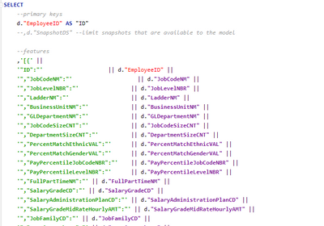

# DataRobot UDF Integration

I created a UDF that allows you to make prediction calls to DataRobot from within Exasol via Python. The only painful part is having to construct a JSON data structure to pass to DataRobot. I'm currently accomplishing that via string concatenation like so: 

```
CREATE OR REPLACE PYTHON SCALAR SCRIPT "UDF_DataRobot" (deployment_id VARCHAR(100), explanations DECIMAL(2,0), json VARCHAR(5000)) EMITS ("PredictionJSON" VARCHAR(5000)) AS
#####################################################################
# Description: This script takes a deployment ID and JSON features and returns a prediction JSON from DataRobot
#
# Author: Mark Jackson
#
# Usage:
#   deployment_id = the ID you can get on the integration page of a deployment in DataRobot
#   explanations = the number of prediction explanations you want to have returned
#   json = a list of features in JSON format for DataRobot to Score
#
# Version History:
# [03/29/2021] MJ Original Version
#####################################################################
import sys
import json
import glob

sys.path.extend(glob.glob('/buckets/bucketfs1/pythonbucket/requests-2.18.4/*'))

import requests

API_URL = 'https://#YOUR SERVER HERE#/predApi/v1.0/deployments/{deployment_id}/predictions'
API_KEY = '' #YOUR API KEY
MAX_PREDICTION_FILE_SIZE_BYTES = 52428800  # 50 MB

def run(ctx):
    json_data = ctx.json
    DEPLOYMENT_ID = ctx.deployment_id
    explanations = ctx.explanations

    class DataRobotPredictionError(Exception):
        """Raised if there are issues getting predictions from DataRobot"""


    def make_datarobot_deployment_predictions(data, deployment_id):

        # Set HTTP headers. The charset should match the contents of the file.
        headers = {
            'Content-Type': 'application/json; charset=UTF-8',
            'Authorization': 'Bearer {}'.format(API_KEY),
        }

        url = API_URL.format(deployment_id=deployment_id)

        params = {
            # If explanations are required, uncomment the line below
             'maxExplanations': explanations,
            # 'thresholdHigh': 0.5,
            # 'thresholdLow': 0.15,
            # Uncomment this for Prediction Warnings, if enabled for your deployment.
            # 'predictionWarningEnabled': 'true',
        }
        # Make API request for predictions
        predictions_response = requests.post(
            url,
            data=data,
            headers=headers,
            verify=False,
            params=params,
        )
        _raise_dataroboterror_for_status(predictions_response)
        # Return a Python dict following the schema in the documentation
        return predictions_response.json()


    def _raise_dataroboterror_for_status(response):
        """Raise DataRobotPredictionError if the request fails along with the response returned"""
        try:
            response.raise_for_status()
        except requests.exceptions.HTTPError:
            err_msg = '{code} Error: {msg}'.format(
                code=response.status_code, msg=response.text)
            raise DataRobotPredictionError(err_msg)

    try:
        predictions = make_datarobot_deployment_predictions(json_data, DEPLOYMENT_ID)
    except DataRobotPredictionError as exc:
        print(exc)
        return 1

    ctx.emit(json.dumps(predictions, indent=4))
    return 0
/
```
