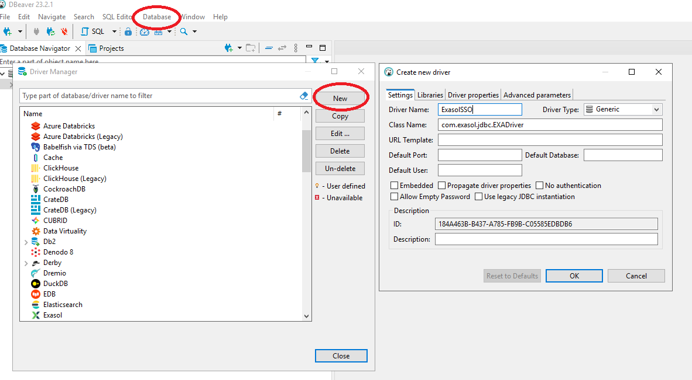
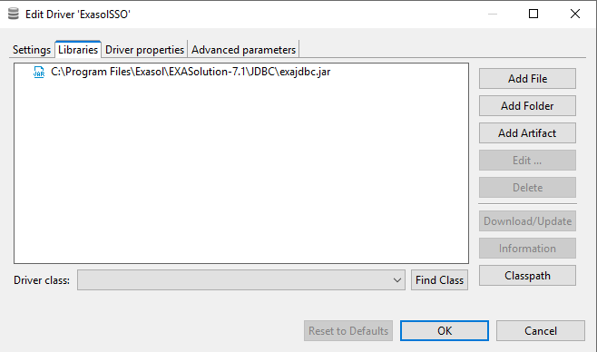
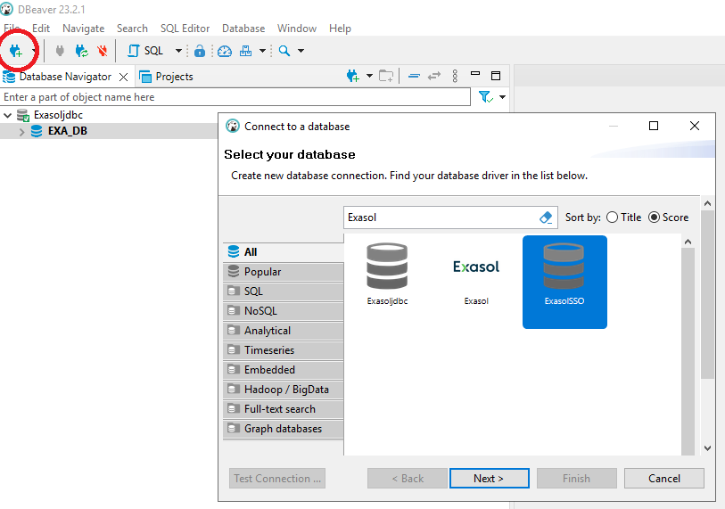
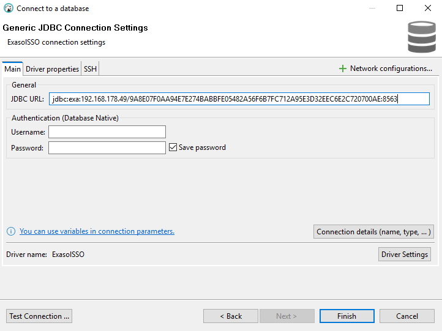
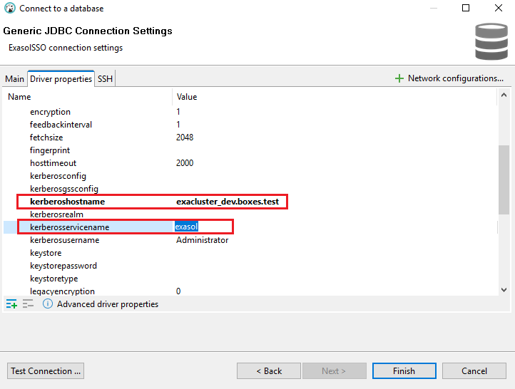

# Setting up DBeaver for Kerberos authentication to Exasol
## Prerequisites
* Exasol DB is configured to use Kerberos for user authentication
* Dbeaver is installed on the user's machine
* OS user is able to get appropriate kerberos tgt-ticket to authenticate in Exasol DB
* Corresponding DB user is created which is identified by the OS user's kerberos principal. This DB user has a privilege to create sessions. For example:
```sql
create user ad_john_smith identified by KERBEROS PRINCIPAL 'jsmith@BOXES.TEST';
GRANT CREATE SESSION TO ad_john_smith;
```
* Connection was successfully tested with **exaplus -k**. Service name and Host name of the Exasol DB Kerberos principal are known.


## 1. Install latest Exaplus or Exasol JDBC driver 
Dbeaver already has an Exasol driver in its standard delivery, but this driver might not be the newest one and may not include kerberos libraries. 
You will need to create a new driver in Dbeaver and for that you should download and install the newest Exasol JDBC driver.
If you want to first check that Kerberos authentication was set up correctly in your environment, you may want to download and use Exaplus, which already contains the latest JDBC driver.

* Download and install latest version of Exaplus https://downloads.exasol.com/clients-and-drivers/exaplus
* Alternatevly, you can download and install just the latest version of JDBC driver here https://downloads.exasol.com/clients-and-drivers/jdbc 

## 2. Create a new driver in Dbeaver
* Run the Dbeaver and navigate to **Database->Driver manager** and click **New** to create a new Exasol driver.
* Specify following driver properties:
> **Driver name** : arbitrary name for a new exasol Driver \
> **Driver type** : ```Generic``` \
> **Class name** : ```com.exasol.jdbc.EXADriver```



* Go to **Libraries** tab and click **Add file**. Navigate to Exaplus or JDBC driver directory (for example: C:\Program Files\Exasol\EXASolution-7.1\EXAplus) and select **exajdbc.jar**.



* Click **Ok** to create a new Dbeaver driver.

## 3. Create and test a connection using Kerberos authentication
Before creating a new connection make sure that:
> - you know the correct values of Service name and Host name of the Exasol DB Kerberos principal (those are set during configuration of Exasol DB to use a Kerberos authentication)
> - your OS user have an appropriate tgt-ticket in it's credential cache
> - DB user was created which is identified by OS user's kerberos principal

* Click **Create new Database connection** and select our new Exasol driver
  


* Enter the database full connection string starting with **jdbc:exa:** in **JDBC URL**. Leave **user** and **password** empty.



* Go to **Driver properties** tab and specify only 2 additional parameters (**kerberoshostname** and **kerberosservicename**) and nothing else
> **kerberosservicename** : The service name of the Exasol DB Kerberos principal. Same as **Service name** parameter in **Exaplus -k**  \
> **kerberoshostname** : The host name of the Exasol DB Kerberos principal. Same as **Host** parameter in **Exaplus -k** \



* Click **Test connection** and if it works click **Finish**. Connection is configured.
