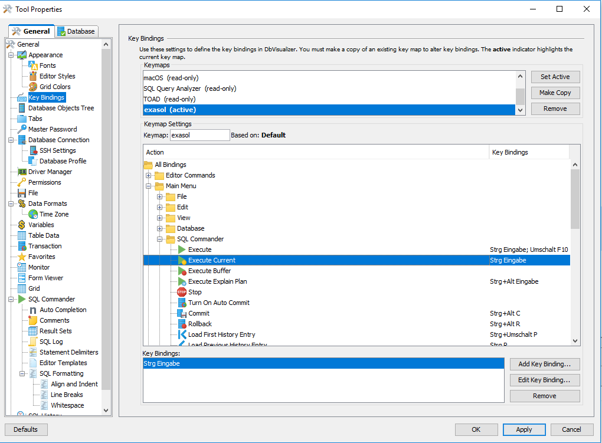
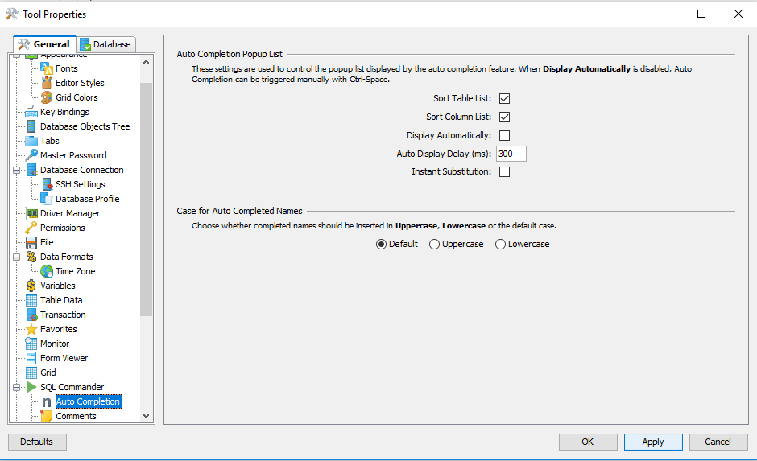
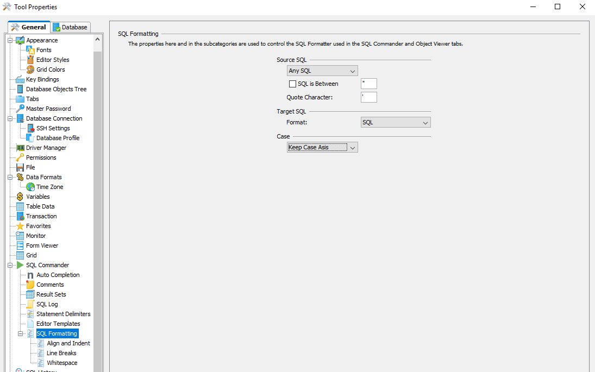

# DBVisualizer: Best Practices when switching from EXAplus 
## Problem

When switching from EXAplus, you would like

* to change the shortcut for executing the current statement
* to do Auto completion
* create LUA Scripts / UDFs
* use of Favorites

## Solution

## Change keyboard shortcuts

When switching from EXAplus, the first thing that you would like to change is the shortcut for executing the current statement. In DBVisualizer this is set to**Ctrl + .**  per default.  In EXAplus on the other hand this shortcut is defined as Ctrl + Enter. To chance it go to Tools -> Tool Properties and open the Key Bindings Dialog in the tree, create a copy of the current keymap called exasol and change the Binding for Main menu -> SQL Commander -> Execute Current:

## Auto completion

It's important to note that in DbVisualizer the auto completion of table/column names works a little bit different than in EXAplus. In EXAplus you had to type first the schema name to access the tables. In DBVisualizer on the other hand you can directly access the table or column name without the need to fully qualify the object. It's also important to note that in DBVisualizer if you are in the context of a schema only the tables of that schema are shown in the auto completion.

You can also customize the behavior of the auto-completion in Tools -> Tool Properties in the Dialog SQL Commander -> Auto Completion:

## Creation of LUA Scripts / UDFs

In DBVisualizer LUA scripts / UDFs should be created as a SQL block.

The start of the SQL Block is**--/**and the end of the block is defined with**/**:


```"code-java"
--/ CREATE LUA SCRIPT MY_CAT RETURNS TABLE AS  return query([[select * from cat]])  /
```
Per default**keywords in DBVisualizer are displayed in uppercase**, so if you open an existing LUA script keywords like are automatically transformed to uppercase, so the case sensitive LUA script is not working anymore, please change this setting in Tool Properties -> Tools - SQL Formatting to "**Keep Case Asis**"

Please also have a look at the official documentation <http://confluence.dbvis.com/display/UG100/Executing+Complex+Statements>

## Favorites versus Bookmarks

In EXAplus frequently used SQL Statements have been stored in the favorite tab. In DBVisualizer you have a similiar feature called Bookmarks. Learn more in the official documentation:<http://confluence.dbvis.com/display/UG100/Managing+Frequently+Used+SQL> .

### EXAplus commands

EXAplus commands like**set autocommit off**  are not working in DBVisualizer. DBVisualizer has it's syntax for it's client commands starting with @, e.g.**@set autocommit off;**See also official documentation: ** <http://confluence.dbvis.com/display/UG100/Using+Client-Side+Commands> 

## Additional Notes

## Known Issues of DBVisualizer

* The open schema call is currently not interpreted by DBVisualizer
* Newly created schemas are not shown in the SQL Editor drop down menu -> Workaround reconnect the connection
* R Scripts sent from a Windows OS using DBVisualizer can't be executed because of windows CRLF, Following Workaround

In the current version, DbVisualizer uses the platforms linefeed convention, i.e. CRLF for Windows and LF for all other platforms. There is a way to force DbVisualizer to use LF for the text it sends to the database regardless of platform:

1) Open the file named**DBVIS-HOME/resources/dbvis-custom.prefs**(where DBVIS-HOME is the DbVisualizer installation folder) in a text editor,

2) Add the following on a new row:**dbvis.exasol.ReplaceCRLFwithLF=true**

3) Restart DbVisualizer. 

