# Exasol loves Lua (part 1) - how to use Eclipse IDE support for writing Lua 
## Blog snapshot

In this first part of a series of blogs, you will learn:

* How to set up Lua Development Tools in Eclipse
* How to get coding support and what each function does
* Ways to make testing easier with MoreUnit

Every craft needs the right tools. Imagine a modern master cabinet maker trying to carve the wood with a butter knife - it's unthinkable.  

*

Software development is no different. You need the right tools to code faster, reduce the risk of errors and make your job as easy as possible. But the key is knowing what's right for you - as there are a wide range of IDEs available, all with their own merits and challenges. 

The [Eclipse](https://www.eclipse.org/ "Eclipse") IDE is probably best know for its superb Java programming support. And as Eclipse was built around the idea of maximum extensibility, a large ecosystem of plug-ins has grown around it over the years.

## Preparation

Before we can start, there are two things that you need on your machine: a Lua interpreter and [LuaRocks](https://luarocks.org/ "LuaRocks"), the Lua package manager.

On a Debian-based Linux you can for example install this using the following command:


```bash
sudo apt install lua5.1 luarocks 
```
In case you are wondering why I picked version 5.1 here, that is because it works with older versions of Exasol too, like 6.2 and 7.0.

We need a proper stand-alone Lua Interpreter later instead of the Java-Native interpreter that comes with LTD if we want to use all features.

## Which Eclipse plug-ins should you use?

Today I want to draw your attention to a collection of Eclipse plug-ins called [Lua Development Tools (LTD)](https://www.eclipse.org/ldt/ "Lua"). A short disclaimer: while the project is stable and works nicely, no features have been added in quite a while, due to the lack of developer availability.

## How to Setup LTD in Eclipse 20.4

1. Download [Eclipse IDE for Java programmers](https://www.eclipse.org/downloads/packages/release/2020-06/r/eclipse-ide-java-developers "Eclipse") as a basis (we will learn later why that is a good pick for Lua too)
2. Unpack it in your home directory e.g. under "Applications/Eclipse-LDT"
3. Download the [Dynamic Languages Toolkit (DLT)](http://ftp.fau.de/eclipse/technology/dltk/downloads/drops/R5.7/R-5.7.1-201703020501/dltk-core-R-5.7.1-201703020501.zip "Dynamic") to the temp directory. This isn't part of Eclipse anymore so we need to install it by hand.
4. In Eclipse IDE


	1. Help → Install new software...
	2. In dialog "Install":
		1. Click "Add"
		2. In dialog "Add Repository":
			1. Click "Archive"
			2. Select "/tmp/dltk-core-R-5.7.1-201703020501.zip"
			3. Name: "DLTK Core 5.7.1"
			4. Click "Add"
			5. Select "Uncategorized" in the software list:  
			
			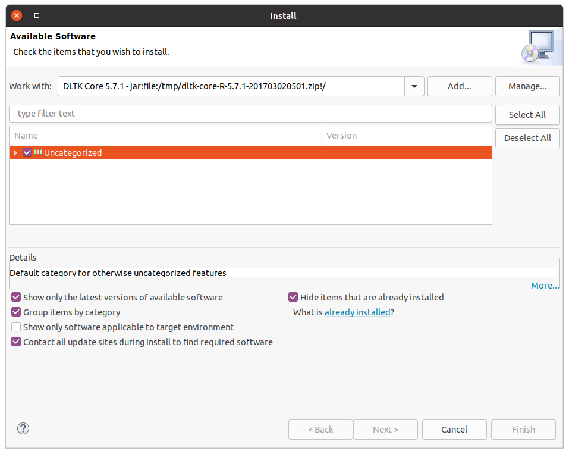
			
			6. Click "Next", "Next", accept the license and finish the wizard.
			7. Don't restart yet. We have more to install.
	3. Help → Install new software...
	4. In dialog "Install":
		1. Click "Add"
		2. In dialog "Add Repository":
			1. Name: "Lua Development Tools (LDT)"
			2. Location: <http://download.eclipse.org/ldt/releases/stable>
			3. Click "Add"
			4. Click "Next", "Next", accept the license and finish the wizard.
			5. Again, don't restart just yet.
	5. Help → Eclipse Marketplace
	6. In dialog "Eclipse Marketplace"
		1. Find: "MoreUnit"
		2. Click "Install"
		3. Click "Confirm"
		4. Accept license
		5. Click "Finish"
		6. The package is unfortunately not signed. So Eclipse wants confirmation at this point that you want to install anyway.
		7. Restart.

Next we are going to tell LDT where to find the Lua interpreter that we installed earlier.

1. Window → Preferences ...
	1. In dialog "Preferences"
	2. Lua Interpreters  
	
	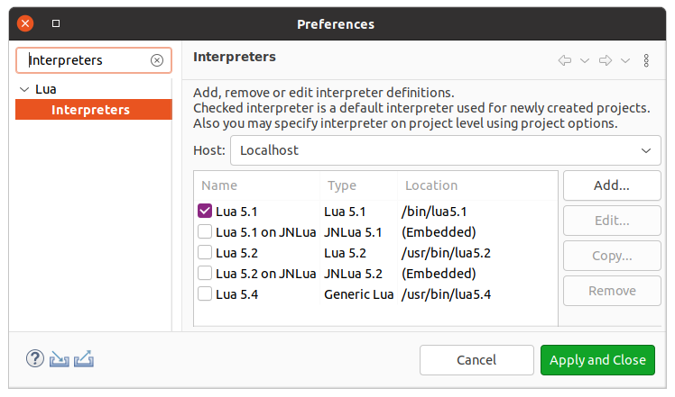 Make sure that you have an entry for the Lua 5.1 interpreter you installed earlier.
	
	3. Edit the "Lua 5.1" entry
	4. In dialog "Edit Interpreter":
		1. Pick the path to the "Interpreter executable" 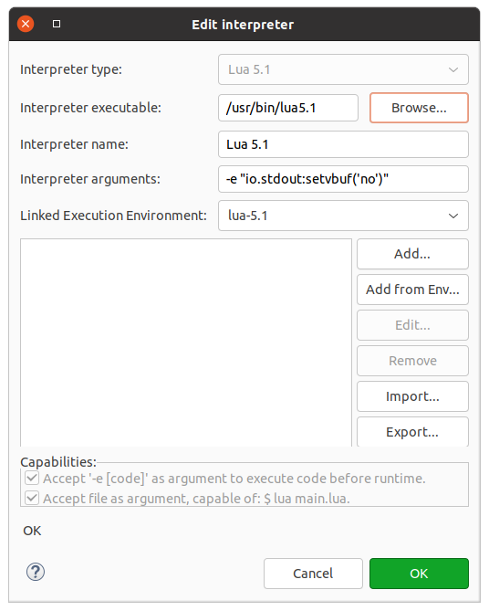
		2. Click "OK"
	5. Click "Apply and Close"

For now we are set. Later we will install another plug-in for even more convenience.

## Importing a project

Let's dive in directly what the LDT can do for you. And to do so, we will use an existing Lua project, Exasol's [remotelog](https://github.com/exasol/remotelog-lua "remotelog"). If you worked with a project in a Git repository before, this procedure will look very familiar.

1. Window → Show View → Other...
2. Select the "Git Repositories" view  
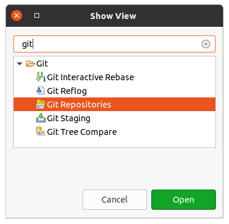
3. Click "Open"
4. Paste the following link in the empty space in the "Git Repositories" view:  
<https://github.com/exasol/remotelog-lua.git>  
You should now have an entry that looks like this:  

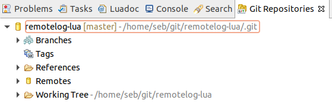

5. Import the contained project

## How to get coding support and what each function does

You now have a Lua project with implementation, tests and documentation.

Next, please open the main implementation file of this project: `src/remotelog.lua`

The first thing you will notice is that you get syntax highlighting for the Lua code and comments and [LDoc](https://stevedonovan.github.io/ldoc/manual/doc.md.html "LDoc"). Of course LDT also brings code completion. Those two things are the minimum feature set you can expect from an IDE.

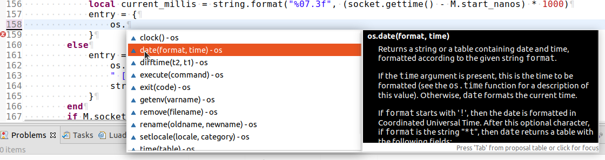

But that's not all. LDT also recognizes LuaDoc comments and displays them nicely. Hover your mouse over the function `M.init` and you will see, what I mean.

## 

Now, scroll all the way down put your cursor on the line reading:


```
start_high_resolution_timer()
```
Click F3 and LDT jumps to the definition of this function. Note that due to the dynamic nature of Lua this works only in simple cases where the LDT can trace back a function reference. If you store the reference in a table for example, LDT does not realize this. Still handy in many situations though.

Another useful feature is the "Rename variable" refactoring. Put the cursor on a variable or function and press [ALT] + [SHIFT] +[R]. The name gets selected and if you change it, all related instances get changed too. This is probably the most often used refactoring of all and it is good to have it.

Other refactorings like extract method like you know them from Java for example are unfortunately missing. They are on the other hand terribly hard to safely implement on a dynamic language like Lua, so this does not come as a surprise.

Another important aspect LDT offers is defining source directories in a project. They are automatically added to the Lua path, enabling you to execute unit tests directly from within Eclipse.

Right-click on the Project "`remotelog`" in the Script Explorer and select "Properties". In the properties dialect find the section Lua/Build path.

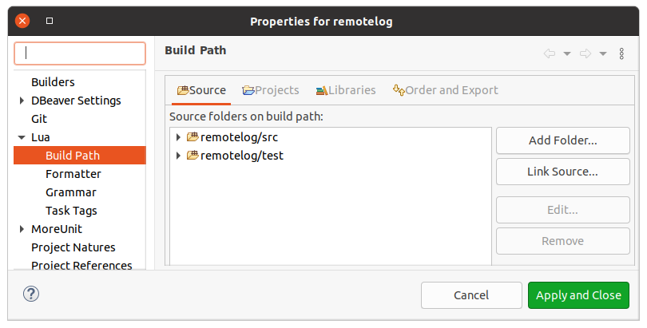

As you can see I marked the directories "src" and "test" as Lua Sources.

While you are here you can also checkout the other project-specific Lua settings LDT offers: Formatter, Grammar and Task Tags.

The Formatter is simple, but quite useful if you want to achieve uniformly looking Lua code in a team.

In the grammar section you can define which Lua version your code targets.

As in other programming languages you can define task tags which you can use as reminders in your comments. They are then displayed in Eclipse's task list. While they are sometimes handy, remember not to check them into version control when you publish your code. Using change tickets is the more professional variant because it keeps your code base clean and allows you to track task progress.

One of the most useful functions is that you can run Lua scripts directly from the IDE.

## Unit testing with LDT

This comes in particularly handy in case of unit testing.

Open the file "`test/test_remotelog.lua`". This file contains a set of unit tests written in LuaUnit. At the end of this file you see a typical LuaUnit idiom:


```
os.exit(luaunit.LuaUnit.run())
```
This means the file is executable and when you run it, you run the contained unit tests. Hit [CTRL] + [F11] and the unit tests are executed. If you only use [F11] the tests are started in the debugger.

To run all unit tests in a project it is customary in the Lua world to provide a script called "`run_unit_tests.lua`" in the main project directory. You can execute that one too.

If you prefer a graphical view of the test results, you can modify the run configuration for "`run_unit_tests.lua`" to get the test results in a JUnit-compatible XML file.

1. Run → Run Configurations.
2. Find the run configuration for the script "`run_unit_tests.lua`"
3. Check the "Arguments" tab and notice the following Script arguments 
```
-o junit -n ${project_loc}/target/unit_test_report.xml
```
 
 

This tells LuaUnit to additionally output the test results in JUnit XML format. And since Eclipse knows that format, you can view it in the JUnit view.

Right-click on the generated test report file in the "Script Explorer" and open it with the JUnit view.

## Testing convenience with MoreUnit

[MoreUnit](https://github.com/MoreUnit/MoreUnit-Eclipse "https://github.com/MoreUnit/MoreUnit-Eclipse") is maybe the most useful little extension that I ever stumbled over on the [Eclipse Marketplace](https://marketplace.eclipse.org/search/site/moreunit "MoreUnit"). With MoreUnit you can switch quickly between implementation and corresponding unit tests using keyboard shortcuts. This is an insanely handy little trick especially if you prefer [Test Driven Development (TDD)](https://en.wikipedia.org/wiki/Test-driven_development "Test").

Let's first install MoreUnit.

1. Help → Eclipse Marketplace...
2. In dialog "Eclipse Marketplace"
	1. Search for "MoreUnit"  
	
	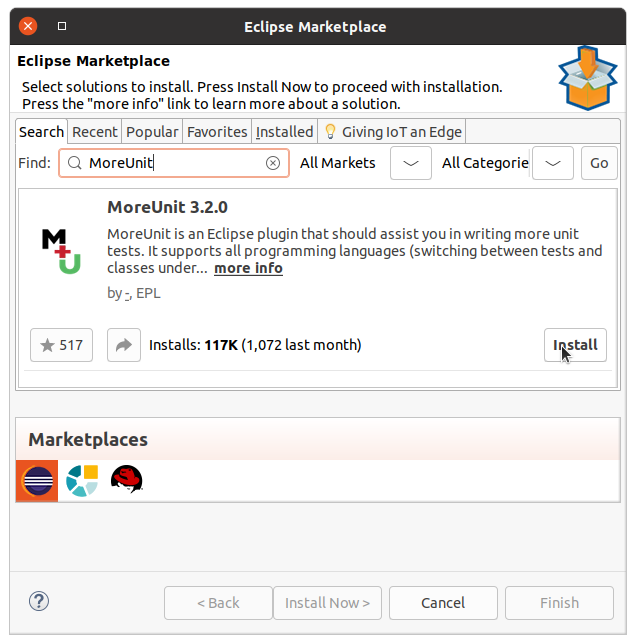
	
	2. Click "Install"
	3. Select all sub-features
	4. Click "Confirm"
	5. Accept the license
	6. Click "Finish"

Next we are going to teach MoreUnit how where our test and implementation files reside and how they are named, so that the switch works. Note that for Java you usually can skip that step since there are well-established conventions for naming and location of tests and implementation. In Lua this requires a little extra setup.

1. Window → Preferences
2. Search for "MoreUnit"
3. Click sub-section "User Languages"
4. Enter source and test path, using placeholders for the project directory (here "`${srcProject}/src`" and "`${srcProject}/test`")  

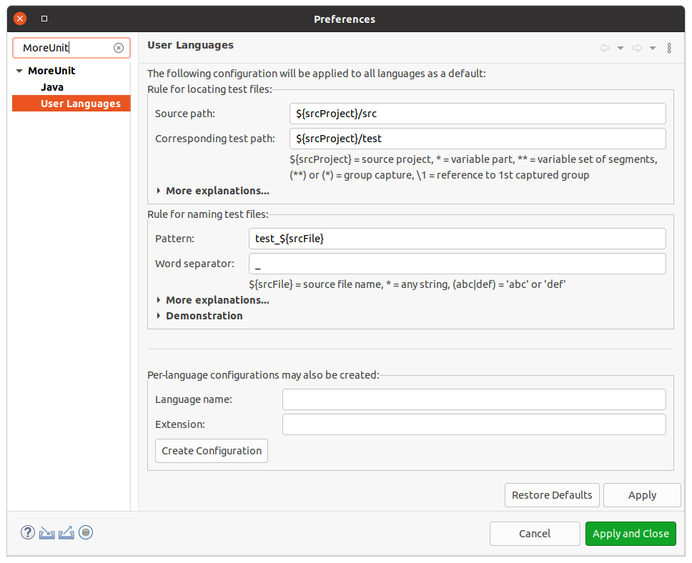

5. Enter the test file name pattern (in this example "`test_${srcFile}`"
6. Click "Apply and Close"

Now that MoreUnit is configured, open the file "`remotelog.lua`" in the editor. Press [CTRL] + [J] to jump to the corresponding test file. This works in both directions.

When you want to work in TDD, your workflow becomes:


|  |  |
| --- | --- |
|  **Red** | 1. Create a test file
2. Create a test
3. Press [CTRL] + [F11] to run it and verify that it fails (which it should since you did not touch the implementation yet!)
4. Press [CTRL] + [J] to jump to the implementation
5. Implement the new functionality
 |
| **Green** | 1. Press [CTRL] +[J] to jump back to the test
2. The test should now succeed
 |
|  **Clean** | 1. Press [CTRL] +[J] to jump to the implementation
2. Refactor until you are satisfied with the code quality
3. Press [CTRL] +[J] to jump back to the unit test
4. Rerun the test with [CTRL] +[F11]
 |

## Debugging

I saved the best part for last. While alt the other features I introduced to you are already very useful, it's debugging where an IDE really sets itself apart from mere editors.

1. Open the file "`test/test_remotelog_console.lua`".
2. Double-click the first line in the function `test_fatal()` to set a break point there.
3. Press [F11] to run the file in the debugger.

In the console you can now see the debugger connecting. When you do this the first time Eclipse will offer switching to the Debug perspective. That is a good idea, so confirm this and make it the default.


```
Debugger v1.4.2  
Debugger: Trying to connect to 127.0.0.1:10000 ...   
Debugger: Connection succeed.
```
As expected, the test runs up to the break point.

The "Debug" view now shows the stack trace.

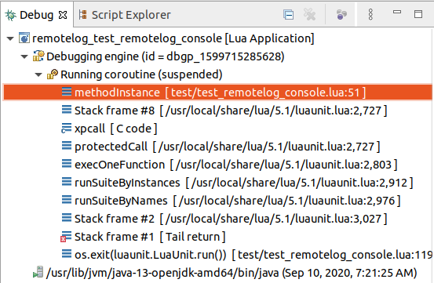

Additionally you get a variable view, breakpoint view, expressions and an interactive console.

In the example below you see how you can inspect the variable hierarchy down from the test's `self` reference to the `log` and the `VERSION`.  
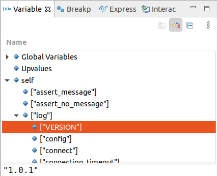

The breakpoints view contains exactly what you would expect. A list of breakpoint you can enable, disable, remove, import, export and so on.

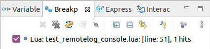

Expressions let you watch the program in realtime and allow you to do conversions.

## 

The interactive console is useful if you want to modify the state of the program while your are debugging it.

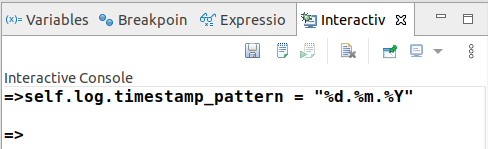

Of course you also have all the stepping options that a regular debugger provides. "Step into", "Step over", "Step return" and so on. I recommend memorizing the keyboard shortcuts. That's more efficient than working with the mouse.

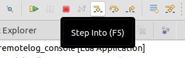

## Conclusion

Lua is a compact but powerful and speedy programming language built right into Exasol to enable high-performance scripting. With the right IDE setup programming and debugging Lua becomes a real pleasure.

In the next articles of our "Exasol loves Lua" series we will dive deeper into unit testing and mocking with Lua, remote logging from Lua Scripts and installing standard modules.

