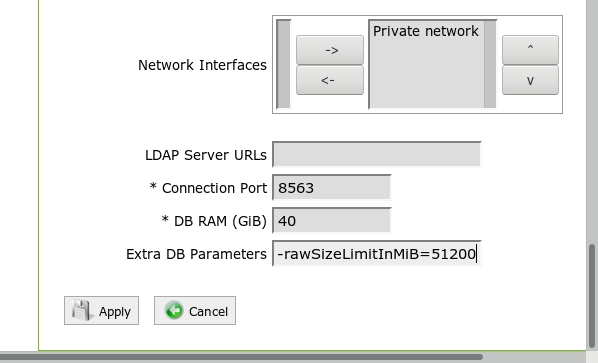

# How to configure database raw and memory size limits 
## Problem

Sometimes databases growing too much on data.

It is possible to set size limits for Exasol databases, so as to prevent databases from growing too much on data. This limit can be set for a database instance using database parameters.

## Solution

## Configuration setup

You can configure local database limit setting the the following database parameters:


| Parameter | Default | Description |
| --- | --- | --- |
| rawSizeLimitInMiB | 0 (no limit) | Raw data size limit of the database in MiB. |
| memSizeLimitInMiB | 0 (no limit) | Memory data size limit of the database in MiB. |
| sizeLimitWarningPercent | 85 | Warning trigger margin. When reaching the stated % of the limit a warning message will be logged in EXAoperation. |

You can either choose a raw data or a memory data limit, but not both.

These parameters are set in the Extra DB Parameters field of the database instance screen:



## Limit checking

When the Exasol database reaches 105% of the given size limit, no more data inserts are permitted. This impacts the following SQL actions:  
• IMPORT  
• INSERT  
• CREATE TABLE AS  
• MERGE  
• SELECT INTO

All such statements are rejected with a SQL exception alike the following:


```
[R0010] Statement currently not allowed because latest database raw size of 54.1 GiB exceeded local raw size limit of 50.0 GiB (108.2%). Please increase your limit or delete some data and FLUSH STATISTICS. 
```
To get the database back to normal operation, you have to reduce its data size below 100% of the limit. You can achieve this by either restarting the database with no or a larger limit, or by deleting or dropping table data.

Whenever your data size passes critical limit margins at 85%, 105% and 100%, you get an EXAoperation warning, error or notice message respectively.

## Additional References

For more information on managing data inserting restrictions and license limits, please consult[this article](https://www.exasol.com/portal/display/DOC/Licenses).

  
