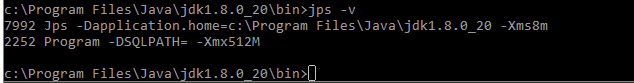
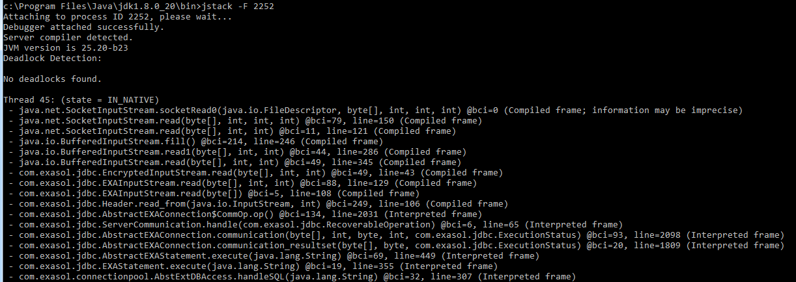
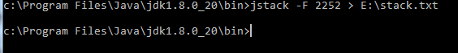

# How to get a java stacktrace for EXAplus 
## Background

In rare cases, to debug a problem Exasol will require detailed information regarding the status of the EXAplus client. As EXAplus is a java application, that information can be supplied as a**java stacktrace**using oracle's java SDK.

## Prerequisites

Java SDK must be installed on the machine where EXAplus was started. The SDK can be downloaded here:

<https://www.oracle.com/java/technologies/javase-jdk8-downloads.html>

## How to get a java stacktrace for EXAplus?

While the following examples and paths were generated on the Windows (tm) operating system, the process does also apply to MacOSX and linux systems.

## *Step 1:*Open a console

Any console will do, depending on your operating system.

## *Step 2:* Change into the 'bin' directory of the JDK installation:


```"code-java"
cd "C:\Program Files\Java\jdk1.8.0_20\bin" 
```
Please note:

* The actual path may vary by operating system, installation and java version.
* This is only required if the bin folder is not included in your PATH variable.

## *Step 3:* Determine the PID of exaplus

This can be done with the system's process monitor (windows task manager) or with thejpsprogram that is part of the JDK:



Here, we have two running java programs:jpsitself and something namedProgram. The latter is exaplus, with PID 2252.

## *Step 4:* Generate the stacktrace

The actual stacktrace is produced withjstackfrom the java SDK:



jstack's output can also be redirected into a file:



## *Step 5:* Attach the generated stacktrace to your ticket with Exasol.

