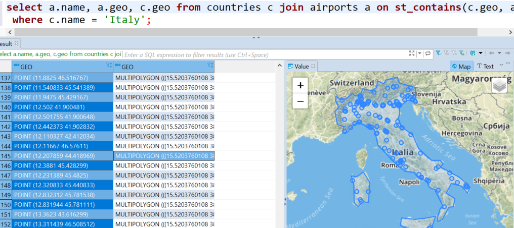

# How to import the whole world into Exasol - Geospatial Data, Geo Indexes, Geo Joins and GeoJSON 
## Background

[Geospatial data](https://docs.exasol.com/sql_references/geospatialdata.htm) can be stored and analyzed in the Exasol database using the GEOMETRY datatype.

In this solution, we will show you some examples of how to import geo spatial data from a CSV and from a GeoJSON file and use SQL functions to perform analytics and geo joins. 

## Spacial Reference Systems

In the system table SYS.EXA_SPATIAL_REF_SYS, you will find more than 3000 different spatial reference systems which can be used for the GEOMETRY datatype. These reference systems are there to define points on earth, but they have different strengths, accuracies, and properties, for example, the SRID 31466 can only reference locations within Germany.

We will use the two SRIDs 4326 and 2163 in our example. 4326 is using degrees as a unit, 2163 uses meters. Often, conversions are necessary between different coordinate systems. The ST_TRANSFORM function can be used for this.

## Prerequisites

## Working with Spatial Data in Exasol

The following example shows how to create a table with a geometry column, how to insert and query data. We are using GEOMETRY(4326) because the provided coordinates are in degrees. Later, in the SELECT query, we transform the geodata into SRID 2163 to see the distance between the two cities in meters:


```"code-sql"
CREATE TABLE cities(name VARCHAR(200), geo GEOMETRY(4326));
INSERT INTO cities VALUES('Berlin', 'POINT (13.36963 52.52493)');
INSERT INTO cities VALUES('London', 'POINT (-0.1233 51.5309)');

-- this shows the distance in degrees:
SELECT a.name, b.name, st_distance(a.geo, b.geo) FROM cities a, cities b;
-- this shows the distance in meters:
SELECT a.name, b.name, st_distance(ST_Transform(a.geo, 2163),
     ST_Transform(b.geo, 2163)) FROM cities a, cities b;
```
GEOMETRY columns can be filled with strings using the well-known text representation (WKT), e.g. 'POINT (13.36963 52.52493)'

## How to process geodata

## Step 1: Importing geodata

### Importing geodata from CSV files

Often, geodata is present in CSV files or in colunms of tables that are imported from different database systems in form of latitude and longitude values. On <https://openflights.org/data.html#airport>, you can download a CSV file containing international airport data. We are using the extended version of this file, which consists of more than 12,000 international airports and train stations. In the first two fields of the file, there is the id and the name of the airport; in columns 7 and 8, we find its latitude and longitude coordinates:


```"code-sql"
CREATE OR REPLACE TABLE airports( airport_id INT, name VARCHAR(500), latitude DECIMAL(9,6), longitude DECIMAL(9,6) );

IMPORT INTO airports FROM LOCAL CSV FILE 'D:\airports-extended.dat' (1, 2, 7, 8);

ALTER TABLE airports ADD COLUMN geo GEOMETRY(4326);
UPDATE airports SET geo = 'POINT ('||longitude||' '||latitude||')';

SELECT * FROM airports;
```
We firstly used DECIMAL(9,6) columns to store the latitude and longitude values, and then we added a GEOMETRY column to store a geodata point for each airport.

Similar to the example above, we can now calculate the distance between two airports or train stations in our table using the ST_DISTANCE and the ST_TRANSFORM function:


```"code-sql"
select st_distance(ST_Transform(a.geo, 2163), ST_Transform(b.geo, 2163))  
 from airports a, airports b where a.name = 'Berlin-Tegel Airport' and b.name = 'Berlin Hauptbahnhof'; 
```
### Importing data from GeoJSON

[GeoJSON](https://tools.ietf.org/html/rfc7946) is an often-used format for storing and exchanging geodata. On [https://geojson-maps.ash.ms](https://geojson-maps.ash.ms/), you can download countries as geodata. When you generate a custom JSON file on this site, the file consists of one JSON object, a so-called FeatureCollection, which contains multiple polygons and multi-polygons, one for each country.

We import the data in three steps:

1. Loading the full GeoJSON string into a VARCHAR(2000000) column in a table. (mind that this does not work if the GeoJSON is larger than two million characters)
2. Parsing the GeoJSON using the json_table UDF script (see [querying-and-converting-json-data-with-the-json-table-udf](https://exasol.my.site.com/s/article/Querying-and-Converting-JSON-Data-with-the-JSON-TABLE-UDF); this UDF script emits a table with one row for each geo-object)
3. Converting each GeoJSON object into a GEOMETRY value using the ST_geomFromGeoJSON UDF script (attached to this solution)

After these steps, we have all countries from the GeoJSON file in a GEOMETRY column. An alternative approach is developing a UDF script that loads the GeoJSON from a server (e.g., by using the Python package requests or paramiko) and parsing and iterating over the GeoJSON objects within the script. For each object, a WKT string is emitted, which can later be converted into a GEOMETRY value. This way, there are no limit on the characters. For our approach, the whole GeoJSON must not be larger than 2,000,000 characters:


```"code-sql"
create or replace table geo_import(v varchar(2000000));
import into geo_import from local csv file 'D:\custom.geo.json' 
column separator = '0x01' column delimiter = '0x02'; -- dummy separaters / delimiters to import a whole line as one column value

-- json_table (can be found in https://exasol.my.site.com/s/article/Querying-and-Converting-JSON-Data-with-the-JSON-TABLE-UDF) emits a row for each country with two columns name and geojson
create or replace view geojson as 
 select json_table(v, '$.features[*].properties.name', '$.features[*].geometry') 
 emits (name varchar(2000000), geojson varchar(2000000)) from geo_import;

-- ST_GeomFromGeoJSON is attached to https://docs.exasol.com/db/latest/sql_references/geospatialdata/import_geospatial_data_from_csv.htm
create or replace table countries as 
 select name, cast(ST_GeomFromGeoJSON(geojson) as geometry(4326)) as geo from geojson;

select * from countries;
```
## Step 2: Geo-Joins and Geo-Indexes

The following query performs a geo-join between the two tables, countries and airports. It finds all airports that are within the country Italy:


```"code-sql"
select a.* from countries c join airports a on st_contains(c.geo, a.geo)  
 where c.name = 'Italy'; 
```
You can use [profiling](https://docs.exasol.com/database_concepts/profiling.htm) to see that an geo-index is created automatically and that this geo-index is used to execute the geo-join:


```"code-sql"
alter session set profile = 'ON';
alter session set query_cache = 'OFF';
select a.* from countries c join airports a on st_contains(c.geo, a.geo)
 where c.name = 'Italy';
flush statistics;
select * from exa_statistics.exa_user_profile_last_day 
where session_id = current_session and command_name = 'SELECT' preferring high stmt_id;
```
Like other indexes in Exasol, the geo-index is persisted so that it can be used for future queries, it is maintained automatically when the table data changes, and it is automatically dropped when it is not used for five weeks or longer. Mind that geo-indexes are a new feature since Exasol 6.1.

### Step 3: Visualizing Geometry Data

The SQL client DBeaver is able to show geospatial data on a map. On a result tab, right click on a GEOMETRY column, choose View / Format, View as Geometry. Then click on the Panels button on the right to show the Value panel with the map.



