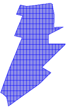
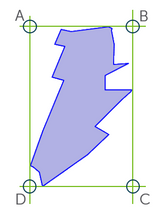
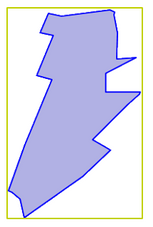
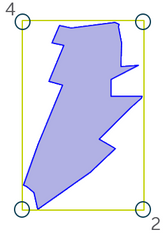
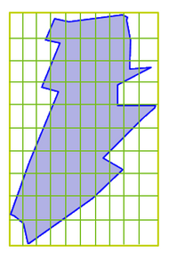
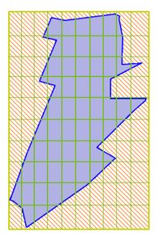

# Improving geospatial performance for large, detailed polygons 
## Preface

Handling very large, detailed polygons can result in subpar performance.If you are performing joins using geospatial functions like looking up if a point lies within an area (polygon) and you are experience unusual high query runtimes, this guide is for you!

In order to efficiently handle very large polygons it is advised to split them in smaller part. To show how this can be achieved is the goal of this article.


|  From this |  To this |
| --------- | ---------- | 
| |  |


## How to

If you want to code along, this is the polygon used for this example:


```sql
MULTIPOLYGON (((-73.89515277899991 40.82783428999991, -73.89483522899992 40.82624684099996, -73.89487088500002 40.82393727199993, -73.89389702299997 40.82398399799994, -73.89320004999996 40.82400818299993, -73.89390164399987 40.8236431209999, -73.89433874699982 40.82341635299984, -73.89488228899991 40.82313435499988, -73.89586019599982 40.82263104599986, -73.8958813589999 40.82099257499988, -73.89490478799985 40.82098751999995, -73.89387380299988 40.82097933499993, -73.89283653100001 40.82097405499998, -73.89290156199988 40.82081122299991, -73.89389462500002 40.8198602899999, -73.894930762 40.81884671999994, -73.89567610799998 40.81812936799991, -73.8970446669999 40.81680185999991, -73.8962135219999 40.81631897099989, -73.89580071599984 40.81606564899989, -73.89542858799986 40.81584467199988, -73.89685073199996 40.81446016799987, -73.89708341799987 40.81422434699991, -73.89733049099995 40.81399633599995, -73.89759123799989 40.81377687299992, -73.89775779499988 40.81364891599992, -73.89786486599994 40.81356666999991, -73.8981505179999 40.81336635499991, -73.89844723499995 40.81317650299993, -73.89912449199987 40.81269524099988, -73.90090498099991 40.81142871299988, -73.90259424199986 40.81022335899997, -73.90279087799998 40.81008304699986, -73.90307457199998 40.80988061199988, -73.90324273499989 40.8107128849999, -73.90341720399988 40.81150688299989, -73.90418036399996 40.81212482099991, -73.9044655149999 40.81228195999996, -73.9041833779999 40.8130864549999, -73.90380412299992 40.81413184199994, -73.9034699719999 40.81507578799996, -73.90306443799986 40.8161067619999, -73.90300983199995 40.81631779199992, -73.90257859099984 40.81736979399992, -73.90210743299993 40.81850519199991, -73.90166319399991 40.81955042599994, -73.9016012119998 40.81969485899989, -73.9012927759998 40.82047544299991, -73.90084561199987 40.82154141799985, -73.90061141099989 40.82210880799988, -73.90198758599993 40.8224404229999, -73.901846838 40.82277863299988, -73.90181687399985 40.82285063499994, -73.901176691 40.82438890899991, -73.90050540499992 40.82600762199993, -73.90164895599993 40.82625697799991, -73.90093510699997 40.82792810199991, -73.89979756799993 40.82768435399992, -73.89940994800001 40.82773418399995, -73.89932566999991 40.82774501799988, -73.89820469299998 40.82788910899996, -73.89700278099993 40.8280504559999, -73.89576668599982 40.8282118029999, -73.89548522799996 40.82824854099993, -73.89529156500001 40.82814234999994, -73.8951102089999 40.82803689899988, -73.89515277899991 40.82783428999991)))
```


to save some space i'll use the variable name **polygon** further on.

## Step 1 - Understanding what we need to do


So you have your polygon looking like this. In order to segment it, we want to overlay a grid and cut away anything from the grid that doesn't belong to the original polygon. First of all we need a grid.

## Step 2 -  Defining the grid



In order to create a grid that fits our polygon we need to define a bounding box. For this we use the


```sql
ST_ENVELOPE(polygon)
```
 function on our polygon. This yields:


```sql
POLYGON ((-73.9044655149999 40.80988061199988, -73.89283653100001 40.80988061199988, -73.89283653100001 40.82824854099993, -73.9044655149999 40.82824854099993, -73.9044655149999 40.80988061199988))
```


We now use


```sql
ST_BOUNDARY(ST_ENVELOPE(polygon))
```
on our 4-point bounding box polygon. This yields:


```sql
LINESTRING (-73.9044655149999 40.80988061199988, -73.89283653100001 40.80988061199988, -73.89283653100001 40.82824854099993, -73.9044655149999 40.82824854099993, -73.9044655149999 40.80988061199988)
```


 From this line string we can extract the extreme points using


```sql
ST_POINTN(ST_BOUNDARY(ST_ENVELOPE(polygon)),2) --for the bottom right point ST_POINTN(ST_BOUNDARY(ST_ENVELOPE(polygon)),4) --for the upper left point
```
resulting in


```sql
POINT (-73.89283653100001 40.80988061199988) POINT (-73.9044655149999 40.82824854099993)
```
We now take these two points apart into their X- and Y-coordinates using


```sql
ST_X(ST_POINTN(ST_BOUNDARY(ST_ENVELOPE(polygon)), 4)) --top left x coord 
ST_X(ST_POINTN(ST_BOUNDARY(ST_ENVELOPE(polygon)), 2)) --bottom right x coord 
ST_Y(ST_POINTN(ST_BOUNDARY(ST_ENVELOPE(polygon)), 2)) --bottom right y coord 
ST_Y(ST_POINTN(ST_BOUNDARY(ST_ENVELOPE(polygon)), 4)) --top left y coord
```
Our 4 points are:


```
-73.9044655149999     
-73.89283653100001     
40.80988061199988     
40.82824854099993
```
## Step 3 -  Building the grid

We use the Exasols UDF Framework to build a Python3 script to generate our grid:


```python
CREATE OR REPLACE PYTHON3 SCALAR SCRIPT NYC_TAXI_STAGE.create_polygon_grid(     min_x DECIMAL(15,13), 
                                                                                max_x DECIMAL(15,13), 
                                                                                min_y DECIMAL(15,13), 
                                                                                max_y DECIMAL(15,13)) EMITS (GRID_FIELD VARCHAR(500), SEGMENT_ID DECIMAL(3)) AS
 
def run(ctx):
        min_x = ctx.min_x
        min_y = ctx.min_y
        max_x = ctx.max_x
        max_y = ctx.max_y
 
        grid_width = 10  #GRID-SIZE DEFINITION: 10: 10 * 10 segments = 100 segments
        x_step_width = (max_x-min_x)/grid_width
        y_step_width = (max_y-min_y)/grid_width
 
        segment_id = 0
        for y in range (grid_width):
                y_step = y * y_step_width
                for x in range(grid_width):
                        segment_id += 1
                        x_step = x * x_step_width
                        ctx.emit(f"POLYGON(({min_x + x_step} {min_y + y_step}, "
                                        f"{min_x + x_step + x_step_width} {min_y + y_step}, "
                                        f"{min_x + x_step + x_step_width} {min_y + y_step + y_step_width}, "
                                        f"{min_x + x_step} {min_y + y_step + y_step_width}, "
                                        f"{min_x + x_step} {min_y + y_step}))", segment_id)
/
```


This script takes the X- and Y- coordinates we just generated and returns (emits) 'POLYGON(...)'-strings for each rectangle segment contained in our bounding box. To be able to identify each individual rectangle afterwards we assign segment id's also.

After we deployed the script our SQL-statement as a whole looks like this:


```sql
INSERT INTO SCHEMA.GRID_TABLE(polygon_id, grid_segment, segment_id)
   SELECT polygon_id, SCHEMA.GRID_SCRIPT(
      ST_X(ST_POINTN(ST_BOUNDARY(ST_ENVELOPE(polygon)), 4)),
      ST_X(ST_POINTN(ST_BOUNDARY(ST_ENVELOPE(polygon)), 2)),
      ST_Y(ST_POINTN(ST_BOUNDARY(ST_ENVELOPE(polygon)), 2)),
      ST_Y(ST_POINTN(ST_BOUNDARY(ST_ENVELOPE(polygon)), 4)))
   FROM SCHEMA.SOURCE_TABLE;
```




In the end, what we get looks something like this for a 10x10 grid. Depending on your polygon size and detail even finer grids can perform better. Just play around with the **code_width** variable in the script above.

  
## Step 4 -  Fitting the grid to the polygon



Lastly we face the challenge to fit our grid to our polygon outline. In other words: we need to get rid of all orange areas. We achieve this by using the following query:


```sql
CREATE OR REPLACE TABLE SCHEMA.FITTED_GRID_TABLE AS(
   SELECT g.location_id, 
          g.segment_id, 
          ST_INTERSECTION(g.grid_segment, z.polygon) AS location_segment
   FROM SCHEMA.GRID_TABLE g
   JOIN SCHEMA.SOURCE_TABLE z ON g.location_id = z.location_id 
        AND ST_INTERSECTS(g.grid_segment, z.polygon));
```
This creates a table only containing the tailored segments which overlap with our polygon. Using **ST_INTERSECTION** tailored segments as POLYGON() or MULTIPOLYGON() which overlap with our initial polygon. The join-condition at the end makes sure we only match segments associated with one specific polygon (assuming we use this process for more then one polygon).

Our end result looks like this:


(this one has been generated with a grid size of 25x25)

Using this method we were able to speed up the process in our NYC TAXI demo by 7x. The optimal grid size depends on a lot of factors like polygon size and polygon detail. Experiment with the grid size and find out which size suites your use case best  .

## Additional References

* [Geospatial Documentation](https://docs.exasol.com/sql_references/geospatialdata/geospatialdata_overview.htm)
* [Python3 Documentation](https://docs.exasol.com/database_concepts/udf_scripts/python3.htm)
* [Github Project - NYC TAXI where this method was used](https://github.com/exasol/opendata-examples/tree/master/nyc_taxi)

*We appreciate your input! Share your knowledge by contributing to the Knowledge Base directly in [GitHub](https://github.com/exasol/public-knowledgebase).* 