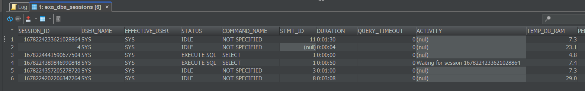
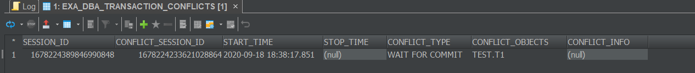
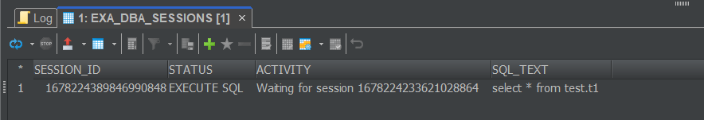
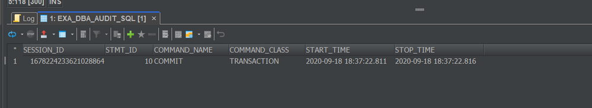
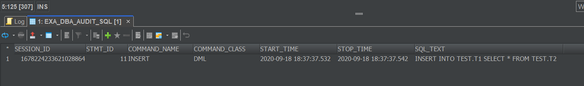
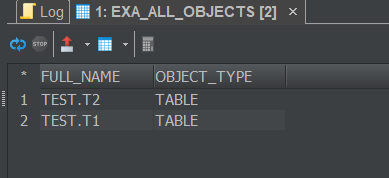
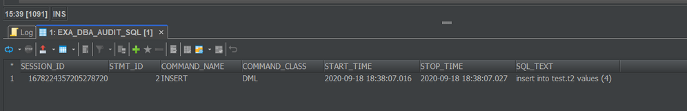
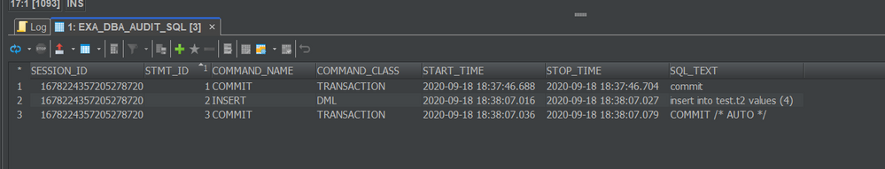

# Investigating Transaction Conflicts using Auditing 
## Background

Investigating [read/write transaction conflicts](https://community.exasol.com/t5/database-features/transaction-conflicts-for-mixed-read-write-transactions/ta-p/2143) is only possible by:

* sending the [database logs](https://docs.exasol.com/administration/on-premise/support/logs_files_for_sql_server_processes.htm) to Exasol Support
* Analyzing [auditing](https://docs.exasol.com/database_concepts/auditing.htm) to determine the order of events

This article describes how to investigate these read/write conflicts. These types of conflicts manifest by receiving a WAIT FOR COMMIT on a simple SELECT statement. 

## Prerequisites

* Auditing must be enabled
* The conflict in EXA_DBA_TRANSACTION_CONFLICTS **must not** state 'intern merged sessions'. If you see this message in EXA_DBA_TRANSACTION_CONFLICTS, the conflict can only be investigated by sending the database logs to Exasol Support.

## How to investigate transaction conflicts using Auditing

## Step 1 - Find the Conflict

As mentioned in [this article](https://community.exasol.com/t5/database-features/transaction-conflicts-for-mixed-read-write-transactions/ta-p/2143), WAIT FOR COMMITs on SELECT statements involve three transactions at any given time. To explain the conflict, we need to identify each of these sessions. The examples used here are a simplified method, but serve to guide you on these investigations. 

The conflicts are visible both in EXA_DBA_SESSIONS and in EXA_DBA_TRANSACTION_CONFLICTS:

EXA_DBA_SESSIONS:



Based on the query above, I have identified a session that is experiencing a conflict. More importantly, I can see that the Session 1678224389846990848 is executing a SELECT statement and is waiting for session 1678224233621028864.

This information is also visible in EXA_DBA_TRANSACTION_CONFLICTS:


```markup
select * from EXA_DBA_TRANSACTION_CONFLICTS WHERE TO_DATE(START_TIME) = CURRENT_DATE AND STOP_TIME IS NULL;
```


Based on the information, I can already begin to reconstruct the conflict. From a terminology perspective, we will refer to tr1, tr2, and tr3 to correspond with the table in example 1 of [this article](https://community.exasol.com/t5/database-features/transaction-conflicts-for-mixed-read-write-transactions/ta-p/2143).

So - the CONFLICT_SESSION_ID above is session 1678224233621028864. This is the same session which is mentioned in the "Waiting for session..." ACTIVITY in EXA_DBA_SESSIONS. This is the session which needs to perform the commit to resolve the conflict. Therefore, we can mark this session as "tr1" in our table. 

The SESSION_ID above is 1678224389846990848 and is the session that is actually waiting for the commit. This is tr3 in our table. So now we have the following information:

|Transaction 1 (tr1)<br>Session ID: 1678224233621028864   |Transaction 2 (tr2)<br>Session ID: ???   |Transaction 3 (tr3)<br>Session ID: 1678224389846990848   |Comments   |
|---|---|---|---|


## Step 2: Analyze Transaction 3

Now that we have transaction 3 identified (this is also the session which experienced the WAIT FOR COMMIT), we can check auditing to find out what this session has been doing. In our case, the conflict is still occurring, so the auditing entry will be empty, but we can view the query being run in EXA_DBA_SESSIONS. Let's check the query that is currently being ran:


```markup
--The Session ID corresponds to the session in tr3 
select SESSION_ID, STATUS, ACTIVITY, SQL_TEXT from EXA_DBA_SESSIONS WHERE SESSION_ID = 1678224389846990848;
```


If you are investigating a conflict in the past, you can query auditing to find this information as well:


```markup
SELECT * FROM EXA_DBA_AUDIT_SQL WHERE SESSION_ID = 1678224389846990848;
```
Since our query is still running, we can assume that the start time of the query is the exact moment that the conflict started, which in this case is 2020-09-18 18:38:17.851 (as seen from EXA_DBA_TRANSACTION_CONFLICTS). We know that TEST.T1 is the conflict object, as seen from EXA_DBA_TRANSACTION_CONFLICTS. So, let's add this information to our table:

|Transaction 1 (tr1)<br>Session ID: 1678224233621028864   |Transaction 2 (tr2)<br>Session ID: ???   |Transaction 3 (tr3)<br>Session ID: 1678224389846990848   |Comments   |
|---|---|---|---|
|   |   |Start-time: 2020-09-18 18:38:17.851<br>Query:<br>```select * from test.t1; ```   |Reads the object TEST.T1<br>Experiences a WAIT FOR COMMIT.<br>Conflict objects: TEST.T1   |

|  |  |  |  |
| --- | --- | --- | --- |
| **Transaction 1 (tr1)** **Session ID: 1678224233621028864** | **Transaction 2 (tr2)** **Session ID: ???** | **Transaction 3 (tr3)** **Session ID: 1678224389846990848** | **Comments** |
|   
|   
|  Start-time: 2020-09-18 18:38:17.851 Query: 
```markup
select * from test.t1;
```
 | Reads the object TEST.T1  Experiences a WAIT FOR COMMIT. Conflict objects: TEST.T1 |

Important to note - in this example, the query is a simple select on TEST.T1, but the query that experiences the WAIT FOR COMMIT can be much more complicated, involving both some system tables, views, etc. Querying some system tables internally are similar to querying the actual table, so they can also cause conflicts. For more information: <https://community.exasol.com/t5/database-features/filter-on-system-tables-and-transaction-conflicts/ta-p/1232>

## Step 3: Analyze Transaction 1

Now, we can take a look at auditing to determine information on transaction 1. We know the following details:

1. The Session ID (1678224233621028864**)**
2. The transaction must have been started BEFORE the conflict started ( 2020-09-18 18:38:17.851)

Transactions contain multiple queries and encompass all queries from the moment that the last COMMIT or ROLLBACK happened. So, we need to identify when exactly the transaction *started* to determine all of the queries that were in this transaction. 


```markup
-- Session ID = the CONFLICT_SESSION_ID, which corresponds to tr1 -- START_TIME is less than the start time that is shown in EXA_DBA_TRANSACTION_CONFLICTS  SELECT SESSION_ID, STMT_ID, COMMAND_NAME, COMMAND_CLASS, START_TIME, STOP_TIME FROM EXA_DBA_AUDIT_SQL WHERE SESSION_ID = 1678224233621028864 AND COMMAND_CLASS = 'TRANSACTION' AND START_TIME < '2020-09-18 18:38:17.851' ORDER BY START_TIME DESC LIMIT 1;
```


Now we know that the last commit had STMT_ID 10, so we need to know all of the queries that ran AFTER that last commit. We can make a query to get this information:


```markup
--Session Id = the CONFLICT_SESSION_ID which corresponds to tr1 -- START_TIME is less than the start_time that is shown in EXA_DBA_TRANSACTION_CONFLICTS -- STMT_ID is greater than the statement id of the last commit/rollback  SELECT SESSION_ID, STMT_ID, COMMAND_NAME, COMMAND_CLASS, START_TIME, STOP_TIME, SQL_TEXT FROM EXA_DBA_AUDIT_SQL  WHERE SESSION_ID = 1678224233621028864  AND STMT_ID > 10  AND START_TIME < '2020-09-18 18:38:17.851'  ORDER BY START_TIME ASC;
```


In this example, there was only one query which was ran. Let's add all of the queries into our table now. It makes sense to document every query and the times in the table so you don't lose track:


|  |  |  |  |
| --- | --- | --- | --- |
| **Transaction 1 (tr1)** **Session ID: 1678224233621028864** | **Transaction 2 (tr2)** **Session ID: ???** | **Transaction 3 (tr3)** **Session ID: 1678224389846990848** | **Comments** |
| Start-time: 2020-09-18 18:37:37.532 Query: 
```markup
INSERT INTO TEST.T1 SELECT * FROM TEST.T2
```
 |  
|   
|  Start-time: 2020-09-18 18:38:17.851 Query: 
```markup
select * from test.t1;
```
 | Reads the object TEST.T1  Experiences a WAIT FOR COMMIT. Conflict objects: TEST.T1 |

## Step 3 - Identify written/read objects

Now that we know all of the queries from that transaction, we need to document a list of all objects which were read and written in that transaction. In this example, it is very easy as there was only one query, but in real-world scenarios, this can be very complicated and error-prone. First, queries may be querying complex view structures, so it's not immediately clear from the query text which objects are actually being read. But let's start with the objects we know from the queries. 

You need to look for any objects that are read in the query - this could be after a FROM clause, IN clause, JOIN clause, or any subselects. Basically, you must parse the queries to determine a list of objects. Our list looks like this:


|  |  |
| --- | --- |
| **Objects Read** | **Objects Written** |
| TEST.T2 | TEST.T1 |
| 
| 

I can further verify that these objects are tables by querying EXA_ALL_OBJECTS:


```markup
-- I use snapshot execution to ensure that this query does not get a Wait for commit --  /*snapshot execution*/ select ROOT_NAME||'.'||OBJECT_NAME FULL_NAME, OBJECT_TYPE FROM EXA_ALL_OBJECTS WHERE LOCAL.FULL_NAME IN ( 'TEST.T2', 'TEST.T1');
```
...and it proves that my objects are tables:



If you notice that some of these objects are VIEWS, then you can query EXA_DBA_DEPENDENCIES_RECURSIVE to determine the underlying objects in the named views. So, let's add this information to the table:


|  |  |  |  |
| --- | --- | --- | --- |
| **Transaction 1 (tr1)** **Session ID: 1678224233621028864** | **Transaction 2 (tr2)** **Session ID: ???** | **Transaction 3 (tr3)** **Session ID: 1678224389846990848** | **Comments** |
| Start-time: 2020-09-18 18:37:37.532 Query: 
```markup
INSERT INTO TEST.T1 SELECT * FROM TEST.T2
```
 |  Reads the object TEST.T2 Writes the object TEST.T1 |
|   
|  Start-time: 2020-09-18 18:38:17.851 Query: 
```markup
select * from test.t1;
```
 | Reads the object TEST.T1  Experiences a WAIT FOR COMMIT. Conflict objects: TEST.T1 |

## Step 4 - Identify sessions which write an object that was read in tr1

In order to identify the full conflict, we have to find **a query which *wrote* one of the objects that was *read* in tr1**. This means that there must be a query which modified TEST.T2. Finding this link will enable us to complete the table and fully identify the conflict. 

Again, we can turn to auditing to identify this. We know the following information:

* An object must have been modified using a DCL or DML statement
* This modification did not occur in our session in tr1
* This modification must have occured *after* the start of the transaction in tr1 (2020-09-18 18:37:22.811)
* This modification must have occured *before* the start of the conflict start_time (2020-09-18 18:38:17.851)

Let's write our query then:


```markup
--Start_time is greater than the start of the transaction in tr1 -- Start time is less than the start of the conflict -- Session ID does not equal the CONFLICT_SESSION_ID SELECT SESSION_ID, STMT_ID, COMMAND_NAME, COMMAND_CLASS, START_TIME, STOP_TIME, SQL_TEXT FROM EXA_DBA_AUDIT_SQL  WHERE COMMAND_CLASS IN ('DDL','DML','DCL')  AND START_TIME BETWEEN '2020-09-18 18:37:22.811' and '2020-09-18 18:38:17.851' AND SESSION_ID != 1678224233621028864;
```
And here are our results:



We have successfully identified a session which modified the object in question! In most real-world cases, there are many options here and it is impossible to identify in auditing, *which* of these sessions are responsible for the conflict, but this is actually not as relevant, because it could be *any* of them. As a best practice, you can assume it is the first one. 

## Step 5 - Verify tr2 details

Now that we have a session ID, let's find out exactly what this session did:


```markup
SELECT SESSION_ID, STMT_ID, COMMAND_NAME, COMMAND_CLASS, START_TIME, STOP_TIME, SQL_TEXT FROM EXA_DBA_AUDIT_SQL  WHERE SESSION_ID  = 1678224357205278720;
```


So, this session performed a COMMIT, followed by an INSERT + COMMIT. Let's document this then. 


|  |  |  |  |
| --- | --- | --- | --- |
| **Transaction 1 (tr1)** **Session ID: 1678224233621028864** | **Transaction 2 (tr2)** **Session ID: 1678224357205278720** | **Transaction 3 (tr3)** **Session ID: 1678224389846990848** | **Comments** |
| Start-time: 2020-09-18 18:37:37.532 Query: 
```markup
INSERT INTO TEST.T1 SELECT * FROM TEST.T2
```
 |  Reads the object TEST.T2 Writes the object TEST.T1 |
|  Start-time: 2020-09-18 18:37:46.688 Query: 
```markup
COMMIT;
```
 | 
|  Start-time: 2020-09-18 18:38:07.016 Query: 
```markup
insert into test.t2 values (4)
```
 |  Writes the object TEST.T2 tr1 < tr2, because tr2 writes to a table that was read by tr1 |
|  Start-time: 2020-09-18 18:38:07.036 Query: 
```markup
COMMIT /* AUTO */
```
 |  --autocommit ends the transaction |
|  Start-time: 2020-09-18 18:38:17.851 Query: 
```markup
select * from test.t1;
```
 | Starts a new transaction --> tr2 < tr3, since tr3 was started after tr2 ended (automatic scheduling).We now have the relations tr1 < tr2 < tr3, which implies tr1 < tr3 Reads the object TEST.T1  **Experiences a WAIT FOR COMMIT.** Conflict objects: TEST.T1 |

## Step 6 - Summarize Conflict

With this information, we now can identify the complete turn of events to explain the transaction conflict. 

Session ID 1678224233621028864 ran the following query at 2020-09-18 18:37:37.532 which read TEST.T2 and wrote TEST.T1:


```markup
INSERT INTO TEST.T1 SELECT * FROM TEST.T2
```
After this insert statement, the session never sent a COMMIT or ROLLBACK leading to the transaction simply being opened. 

Shortly afterwards, Session ID 1678224357205278720 wrote the object TEST.T2 by running the following statement: 


```markup
insert into test.t2 values (4)
```
and sending a COMMIT afterwards. This enforced the relationship that tr2 must occur after tr1 because it wrote one of the objects that was read in tr1. Finally, Session 1678224389846990848 tried to read TEST.T1, which enforced the relationship that tr3 must occur after tr2, and therefore also after tr1. This leads to the WAIT FOR COMMIT scenario. 

In our example, the conflict can be ended by either killing session 1678224233621028864 or by asking the user to send a COMMIT or ROLLBACK to the database.

## Additional Notes + Pitfalls

In real-world examples, it is rarely this straightforward to investigate. This is mostly due to the fact that many long-running transactions also contain many SQL statements which are reading and writing many different tables. When views are added into the equation, it gets significantly more difficult to determine which of the objects were altered in tr2 that enforced the relationship. In Step 4, if the conflict has been opened very long, there may be thousands of statements which were editing database objects. You can attempt to search through the SQL_TEXT to make further limits, but it may be very difficult. In such cases, you can send the database logs to Exasol Support to give more details in the logs. 

There are also some conflicts which are difficult to reproduce because the objects which are read and written in certain scenarios are not immediately clear. Other database objects may also be edited or read, for example connections, users, schemas, etc. In such cases, auditing may not be very helpful because you don't immediately know which additional objects were being read. For example - during an IMPORT, the connections are read; thus, another transaction (tr2) could edit one of the connections and cause this relationship as well (which is not immediately apparent in auditing). 

## Additional References

* <https://docs.exasol.com/database_concepts/transaction_management.htm>
* <https://community.exasol.com/t5/database-features/transaction-system/ta-p/1522>
* [https://community.exasol.com/t5/database-features/filter-on-system-tables-and-transaction-conflicts/...](https://community.exasol.com/t5/database-features/filter-on-system-tables-and-transaction-conflicts/ta-p/1232)
* [https://community.exasol.com/t5/database-features/transaction-conflicts-for-mixed-read-write-transac...](https://community.exasol.com/t5/database-features/transaction-conflicts-for-mixed-read-write-transactions/ta-p/2143)
* <https://community.exasol.com/t5/internal-database-features/internal-resolving-transaction-conflicts/ta-p/2169>
