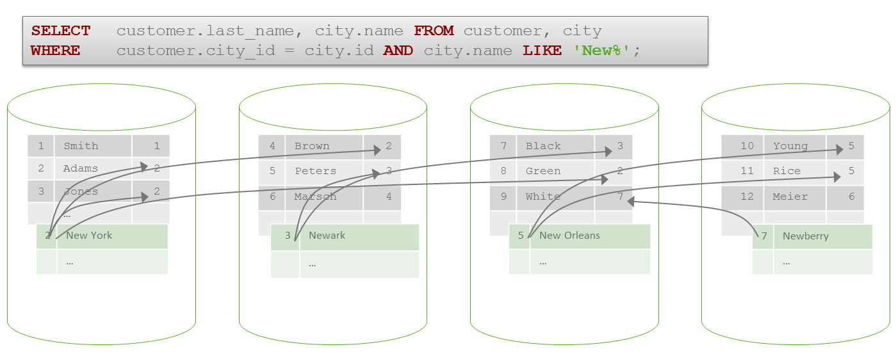
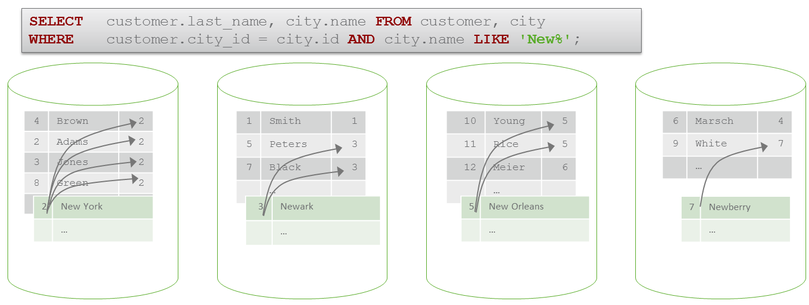

# Local and Global Joins 
## Background

In Exasol, there are two different types of joins: A local join and a global join. The type is not influenced by the SQL statement, but by the internal data distribution (see [here](https://community.exasol.com/t5/database-features/data-distribution/ta-p/772) for more information.

## Explanation

## Global Join

If no data distribution is specified or database distribution does not fit for performing a local join (will be discussed later), a global join is executed.  
The following image will illustrate a global join:



To perform a join, it is necessary to find matches for the join keys within the cluster. The example above illustrates the global match finding using arrows. Since the data is not distributed suitable to find matches on the local node only, it is necessary to use the network to find matches. E.g. Mr. Green (residing on node 3) is living in city 2 (New York) which is residing on another node (node 1). Thus the query requires a global index to perform the join.  
A global join causes network traffic by finding matches and transferring needed columns for matches to the responsible node. 

## Local Join

Using distribution keys (see [here](https://community.exasol.com/t5/database-features/data-distribution/ta-p/772)) on the join columns (CUSTOMER.CITY_ID and CITY.ID in the example) causes a local join.


```"code-sql"
ALTER TABLE CUSTOMER DISTRIBUTE BY CITY_ID; 
ALTER TABLE CITIES DISTRIBUTE BY ID; 
```
The optimizer recognizes that both tables have a suitable distribution to perform a local join. It is not necessary to find matches on other nodes and thereby no data needs to be transferred to the responsible nodes.  
The following image illustrates the same join with a suitable data distribution:



## Determining join types

It is possible to determine the join type using a query profile.  
For a global join the keyword "GLOBAL" is shown in the PART_INFO column. The following table will show the difference between both join types in profiling tables (statement 1: global join, statement 2: local join) :


| STMT_ID | PART_ID | PART_NAME | PART_INFO | OBJECT_NAME |
| --- | --- | --- | --- | --- |
| 1 | 1 | COMPILE / EXECUTE | 
| 1 | 2 | SCAN | | || CITY |
| 1 | 3 | JOIN | GLOBAL | CUSTOMER |
| — | — | — | — |
| 2 | 1 | COMPILE / EXECUTE | 
| 2 | 2 | SCAN |  CITY |
| 2 | 3 | JOIN |  CUSTOMER |

## Differences in Performance

Typically a local join can be executed much faster than a global join since no network traffic is caused.

## Additional References

* [Data Distribution](https://community.exasol.com/t5/database-features/data-distribution/ta-p/772)
* [Distribution Keys](https://docs.exasol.com/sql/alter_table(distribution_partitioning).htm)
* [Profiling](https://docs.exasol.com/database_concepts/profiling.htm)
* [Performance Guide](https://docs.exasol.com/performance/best_practices.htm#DistributionKeys)
