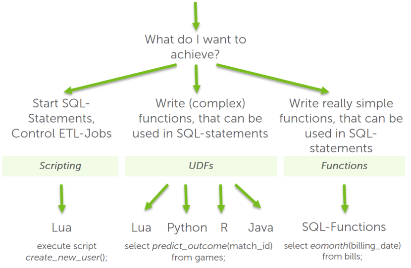

# Lua, Python and all the others: When to use which programming language? 
## Background

Exasol comes with a variety of programming languages. Especially for new users, it can sometimes be hard to understand when to use which programming language. So here's a little guide for helping you choose the right language for your task.

## Explanation

This article focuses mainly on the possibilities of using programming languages inside the database.

There are mainly three different usecases where you want to write code in a programming language inside the database: Scripting, UDFs and Functions.

### Scripting

For [Scripts](https://docs.exasol.com/database_concepts/scripting.htm "Scripts") that run inside the database you will use the programming language Lua. You can use them to execute multiple SQL commands sequentially and to handle errors during the executions. You can run control jobs within the database (for example, complex loading processes) and simplify the repetitive jobs by parameterized scripts, such as, creating a user with its password and privileges.

### UDFs

For [UDFs](https://docs.exasol.com/database_concepts/udf_scripts.htm "UDFs"), you have the choice between a whole bunch of different programming languages. Each language offers it's own benefits.

Python for example scores with a very large number of libraries, which users can also add themselves. This makes it very comfortable to work with complex tasks as the comlexity can be handled inside of the library. Examples here are collecting data from a REST-API, applying data science models or parsing HTML data.

R is a great language for people that are used to writing their analysis in R already. So this is often used for projects regarding data science and statistics.

Lua differs a little from the others here as it is very natively integrated into Exasol and has the lowest overhead compared to other languages, so it is often a good choice if you want to optimize that last bit of performance. For this purpose, users cannot add their own libraries to Lua.

  
### Functions

 Exasol also offers the possibility to write basic [functions](https://docs.exasol.com/sql/create_function.htm "Functions") in SQL. Functions are more limited than UDFs in terms of what you can achieve with them, but they can be a good choice if you want to do some kind of mapping, like recreating a function that you have used in another database where Exasol's syntax is a little different. A set of SQL functions can be found in our Github Repository [exa-toolbox](https://github.com/exasol/exa-toolbox/tree/master/sqlserver_compatibility "exa-toolbox") . There we collected some functions that can be useful when migrating from SQL-Server to Exasol.  
## Additional References

Links to our documentation on:

* [Scripts](https://docs.exasol.com/database_concepts/scripting.htm "Scripts")
* [UDFs](https://docs.exasol.com/database_concepts/udf_scripts.htm "UDFs")
* [Functions](https://docs.exasol.com/sql/create_function.htm "Functions")

*We appreciate your input! Share your knowledge by contributing to the Knowledge Base directly in [GitHub](https://github.com/exasol/public-knowledgebase).* 