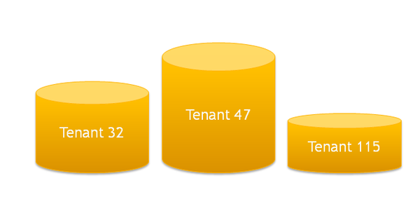
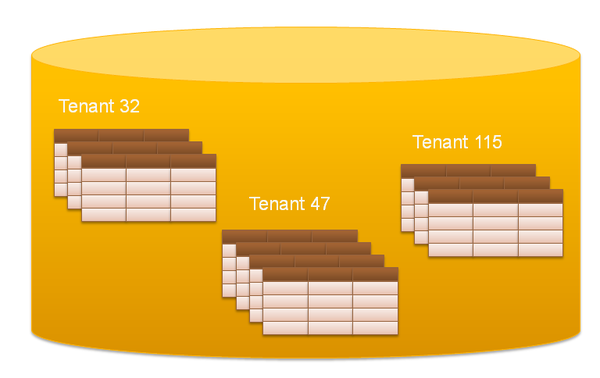
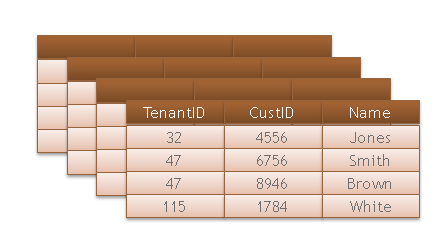
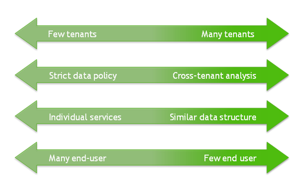
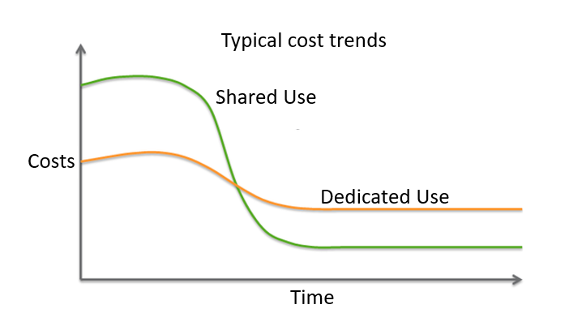

# Multi Tenancy - It's all about trust 
## Background

Many organizations - such as service providers - face the challenge to manage data of different clients (tenants) efficiently and cost-effective and, most importantly, make them trust in the security of their data. There are three main approaches to multi-tenancy:

* Separate Databases
* Shared database, separate schemas
* Shared database, shared schemas

## Approaches to manage Multi-Tenant data

The options of a data architect encompass a broad solution spectrum from strictly isolated data to a shared dataset. The optimal solution significantly depends on technical and business considerations and can strongly differ from one organization to another, meeting specific requirements. We will consider 3 major design approaches.

## Separate databases

The simplest way to achieve the secure data isolation is to store the data of each tenant in a separate database.

This approach makes it easy to adapt the data model to the tenants' specific requirements. The significantly increased hardware and maintenance costs make this solution appropriate for such customers that are willing to accept the higher cost for enhanced security and flexibility.

## Shared database, separate schemas

Each tenant gets its own schema within one and the same database, whereas the data isolation will be enforced by database internal user and right management.

This approach is relatively easy to implement and tenants can adapt their own schemas to their specific needs as with the separate database approach. It still offers a certain amount of security for tenants and does not increase the hardware and maintenance costs at the same time.

However, the process of restoring the data of a single-tenant is a significant disadvantage of this approach compared to the separate-database one. Instead of simply restoring one tenant's database you have to restore the full database to a separate temporary instance and to transfer the required data, which can be a rather time-consuming task.

The separate schema approach suits well for tenants that have a relatively small number of tables and accept sharing the database with others.

## Shared database, shared schema

With the third approach, all tenants share the same schema and moreover the same tables. Each row is supplied with a Tenant-ID which is subsequently used to ensure data isolation.

This approach has the lowest hardware and backup costs compared to the other two because it allows you to operate the largest number of tenants per database instance. However, this approach may require additional development efforts to ensure the security of each tenants' data.

The data restoring procedure is similar to the case of the shared database with the addition that you deal with single rows instead of whole tables.

This approach is suitable when you have to serve a large number of tenants who are willing to accept shared resources and logical data isolation within a database in the name of lower cost.

## Making a choice

To choose an optimal solution for your organization, you have to consider a number of technical and business aspects. Some of them are discussed below.

## Tenant Requirements

* How many tenants are supposed to use the data warehouse?
* The more tenants you have, the more likely you tend to a shared approach.
* Should someone have access to the data of all (or many) tenants?
	+ If your tenants are for example more or less independent subsidiaries of a larger organization, it is likely you will need to choose the most shared approach to enable cross-tenant analysis.
* Are you going to offer special services for some tenants?
	+ If so, you will likely tend to a more isolated approach.
* Do you expect a large number of end-users per tenant?
	+ The more users you expect, the more likely you tend to an isolated approach.

## Financial considerations

The development of a shared data model usually requires significantly more effort depending on the complexity of the access model to be implemented. Maintenance and hardware costs are usually lower than those of a more isolated approach. So your choice depends mainly on the expected service duration and the willingness to accept the higher initial costs.

## Security

If you store sensitive customer data in your data warehouse, the security question will significantly influence your decision. A common prejudice is that only physically separated data can be secure. Therefore a great deal of convincing might be necessary if you consider a more shared solution favorable. In fact, a shared solution can be just as secure as an isolated one. However, to achieve this you usually need to develop a rather complicated design.

## Additional References

* [Planning Guide](https://docs.exasol.com/planning.htm)
