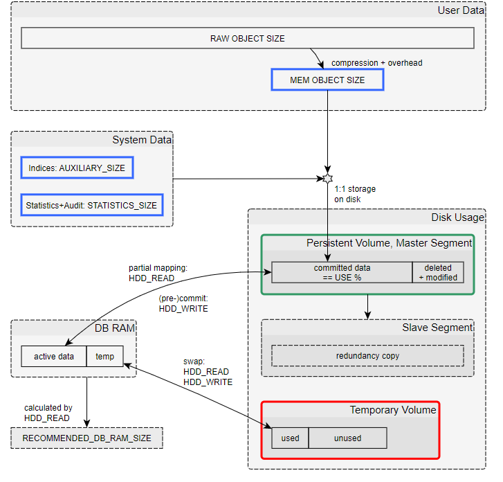
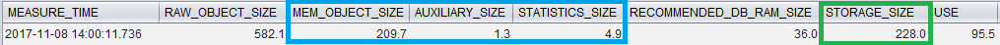
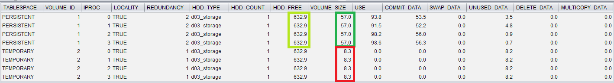
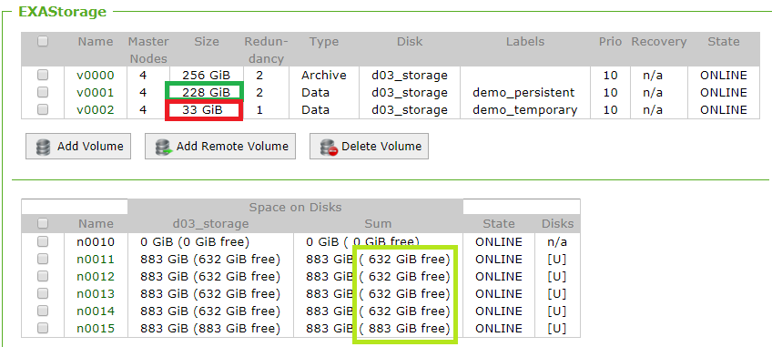

# Overview of Exasol's data and memory management 
## Question

With Exasol's automated disk and memory management, it its not always easy to answer questions like

* How much data is stored in the database?
* How much disk space do I use?
* How much memory is in use?
* How much disk space is left? And how much more data can I actually store?

## Answer

This article addresses a few of those questions by giving an overview of the relations between the different values one can read from Exasol's system tables or web management interface (EXAoperation).

## Overview

Have a look at the following diagram showing the general relationships between many of the keywords used when talking about data sizes in Exasol:

## Notes:

* The ratio between RAW_ and MEM_OBJECT_SIZE is what Exasol commonly defines as **compression ratio**
* The distinction between RAW and MEM sizes also applies to system data: Everything is **compressed in RAM** and mapped to/from disk.
* Usually there is no need to fit all of the data into DB RAM. Systems with a large amount of passive data may perform well with 10% of DB_RAM compared to overall MEM_OBJECT_SIZE.
	+ A typical "first guess" estimation for required DB_RAM is about 10% of the expected RAW_OBJECT_SIZE.
* While **deleted blocks** in storage are reused by later operations, as a general rule, storage volumes **do not shrink** unless forced to do so.
* In DB_RAM, the ratio between active data and temp data is flexible, but temp is hard-limited at 80%.

## Information Location

### Object Level

| Metric | Location | Comment |
| --- | --- | --- |
| RAW_OBJECT_SIZE | System table EXA_DBA_OBJECT_SIZES | Theoretical value, never actually required |
| MEM_OBJECT_SIZE | System table EXA_DBA_OBJECT_SIZES | 
| Index size | AUXILIARY_SIZE in System table EXA_DBA_INDICES | 
| Statistics + Audit Size | STATISTICS_SIZE in System table EXA_STATISTICS_OBJECT_SIZES | 
| HDD_READ / HDD_WRITE | N/A | 

### Database Level

| Metric | Location | Comment |
| --- | --- | --- |
| RAW_OBJECT_SIZE | System table EXA_DB_SIZE_LAST_DAY | 
| MEM_OBJECT_SIZE | System table EXA_DB_SIZE_LAST_DAY | 
| Index Size | System table EXA_DB_SIZE_LAST_DAY | 
| Statistics+Audit Size | System table EXA_DB_SIZE_LAST_DAY | 
| HDD_READ / HDD_WRITE | System Table EXA_MONITOR_LAST_DAY | 
| DB_RAM Size | System table EXA_SYSTEM_EVENTS | You can assume that the database will always "use" all that RAM and does not yield to others. |
| RECOMMENDED_DB_RAM_SIZE | System table EXA_DB_SIZE_LAST_DAY | 
| TEMP_DB_RAM_SIZE | System Table EXA_MONITOR_LAST_DAY | == (DB_RAM:temp + Temporary:used) |
| DB_RAM:active data | N/A | 
| DB_RAM:temp | see Node Level below | 
| Persistent:size | STORAGE_SIZE in EXA_DB_SIZE_LAST_DAY | 
| Persistent:committed | see Node Level below | ~= ( MEM_OBJECT_SIZE + AUXILIARY_SIZE + STATISTICS_SIZE ) |
| Persistent:deleted | see Node Level below | size = committed * (100 / USE ) |

### Node Level

**EXASOL 6.0.0** introduces a new system table for more detailed storage usage: EXA_VOLUME_USAGE  
Please refer to the user manual or column comments for details on the columns.

| Metric | Location | Comment |
| --- | --- | --- |
| Persistent:size | sum(VOLUME_SIZE) | Size is always synchronized across nodes |
| Persistent:committed data | sum(COMMIT_DATA) | 
| Temporary:used | sum(SWAP_DATA) | 
| Temporary:unused | sum(UNUSED_DATA) | 

### Storage Level

| Metric | Location | Comment |
| --- | --- | --- |
| Persistent Volume Size | EXAStorage -> (Labels: <dbname>_persistent) -> Size | == Persistent:size from Database level |
| Temporary Volume Size | EXAStorage -> (Labels: <dbname>_temporary) -> Size | 
| Exists Slave Segment? | EXAStorage -> persistent -> Redundancy | Gives total number of copies: 1 == no redundancy |
| Free Disk Space | EXAStorage -> Space on Disks -> sum(sum:free) | 
| Free database (disk) space | See [how-to-monitor-free-database-disk-space](https://community.exasol.com/t5/environment-management/how-to-monitor-free-database-disk-space/ta-p/1364) | 

