# Pulling the Exasol Docker logs...works for NGA, too 
## Background

Exasol runs on Docker. Many times, troubleshooting issues with the database requires generating EXACluster Debug Information. Exasol on Docker does not have a UI menu available to generate the logs but uses the command line to instruct Exasol on pulling the logs. This article is an extension of [how-to-get-debug-information-and-log-files-from-docker-based](https://exasol.my.site.com/s/article/How-to-get-debug-information-and-log-files-from-docker-based-systems) 

In order to reproduce our results, we list this article's specifications and additional information regarding log generation.

 - **Docker image:** Exasol 7.0.7

 - **Docker version:** 18.09.07 build 2d0083d

 - **Docker server:** Zorin OS 05.12.4 release 12 (Ubuntu Xenial)  
  
Before you begin, there are 2 commands used to pull logs, both using the same arguments and parameters. 

 **Command**: exasupport

 and

 **Command:** get_support_info

 Our example will use "exasupport" as it is supported on our version of Docker If you have any issues with running "exasupport", then exchange the "exasupport" for "get_support_info". Example:

 
```markup
exasupport -d 0 -s 2021-03-15 -t 2021-03-15 -e "All databases" -x 1
```
 becomes

 
```markup
get_support_info -d 0 -s 2021-03-15 -t 2021-03-15 -e "All databases" -x 1
```


## Prerequisites

- The I.P. of your Docker server  
- A terminal (Command Line) ssh client to connect to the Docker server, such as [PuTTY](https://www.chiark.greenend.org.uk/~sgtatham/putty/latest.html "Official") , and proper credentials. If you are logging into the Docker server itself, then you can simply open a Terminal window.  
- Basic knowledge of Linux, especially using the Terminal (Command Line) client.  
  


## How to Pull the Exasol Docker logs

*FYI*. The terms "Command Line window" and "Terminal Window" are used interchangeably but mean the same thing. It's an interactive window connected to your Docker server.

## Section 1. Getting inside the Exasol container

### Step 1.

Log into your Docker server, either by using an SSH-client terminal window or logging onto the Docker server itself and opening a Terminal window.

## 

### Step 2.

Run the command "docker ps" to see a list of all running containers.

**Command:** docker ps

**Expected Result:** Your screen should show an Exasol container up and running. Our example shows a container named "exasoldb1" running. This is the container we will work with. 

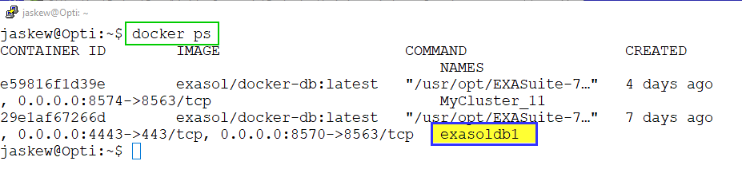

### Step 2 (Optional)

Instead of referencing the "exasoldb1" container, you can always use the "CONTAINER_ID" instead. The CONTAINER_ID is the actual name of the container, whereas the "exasoldb1" is a human-readable alias or nickname for the container 29e1af67266d. Our example shows the CONTAINER_ID is named "29e1af67266d" and has the alias or name of "exasoldb1"

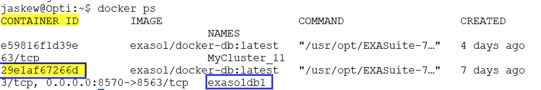

### Step 3.

Open an interactive session inside of your Docker container. Our example will open the "exasoldb1" container and start the bash shell.

 **Command:** docker exec it 29e1af67266d /bin/bash

or

**Command:** docker exec -it **exasoldb1** /bin/bash

**Expected Result:** You should continue to see the interactive session with the NEW server name and NEW user. Our example initially logged into server "Opti" with user "jaskew". Now we see the server-name is "n11" and the user is now "root".

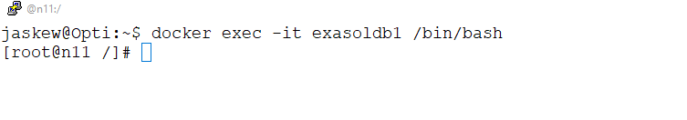

## Section 2. Logs!, Already!

### Step 1.

Execute the "exasupport -h" command and argument to see the content of what "exasupport" offers:

**Command:** exasupport -h

**Expected Results**: You should see something like this:

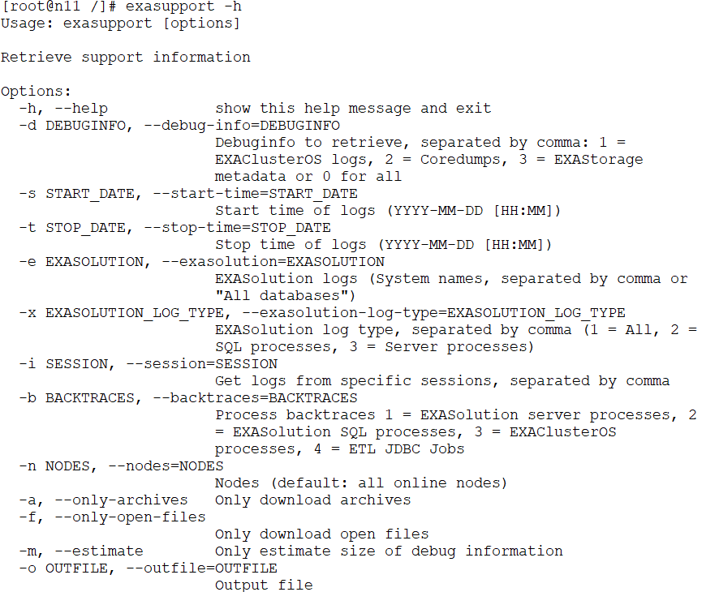

### Step 2.

Ensure you have enough space to generate logs - as they can become quite large if your system is active and your selection criteria (arguments and parameters) are not very stringent. We will use the "df -h" command and parameter to show the available space.

**Command:** df -h

**Expected Results:** Your screen should appear something like this, showing the file systems, space used, and space available.

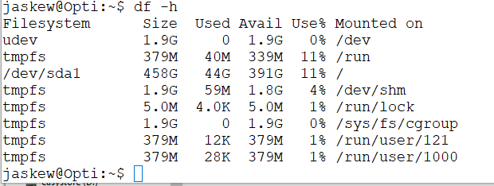

This is a tie-in to Step 3. When you complete "building" your exasupport command in Step 3, you can add the suffix "-m" to the end of your "exasupport" command, in order to estimate the amount of space the logs will take up. This allows you to see the estimated log size prior to running the actual "exasupport" command (sans the "-m" suffix).

For example: 


```sql
exasupport -d 0 -s 2021-03-15 -t 2021-03-16 -e "All databases" -x1 -d1,2 -m
```
You can assess whether you have enough space to generate the logs. If not, you can either change to a directory (file system) with more space or make your "exasupport" parameters more stringent to reduce the overall size of the logs.

### Step 3.

Build the command to generate the logs. Our example will generate the logs with these parameters:

**a**. The date range for our logs is from 2021-03-01 to 2021-0302. Therefore, we use the -s for the start-date and -t for the end-date:

**Arguments and parameters:**  **-s** 2021-03-01 **-t** 2021-03-02

**b**. Set the EXASolution logs you desire. We are referring to the "-e" or "--exasolution" argument. For brevity's sake, our example will use the parameter "All databases"  - get all the EXASolution logs. If you are unsure which database you want but you don't want to pull the logs for "All databases", then the command "dwad_client shortlist" will give you the database names.

*Optional info for getting the database names:*

**Command:** dwad_client shortlist

**Argument and parameter:** **-e** "All databases"

**c**. Set the log type you desire. Our example chooses "All" the log types. The argument is "-x" and the parameter we are using is "1" - meaning all log types.

**Argument and parameter:** **-x** 1

**d**. **(Optional)** You can limit the logs just to a particular session if you know the session_id of the session you are generating logs. The argument to limit the logs to a particular session is '-i".  If you choose to use the "-i" argument, then the format would be:

**Argument and parameter:** **-i** <session_id>

**e**. (Optional) Specify a custom name to save the generated logs. Our example will override the default generated log name, using the "-o" option - for output. As the content of the logs is always a tarred and gzipped file, so be sure to add the suffix "tar.gz" to the end of your custom log name. Our example specifies the "-o" argument with the parameter "demo_logs.tar.gz". We see the suffix of our custom log file ends with a ".tar.gz" suffix - or file type.

**Argument and parameter (optional):** **-o** demo_log.tar.gz

**f.** Putting it all together, we generate our logs.

**Command:**    exasupport -s 2021-03-01 -t 2021-03-02 -e "All databases" -x 1 -o demo_logs.tar.gz

**g**. You will find your new logs in the same directory as you executed the command. You can verify the new logs exist by running the command "ls -lart". The new logs should be at the bottom of the list.

**Commands:** pwd       #Shows your current directory. (Optional command - added for clarity).

          ls -lart   #"Lists" contents of current directory

**Expected Results**: You should see the "demo_logs.tar.gz" in the screen.

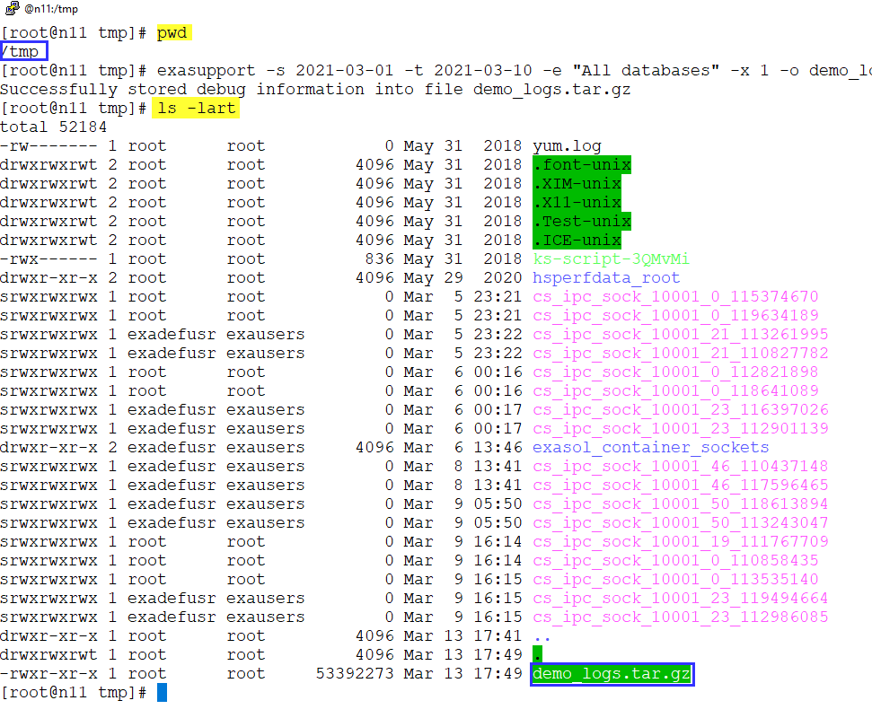

## Section 3. Copy the logs from inside Docker to a server.

If you are reading this section, you probably did not follow the article in setting up Exasol on Docker [deploy-exasol-docker](https://exasol.my.site.com/s/article/How-to-deploy-a-single-node-Exasol-database-as-a-Docker-image-for-testing-purposes). That's okay, I didn't either, hence this article. First, we address the generated logs residing inside the Docker container. You may remember from earlier steps, that our example is running a Docker container named, "exasoldb1". At this point in this exercise, the logs are inside "exasoldb1" and you can not access the logs outside of the container. 

What to do? Start by locating your logs. If they are NOT in the directory where you ran the get_support_Info command, try /exa/tmp/support/.

Next, you can Docker copy the logs to the Docker server filesystem/directory outside of the Docker container. The command format is: 


```sql
docker cp <contianer>:/tmp/<filename> <local path>.
```
You can refer to [Docker_cp](https://docs.docker.com/engine/reference/commandline/cp/) for more information. Let's give an example:

**Command: docker cp**

**The logs:** **/exa/tmp/support/exacluster_debuginfo_2021_04_21-17_35_15.tar.gz** 

**The Docker container:  ec6499418c05**

**Docker server directory destination: /tmp**

Our command would look like this: 


```sql
docker cp ec6499418c05:/exa/tmp/support/exacluster_debuginfo_2021_04_21-17_35_15.tar.gz /tmp
```
For example, you could copy the logs to /tmp or /exa. This will make the next steps easier to troubleshoot if there are issues. If you see your logs in the docker server directory, you can proceed to step 4. Our example is doing a docker cp to the Docker server directory /tmp. If you do not see your logs, no worries, we continue. 

You can do a secure copy (scp) or secured ftp (sftp) from the container to the Docker server or any server of your choice.

Let's assume we want to scp the logs from inside the Docker container to the Docker server. Our example uses:

**Command: scp**

**The logs:** **demo_logs.tar.gz**

**Docker server I.P.:** **192.168.1.109**

**Docker server directory destination: /tmp**

**Docker server user:** **jaskew**

Our command would look like this:


```sql
scp demo_logs.tar.gz jaskew@192.168.1.109:/tmp/
```
Having executed the scp command, your screen should look something like this:

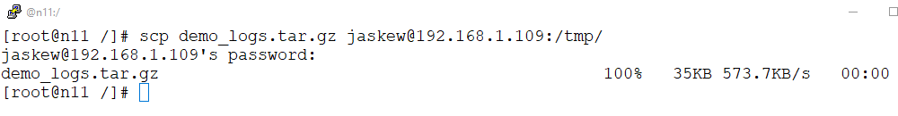

At this point, you can validate the "demo_logs.tar.gz" appear on the destination of the Docker server.

## Section 4. Download the logs to your local computer

You can use your favorite FTP client to download the logs to your local computer. Our example will use FileZilla, but WinSCP works, too, as do other Window FTP clients.

### Step 1.

Launch the Windows FTP client. Again, our example will use FileZilla.

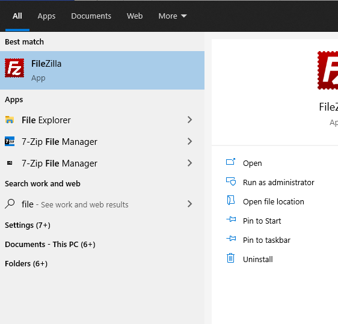

### Step 2.

Ensure your FTP client has a connection to the server that you copied the logs in Section 3. Our FileZilla example will create a connection for the destination server. Remember, it  was the Docker server that had an **I.P.** of **192.168.1.109**. Our new connection in FileZilla reflects that.

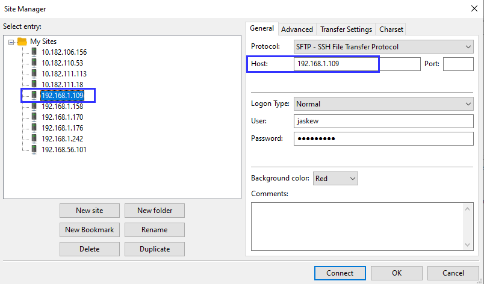

### Step 3.

Open the connection. Remember from Section 3, that the **destination folder** on the Docker server was "**/tmp**". Our example sets the remote site directory to "/tmp".

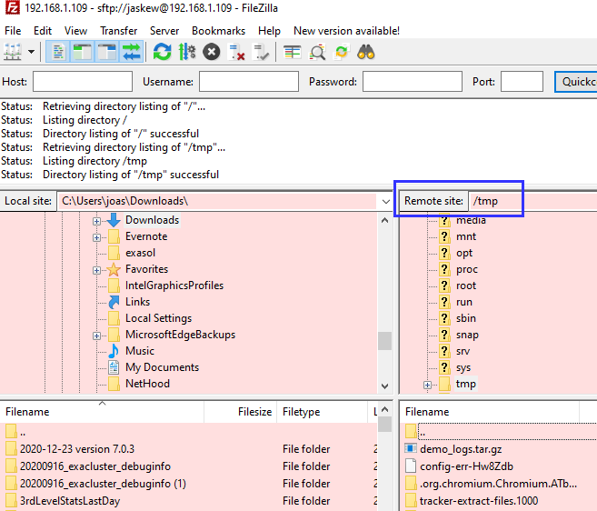

### Step 4.

Download the logs to your local computer.

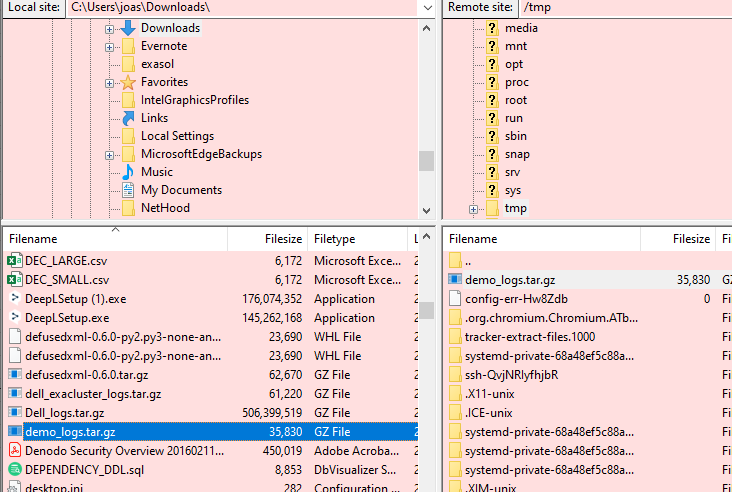

We are done. From here, if you have ticketing system access, you can attach the logs to the ticket.

## Additional Notes

In case you were not aware, you can find out more about Exasol with Docker or NGA by searching our Knowledge base: [link](https://exasol.my.site.com/s/). 
It's the best place to find quick answers and discover additional content. Those with a current Exasol license can open a "Question" ticket to address content you did not find in our community. The site is: [Exasol Help Center](https://exasol.my.site.com/s/create-new-case).
  


## Additional References

[Docker-guide](https://exasol.my.site.com/s/article/Docker-Guide)   
[Docker_and_BucketFS](https://exasol.my.site.com/s/article/Exasol-on-Docker-How-to-Create-a-BucketFS-and-Buckets-Inside)   

