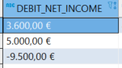
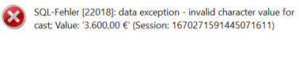

# How to Remove Currency Symbols

## Question
I wonder how I can get rid of currency symbols in the exasol database (except using the function TRIM).

As you can see, it works fine for display purposes.
Apparently, as soon as I perfom calculations with the referring column, the following error message occurs:

Do you guys know a quick and easy solution for this?
It would be much appreciated! 

## Answer
According to the header in your screenshot thats a CHAR / VARCHAR....not what I'd pick for something like an INCOME....
You might use REPLACE(DEBT_NET_INCOME,'€','') and trust in an implicit CAST or do the CAST on top...
Or, even better, model _INCOME-type columns as numeric.
