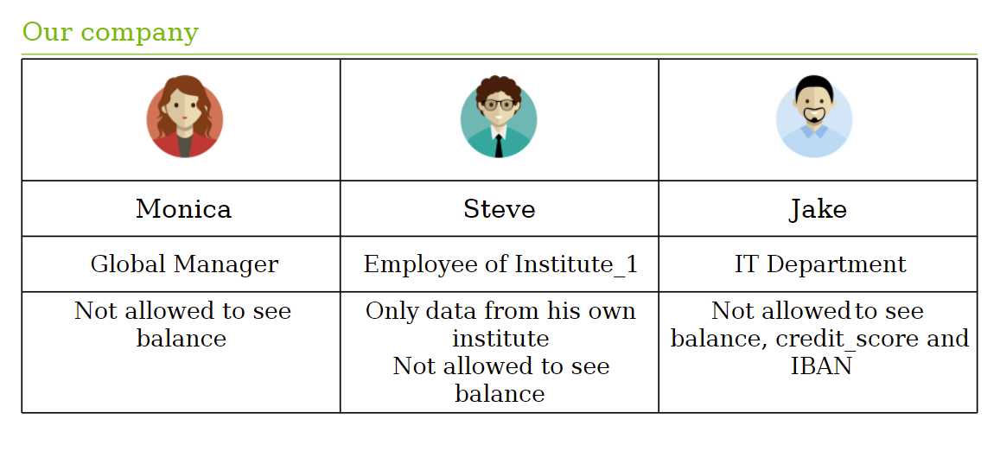
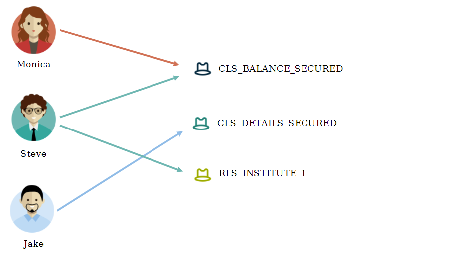

# Row and Column Level Security with Virtual Schemas 
## Table of Contents:

## Background:

**The official project to implement Row Level Security via Virtual Schemas is described here: <https://github.com/exasol/row-level-security-lua>. We recommend to use the Github Project to implement your own Row Level Security. The below article is only an example of a custom connector and is not officially supported.**

This article describes how you could implement a custom Virtual Schema adapter to implement column level security in addition to row level security. It consists of 4 parts:

* Creating the Virtual Schema
* Setting up permissions
* Using the Virtual Schema
* Maintaining the Table Permissions

Please note that these scripts will require adaptation to work with your exact use case. This is just an example of how it can be done.

In this example, let's pretend that we work for a bank that has several different institutes. An employee of one institute should not be able to see the data in other institutes. This data is stored in the column INSTITUTE. This is called Row Level Security as the employee of one institute can only see the rows that correspond to his institute.

At the same time, there are also bank employees that are not working for a particular institute, such as in IT or HR. However, these users should not be able to see secured fields, like account balances, etc. This is called Column Level Security because the users should only be able to see information on certain columns. Our three users are summarized below:



## Preparation:

To prepare for this demo, you will need to download these 2 files:

* RLS-CLS-data_schema_customer.csv
* RLS-CLS-Demo_PYTHON3.sql

Open the SQL File and change the IMPORT statement so that it matches your path. Within this file, we will create our users, table, virtual schema adapter script, roles, and import our data (lines 1-80).

## Creating the Virtual Schema

We are using a Virtual Schema Adapter called `"RLS_ADAPTER"`. This adapter is specifically created to work with the tables which we are creating, namely `ADAPTER_SCHEMA.RESTRICTIONS_ROWS` and `ADAPTER_SCHEMA.RESTRICTIONS_COLUMNS`. All of our RLS and CLS Information is stored in these tables. When querying the virtual schema, this information is read to determine which data to return. Once we create our Adapter script (found in the SQL file above) and connection back to the database, we can create our virtual schema. This information is also in lines 81-220 of our SQL file.


```sql
CREATE VIRTUAL SCHEMA SECURED_BANK USING adapter_schema.rls_adapter 
 with table_schema='OUR_BANK' META_CONNECTION='SELF_CONNECTION';  
```
## Setting up Permissions

Once our Virtual Schema is created, we need to assign the users roles which match their privileges. We've created these Roles to match their permission policies:

* CLS_BALANCE_SECURED – Column level security on BALANCE
* CLS_DETAILS_SECURED – Column level security on IBAN and CREDIT_SCORE
* RLS_INSTITUTE_1 – Row level Security on INSTITUTE_1

Based on the permissions from before, we have this alignment:



To complete the Setup, we just need to create these roles, assign them to the users, and insert the details of the permissions into our tables RESTRICTIONS_ROWS and RESTRICTIONS_COLUMNS. Note: This table includes the information that the user SHOULD NOT see. Finally, we have to grant the SELECT privileges on the Virtual Schema to our 3 users. To create this, you can run lines 230-300 of the SQL file.

## Using the Virtual Schema

Now that the Virtual Schema is set up, our 3 users can begin running queries against it. Behind the scenes, the database is connecting back to itself and modifying the query that is being sent to the base table. As a user, you don't have to worry about these details. They are done automatically.

To test this, you can impersonate any of these users to see what information they see. Steve, for example, will only see limited information in Institute 1, while the other 2 will see limited information for the entire company.


```sql
-- Regional manager
impersonate MONICA;
select current_user;
select count(*) from SECURED_BANK.customer;
select * from SECURED_BANK.customer
where last_name like 'St%';

-- Institute_1
impersonate STEVE;
select count(*) from SECURED_BANK.customer;
select * from SECURED_BANK.customer
where last_name like 'St%';

-- IT Department
impersonate JAKE;
select count(*) from SECURED_BANK.customer;
select * from SECURED_BANK.customer
where last_name like 'St%';

```
## Maintaining Table Permissions

Since everything is role-based, this framework is extremely flexible. It is very easy to add further restrictions or new users to this concept. For example, if I want to add a new user to this concept, I only need to grant the accompanying roles to our new user:


```sql
-----------------
-- new Intern
-----------------
impersonate SYS;
create user "JESSICA" identified by "my_password";
grant create session to JESSICA;

-- setup RLS and CLS
grant RLS_INSTITUTE_1 to JESSICA;
grant CLS_DETAILS_SECURED to JESSICA;

grant select on SECURED_BANK to JESSICA;

-- impersonation (only for demo purposes)
grant impersonation on JESSICA to IMP;
grant IMP to JESSICA;

-- Try it out
impersonate JESSICA;
select count(*) from SECURED_BANK.customer;
select * from SECURED_BANK.customer 
where last_name like 'St%'
; 
```
Or if I need to add more restrictions, such as limiting the visibility of e-mail addresses, I can just add a new entry into our RESTRICTIONS_COLUMNS table:


```sql
INSERT INTO ADAPTER_SCHEMA.RESTRICTIONS_COLUMNS VALUES  
 ('CLS_DETAILS_SECURED','CUSTOMER','EMAIL'); 
```
Now, the E-mail column is also hidden for all users with the CLS_DETAILS_SECURED role.

With this framework, you can specify as many restrictions on as many tables as you want. You can even expand the adapter to script to fit your exact use case.

## Additional References:

* <https://github.com/exasol/row-level-security-lua>
* [Virtual Schemas](https://docs.exasol.com/database_concepts/virtual_schemas.htm)
* [Privileges](https://docs.exasol.com/database_concepts/privileges.htm)

## Downloads
* [RLS-CLS-data_schema_customer.csv](https://github.com/exasol/public-knowledgebase/blob/main/Database-Features/attachments/RLS-CLS-data_schema_customer.csv)
* [RLS-CLS-Demo_V2.sql](https://github.com/exasol/public-knowledgebase/blob/main/Database-Features/attachments/RLS-CLS-Demo_V2.sql) - the vanilla version of the adapter
* [RLS-CLS-Demo_PYTHON3.sql](https://github.com/exasol/public-knowledgebase/blob/main/Database-Features/attachments/RLS-CLS-Demo_PYTHON3.sql) - a Python 3 version of the adapter. When possible it takes advantage of no SQL metadata commands introduced in in Exasol 7.0, WebSocket protocol version 2. And when not possible it just executes metadata-like queries in snapshot execution mode.

*We appreciate your input! Share your knowledge by contributing to the Knowledge Base directly in [GitHub](https://github.com/exasol/public-knowledgebase).* 