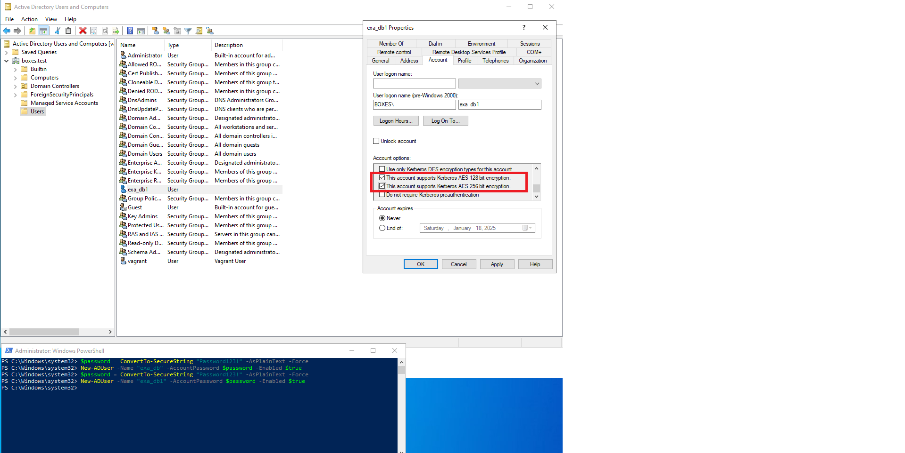
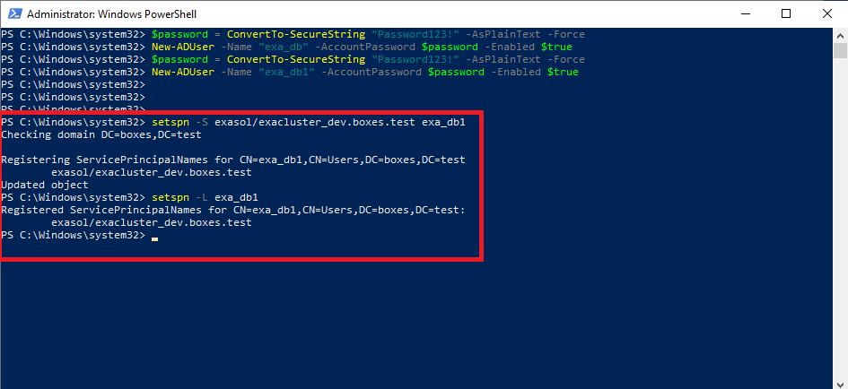
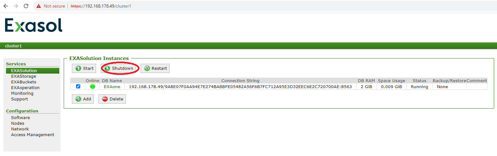
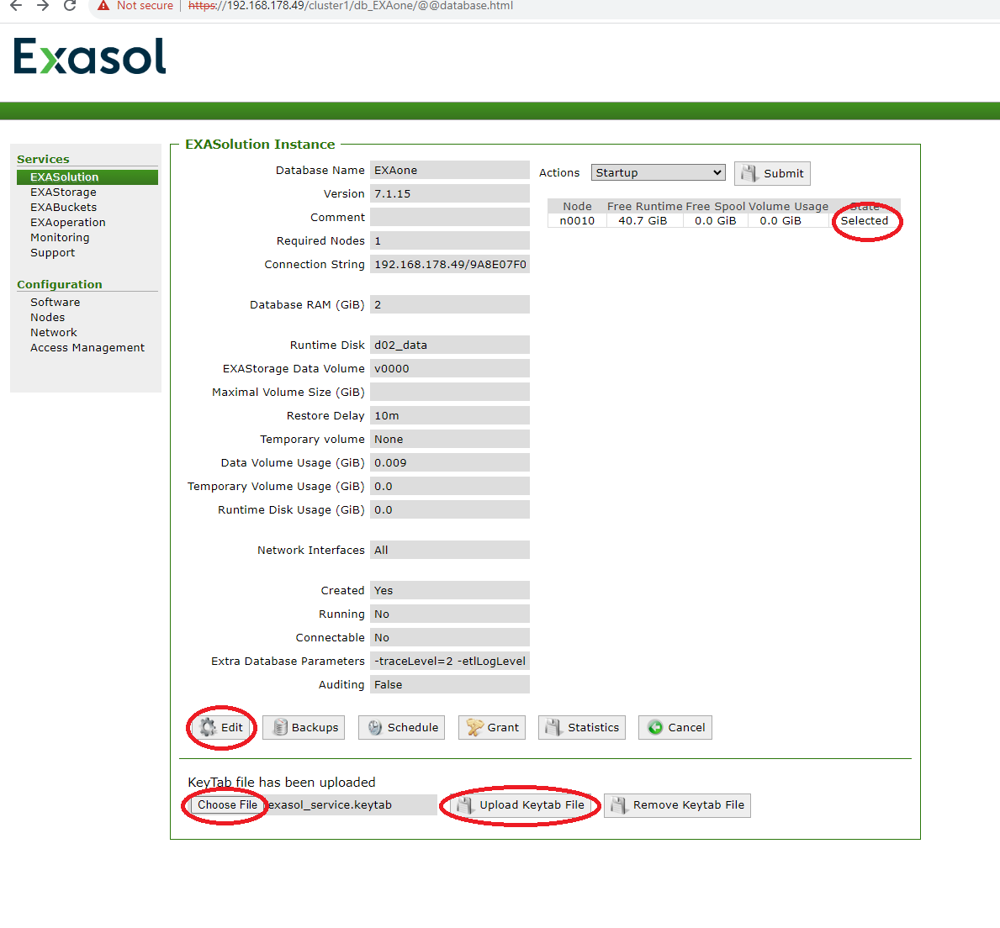
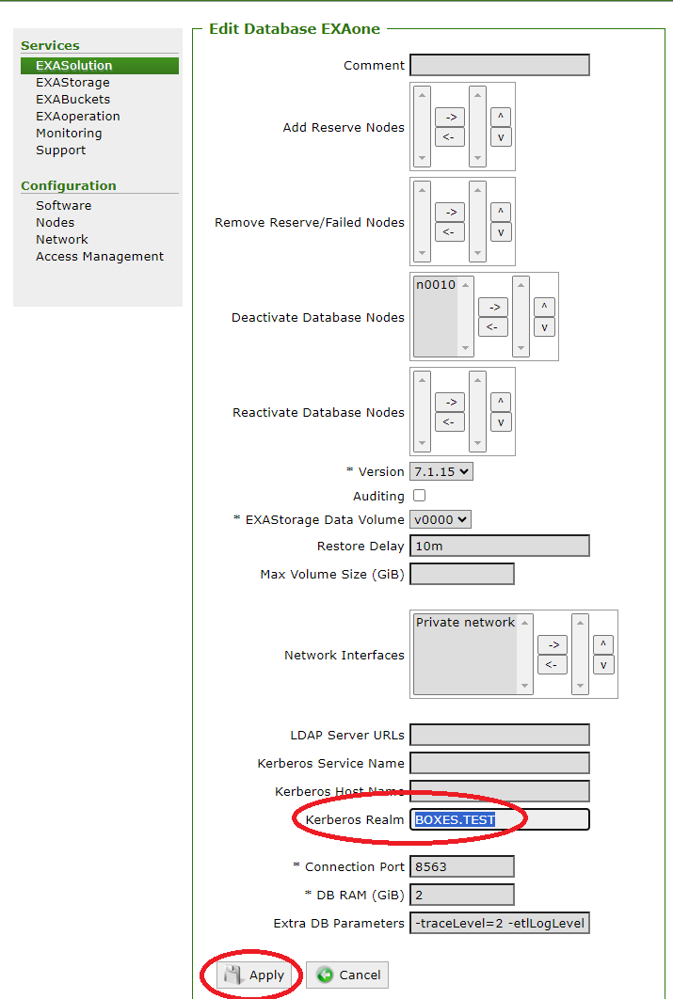
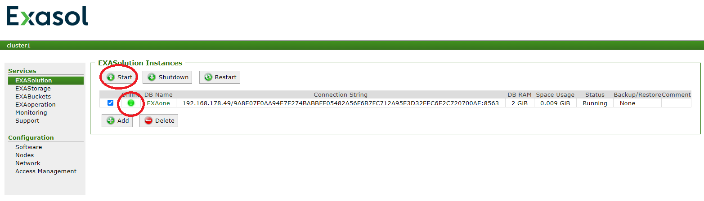
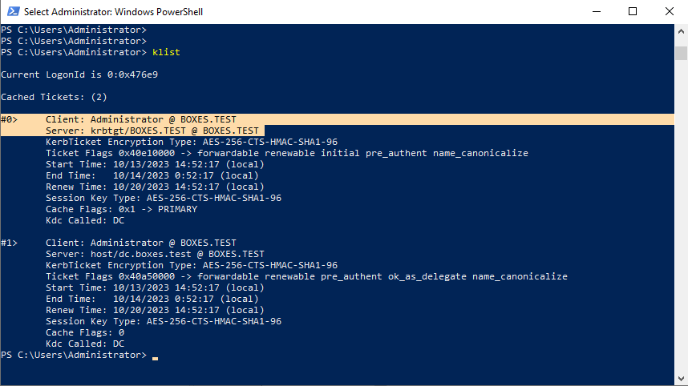
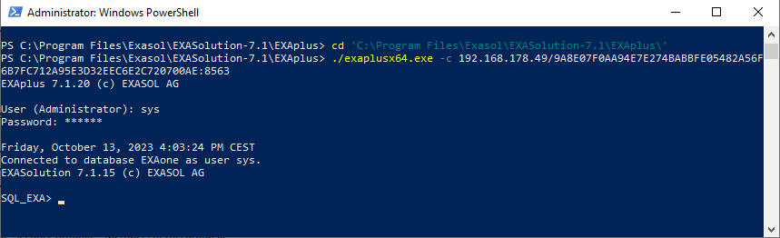
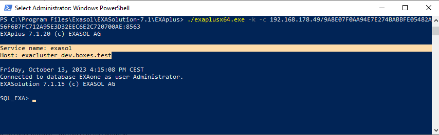

# Setting up Exasol Kerberos single sign-on with Active Directory
## Prerequisites

To successfully set up and use this integration, ensure the following requirements are met:

### 1. Active Directory (AD)
- Installed and configured to authenticate users.
- A domain is set up to host users for Single Sign-On (SSO) with Exasol DB.
- Administrative access to AD is available.

### 2. Exasol Database
- Installed and properly configured.
- Exasol v7.1 - administrative access to EXAoperation is available.
- Exasol v8 - administrative access to COS and ConfD is available.
- DBA privileges are granted for the database.

### 3. Client Machine
- Capable of authenticating with AD (able to obtain a Kerberos Ticket Granting Ticket (TGT) for the client user).
- Able to establish a connection to the Exasol database.
- EXAplus client installed. [Download here](https://downloads.exasol.com/clients-and-drivers/exaplus).

## Configuring SSO for ExasolDB

>  **Important:** Please **double-check all commands and inputs** for accuracy. Even small typos can lead to critical errors or unexpected behavior.
> 
> - Identifiers (usernames, hostnames, realms, domains etc.)  and configurations provided below are **case-sensitive**.
> - To avoid additional issues it is recommended to use simple names in lowercase where it is applicable.
> - If you encounter issues, review your inputs for potential misspellings or formatting errors before proceeding.
> 
> Your attention to detail is crucial for successful execution.

###  1. Create Exasol service account in AD
Create a new user in the AD domain to represent Exasol DB service. 
> **Important:** This account represents the Exasol database itself and is not intended to be used as a user account for authentication within the database. You can pick an arbitrary name, it is just an alias for an Exasol service. Try to keep it simple and use lower case.

> **Important:** Only users from the same domain/realm will be able to authenticate in the Exasol database using this service account.

This can be accomplished using the following PowerShell commands:
```
$password = ConvertTo-SecureString "{Service account password}" -AsPlainText -Force
New-ADUser -Name "{Service account name}" -AccountPassword $password -Enabled $true
```
* **\{Service account name\}**: arbitrary Exasol service user alias  
* **\{Service account password\}**: password for Exasol service user  

**Example**
```
$password = ConvertTo-SecureString "Password123!" -AsPlainText -Force
New-ADUser -Name "exa_db1" -AccountPassword $password -Enabled $true
```

###  2. Anable supports AES 128/256 bit encryption for Exasol service user
In "Active Directory Users and Computers" go to previously created Exasol user -> Properties -> Account -> Account options -> check "This account supports AES 128 bit encryption" and "This account supports AES 256 bit encryption" checkboxes.



###  3. Register SPN for exasol service user
In order to register SPN execute the following command in PowerShell: 

```
setspn -S {Exasol service name}/{Exasol host name}.{AD domain} {Service account name}
```

* **\{Exasol service name\}**: this parameter represents a **kerberos service name** of a particular exasol instance. This is the first out of 2 parameters which will be used during user authentication. It is arbitrary now, but later on it will be critical to use the exact value which is set up here. Try to keep it simple and use lower case. 
* **\{Exasol host name\}**: this parameter represents a **kerberos host name** of a particular exasol instance. This is the second out of 2 parameters which will be used during user authentication. It is arbitrary now, but later on it will be critical to use the exact value which is set up here. Try to keep it simple and use lower case. 
* **\{AD domain\}**: Active Directory domain of the Exasol service user created during step 1. 
* **\{Service account name\}**: Exasol service user created during step 1  

To check that SPN was registered correctly run the following command in PowerShell:
```
setspn -L {Service account name}
```

**Example**
```
setspn -S exasol/exacluster_dev.boxes.test exa_db1
```


###  4. Generate keytab file for Exasol service
With help of the following ktpass command generate a keytab for Exasol service which will later be uploaded in Exaoperation:

```
ktpass -out {Keytab path}\exasol_service.keytab -princ {Exasol service name}/{Exasol host name}.{AD domain}@{Kerberos realm} -mapuser {NETBIOS}\{Service account name} -mapop set -pass {Service account password} -ptype KRB5_NT_PRINCIPAL -crypto all
```
* **\{Keytab path\}**: Arbitrary local directory where keytab file will be created.  
* **\{Exasol service name\}**: Exasol **kerberos service name** which was set in step 3.  
* **\{Exasol host name\}**: Exasol **kerberos host name** which was set in step 3.  
* **\{AD domain\}**: Active Directory domain name of the Exasol service user created during step 1.  
* **\{Kerberos realm\}**: In AD it is usually the domain name written in all capital letters.  
* **\{NETBIOS\}**: Active Directory domain's Netbios (subdomain) name. Can be found in AD domain properties.  
* **\{Service account name\}**: Exasol service user created during step 1.  
* **\{Service account password\}**: Password of the Exasol service user created during step 1.  

**Example**
```
ktpass -out C:\temp\exasol_service.keytab -princ exasol/exacluster_dev.boxes.test@BOXES.TEST -mapuser BOXES\exa_db1 -mapop set -pass Password123! -ptype KRB5_NT_PRINCIPAL -crypto all
```

###  5.1 Upload service keytab in EXAoperation - Exasol v7.1.
> **Important:** This section applies only to Exasol version 7.1 with EXAoperation. For other types of Exasol installations, please refer to Section 5.2.
* Login to Exaoperation of the Exasol DB instance which you need to be accessible with AD SSO.
* Shutdown the database
  
* Go to the database link and wait until the **State** became **Selected**
* In the keytab section click **Choose file** and select the keytab file generated in step 4.
* Click **Upload keytab file** button.
  
* Then click **Edit** button to go to Edit db page
* Specify the **Kerberos Realm** parameter using Kerberos realm from step 4 and click **Apply**
  
* Startup the database and wait until it goes online
  

###  5.2 Upload service keytab using Confd - Exasol v8.
> **Important:** This section applies to Exasol version without ExaOperation.
* Log in to any node of your Exasol database deployment and use the command-line tool confd_client to perform the following operations.
* Stop the database using [db_stop](https://docs.exasol.com/db/latest/confd/jobs/db_stop.htm) confd job.
* Upload the keytab file generated in Step 4 to a temporary location in the Cluster Operating System (COS), such as `/tmp/exasol_service.keytab`.
* Use the [db_configure_kerberos](https://docs.exasol.com/db/latest/confd/jobs/db_configure_kerberos.htm) job to setup Kerberos realm EXAconf parameteres and upload keytab file on all nodes. Only Kerberos realm parameter is nessesary.
> **Important:** Currently this job doens't work correctly.
> 
> The db_configure_kerberos job cannot process actual keytab files. It expects either the file's content as a text string or an attempt to read the file as text using the {<filename} syntax. Both approaches fail since keytab files are binary and cannot be represented as text.
> 
* **Workaround**
  * Use db_configure_kerberos only to set EXAConf parameters and create a "dummy" keytab file in the correct location. 
  * Manually replace the "dummy" keytab with the actual keytab file  on all nodes.
  * The keytab file must be located on each DB node in the following path: /exa/etc/<database name>-keytab.
  * Ensure the keytab file does not already exist before running the job. If it does, delete it first.
* Start up the database using [db_start](https://docs.exasol.com/db/latest/confd/jobs/db_start.htm) confd job.
 
**Example**
```
# stop the database
confd_client db_stop db_name: DB1

cd /exa/etc/

#if keytab file alredy exists move it somewhere else
mv DB1-keytab DB1-keytab.bak

#run the db_configure_kerberos job
confd_client db_configure_kerberos db_name: DB1 keytab: 'any_string' realm: BOXES.TEST

#On all nodes: remove "dummy" keytab created by db_configure_kerberos
rm DB1-keytab

#On all nodes: upload correct keytab file under the same name
cp /tmp/exasol_service.keytab /exa/etc/DB1-keytab

# start the database
confd_client db_start db_name: DB1
```


###  6. Create a Database User for Authentication with a Kerberos Principal
> **Important:** AD users should be in the same realm/domain as the Exasol service account from the Step 1.

The Exasol cluster is now configured to authenticate AD users using Kerberos tickets. Next, you need to create corresponding database users (they will be authenticated via the TGT of an AD user's principal) and grant them the necessary privileges within the database.

Since this is a SSO solution, a TGT for the corresponding AD user principal should already be available once the user logs in to their client machine. You can verify this by running the klist command on the user's machine.



If for some reason tgt is not there (for example it has expired), you can try to request it manually with help of **kinit** command.

To enable an AD user to authenticate to the Exasol database using AD SSO, follow these steps::
* connect to Exasol DB as dba
* create a database user which is identified by the AD user's kerberos principal:
  ```sql
  create user {db user name} identified by KERBEROS PRINCIPAL '{AD user name}@{Kerberos realm}';
  GRANT CREATE SESSION TO {db user name};
  -- grant all other privileges and roles necessary for this particular user
  ```
  *  **\{db user name\}**: arbitrary Exasol db user name. This username itself is just a representation of AD user, it can be completely different form AD username and will not be directly used during authentication.  
  *  **\{AD user name\}**: username of AD user which we want to allow to access the database.  
  *  **\{Kerberos realm\}**: In AD it is usually the domain name written in all capital letters. The AD usre must have the same Realm as the Exasol service account from Step 1.  

  **Example**
  ```sql
  create user ad_john_smith identified by KERBEROS PRINCIPAL 'jsmith@BOXES.TEST';
  GRANT CREATE SESSION TO ad_john_smith;
  GRANT select any table TO ad_john_smith;
  ```

###  7. Test database connection from the user's AD account with EXAplus 
Configuration is completed. Now we can test connection to the database from the user's AD account with help of EXAplus.

* Login into the user's machine using user's AD account.
* Make sure that user's credential cache already contains an appropriate tgt-ticket. To do so, use **klist** command and check that the result contains a ticket for the principal **\{AD user name\}@\{Kerberos realm\}**.
* Open shell terminal and navigate to EXAplus directory
* To verify network connectivity between the client machine and the Exasol database, first attempt to connect to the database using a standard authentication method with a username and password. For example, use the dba user created in Step 6.
  ```
  ./exaplusx64.exe -c {Full connection string to Exasol db}
  ```
  **Example**

  

* Once connection is established you can be sure that client can access the DB. Now proceed with testing Kerberos authentication.
* Add **-k** option to the command. EXAplus will ask you to type **Service name** and **Host** instead of username and password. Use **\{Exasol service name\}** and **\{Exasol host name\}** from step 3.

  **Example**

  

##  Known issues

### Error: [28900] Cannot initialize SSPI security context
`Error: [28900] Cannot initialize SSPI security context. The specified target is unknown or unreachable` during Step 7. This usually mean that prived parameters **Service name** and **Host** don't match the service keytab uploaded in Exasol DB.

**Actions:**
* Make sure that **Service name** and **Host** are exactly the same as returned by `setspn -L {Service account name}` command. Run it in the same command promt before runing Exaplus.


### Error: [28900] Connection exception - authentication failed.
`Error: [28900] Connection exception - authentication failed.` during Step 7. 

**Actions:**
* Permissions on `/var/tmp/krb5_500.rcache2`.There might be an issue with permissions for this file `/var/tmp/krb5_500.rcache2`. It is a temporary file used by the Kerberos authentication mechanism to store information about authentication tickets that have been issued. This file is generated by the Kerberos libraries when Exasol performs Kerberos authentication. Ensure that users in the `exausers` group (in particular this user: `exadefusr` ) have Read/Write permissions in the `/var/tmp/` directory on all nodes. If permission are insufficient, issue corresponding chmod command: `chmod 777 /var/tmp/`
* Make sure that Exasol Service Account keytab is correctly imported in the DB.
* Check that **Kerberos Realm** db parameter is correctly set in Exaoperation/EXAConf.
* Try to regenerate keytab carefully and import it into DB once again.
* This error could indicate several different issues. To investigate further, export the database logs following the [instructions here](https://docs.exasol.com/db/latest/administration/on-premise/admin_interface/exasupport.htm?Highlight=exasupport) and send them to Exasol Support.


*We appreciate your input! Share your knowledge by contributing to the Knowledge Base directly in [GitHub](https://github.com/exasol/public-knowledgebase).* 
