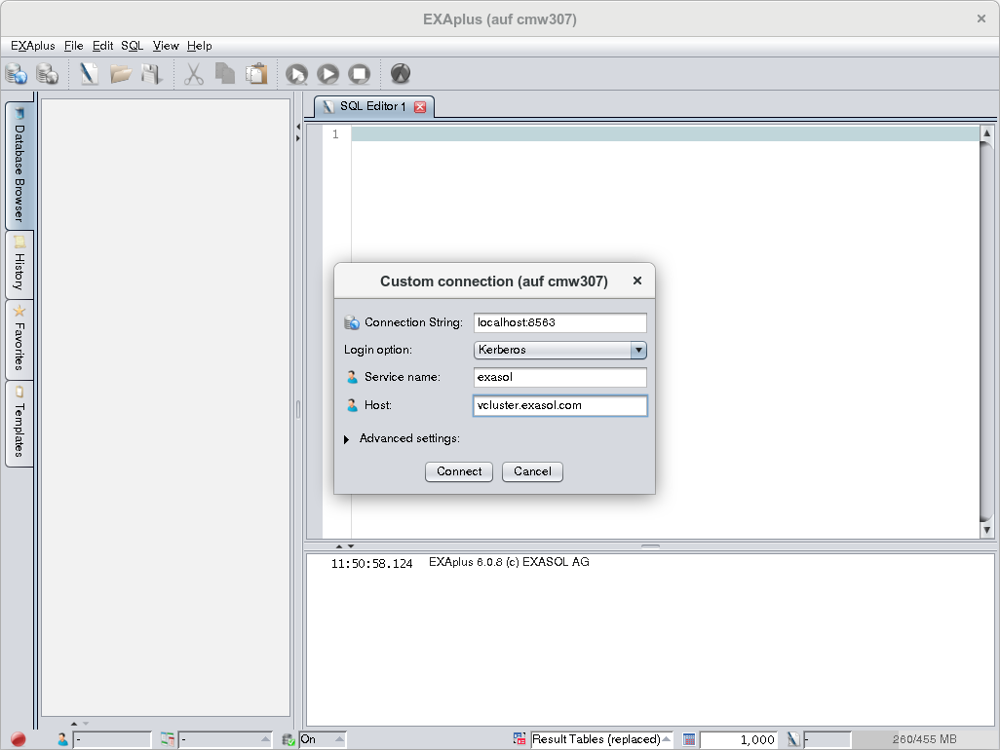
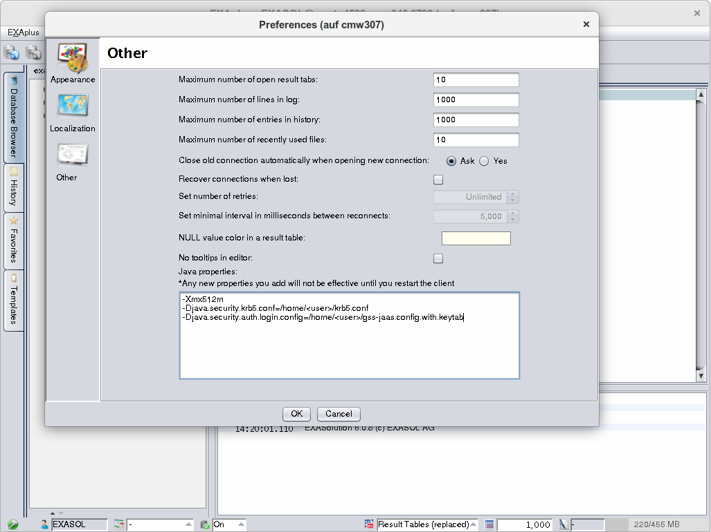

# Single Sign-On with Kerberos 
* ## Background

 This how-to describes the necessary steps to use Kerberos based single sign-on (SSO) in Exasol.

 ### EXAoperation (Exasol 7.x)

 The configuration of EXAoperation is explained in the Exasol documentation:  
<https://docs.exasol.com/db/7.1/administration/on-premise/access_management/kerberos_sso.htm>

 ## Prerequisites

 Database and used drivers / EXAplus have version 6.0.8 or newer.

 ## How to install SSO with Kerberos?

  ## Step 1: Create Exasol user with Kerberos authentication

 ### Create user

 CREATE USER (identifier) IDENTIFIED BY KERBEROS PRINCIPAL (string-literal)

 The Kerberos principal is usually formed like this: (user)@(realm)

 ### Alter User

 ALTER USER (identifier) IDENTIFIED BY KERBEROS PRINCIPAL (string-literal)

 ### Rename User

 Renaming a user with Kerberos authentication will not affect the Kerberos principal specified by CREATE USER or ALTER USER.

 More details on the creation of users can be found in the user manual.

 ## Step 2: Client configuration

 After these steps, the database is ready to accept users that authenticate via Kerberos.

 For the client side, different options to use this authentication method exist:

 ### ODBC

 #### New connection string parameters

 

|  |  |
| --- | --- |
| KERBEROSSERVICENAME | Service name part of the Kerberos principal.Default: exasol |
| KERBEROSHOSTNAME | Hostname of the Kerberos principal.Default: use hostname from the connection string |

 Kerberos based single sign-on will be used if user and password are not specified and the SQL_DRIVER_PROMPT flag is not set during SQLDriverConnect().

 #### ODBC Single-Sign-On on Linux

 You can either use your existing ticket for your user or use a keytab file.


+ **Use existing ticket**:  
We assume that you already have a ticket for your user from the KDC. If not, obtain a ticket using kinit:  
	
```"code-java"
kinit user@YOUR.REALM 
```
 
+ **Use keytab file** :  
To use a keytab file, you have to make sure there are no tickets in the cache using kdestroy. Then you have to tell Kerberos where your keytab file is located:  
	
```"code-java"
export KRB5_CLIENT_KTNAME=/home/<your_user>/<your_keytab_file_name> 
```
Alternative: add the location of the keytab file to the krb5.conf:

   
```"code-java"
[libdefaults]  default_client_keytab_name = /home/<your_user>/<your_keytab_file_name>
```
 
+ We assume you have a valid krb5.conf
+ Create an odbc.ini configured for Kerberos. Here is an example:  
	
```"code-java"
[exa_linux]
Driver = /home/<your_user>/KerberosTest/EXASolution_ODBC-6.0.8/lib/linux/x86_64/libexaodbc-uo2214lv2.so
EXAHOST = exasol-host:8563
EXALOGFILE = odbc.log
LOGMODE = Debug Comm
KerberosServiceName = exasol
KerberosHostName = kerberos.hostname.for.exasol
```
 
+ Make sure your environment variables are correctly set (this might vary depending on the environment)
	
```"code-java"
export KRB5CCNAME=DIR:/path/to/your/cache/ 
export KRB5_CONFIG=/path/to/your/krb5.conf 
export ODBCINI=/path/to/your/odbc.ini 
```
 
+ You should now be able to use the exa_linux DSN  
	
```"code-java"
isql exa_linux -v 
```
   #### ODBC Single-Sign-On on Windows

 On Windows just install the Exasol ODBC driver. Then in the ODBC Configuration tool from Windows add a new DSN for the Exasol ODBC driver.

 Now you can setup the connection:


+ Specify any DSN name
+ Specify connection string (host: port)
+ Specify "Additional parameter" in the second tab (Advanced) of the configuration tool to "kerberosServiceName=&lt;yourServiceName&gt;.
+ You may require kerberosHostName too, depending on your Active Directory configuration. For this you have to extend the additional parameters as follows: "kerberosServiceName=&lt;yourServiceName&gt;;kerberosHostName=&lt;yourKrbHostName&gt;".
	
#### Compatibility Mode

 If it is not possible to specify the additional parameters, the "compatibility mode" using username and password can be used. For this, you can specify the Kerberos service name in the "User name" field as:

   
```"code-java"
Kerberos:<yourServiceName> 
```
   If the kerberosHostName has to be specified, the "User Name" field has the following format:

 **Linux**

   
```"code-java"
Kerberos:<yourServiceName>@<yourKrbHostName>
```
   **Windows**

   
```"code-java"
Kerberos:<yourServiceName>/<yourKrbHostName> 
```
   ### JDBC

 #### New connection string parameters

 If one of the following connection string parameters is set, Kerberos single-sign-on will be used for JDBC.

 

|  |  |
| --- | --- |
| kerberosservicename | Service name part of the Kerberos principal.Default: exasol |
| kerberoshostname | Hostname of the Kerberos principal.Default: use hostname from the connection string |

 #### JDBC Single-Sign-On On Linux

 #### Using ticket cache

 We assume that you already have a ticket for your user from the KDC. If not, obtain a ticket using kinit:

   
```"code-java"
kinit user@YOUR.REALM 
```
   If you now use JDBC with the connection string parameters specified above, authentication should work without asking for a username or password.

 For illustration we provide an example Java application:

   
```"code-java"
package com.exasol;
 
import java.sql.Connection;
import java.sql.DriverManager;
import java.sql.SQLException;
import java.util.Properties;
 
public class KerberosTest {
     
    static Properties props = System.getProperties();
     
    private void testKerberosConnection(String h, String p)
    {
        String connectionString="jdbc:exa:" + h + ":" + p + ";kerberosservicename=exasol;kerberoshostname=kerberos.hostname.for.exasol";
        //Optional connection string parameters: ";debug=1;logdir=/home/<your_user>"
 
        try {
            Class.forName("com.exasol.jdbc.EXADriver");
        } catch (ClassNotFoundException e) {
            e.printStackTrace();
        }
        Connection driverConn=null;
        try {
             //Connectiong to the EXASOL Server as the current OS user
             driverConn = DriverManager.getConnection(connectionString);
        } catch (SQLException e) {
            e.printStackTrace();
        }
        try {
            if (driverConn!=null && !driverConn.isClosed())
                System.out.println("Kerberos connection test success!");
            else
                System.out.println("Kerberos connect failed!");
        } catch (SQLException e) {
            e.printStackTrace();
        }
    }
 
    public static void main(String[] args) {
        (new KerberosTest()).testKerberosConnection(args[0], args[1]);
        System.out.println("Done.");
    }
 
}
```
   How to run the test application:

   
```"code-java"
java -Djavax.security.auth.useSubjectCredsOnly=false -Djava.security.krb5.conf=/path/to/your/krb5.conf -cp exajdbc.jar:/path/to/example com/exasol/KerberosTest <your_exasol_host_name> <your_exasol_port_nr>
```
   In case of problems with Kerberos not working as expected, you can enable command line Kerberos debugging by setting the following parameter value to true:

   
```"code-java"
-Dsun.security.krb5.debug=true
```
   These logs displayed will help you understand the issues related to kerberos not working. 

 #### Using keytab file

 To configure the Exasol GSSAPI connection and to specify the keytab file you can use a gss.config file:

   
```"code-java"
com.sun.security.jgss.initiate {
com.sun.security.auth.module.Krb5LoginModule required
principal="<your_user>@<your_realm>"
useKeyTab=true
doNotPrompt=true
keyTab="/home/<your_user>/<your_keytab_file_name>";
};
```
   How to run the test application:

   
```"code-java"
java -Djava.security.auth.login.config=/home/<your_user>/gss.config -Djavax.security.auth.useSubjectCredsOnly=false -Djava.security.krb5.conf=/path/to/your/krb5.conf -cp exajdbc.jar:/path/to/example com/exasol/KerberosTest <your_exasol_host_name> <your_exasol_port_nr> 
```
   #### **JDBC Single-Sign-On****On****Windows**

 First, install the Exasol JDBC driver. In the Java sample provided above, you can modify the connection string as follows:

   
```"code-java"
String connectionString="jdbc:exa:" + h + ":" + p + ";kerberosservicename=<your_kerberos_service_name>;kerberoshostname=<your_kerberos_hostname>;debug=1;logdir=c:\\Users\\<your_user>"; 
```
   Compile the sample and run it

   
```"code-java"
java -cp "c:\Program Files (x86)\EXASOL\EXASolution-6.0\JDBC\exajdbc.jar";c:\path\to\example;C:\Users\<your_user>\Waffle\Bin\jna-4.0.0.jar;c:\Users\<your_user>\Waffle\Bin\jna-platform-4.0.0.jar;c:\Users\<your_user>\Waffle\Bin\waffle-jna.jar kerberosTest <your_exasol_server_host> <your_exasol_port> 
```
   ### Compatibility Mode

 Similar to ODBC, the "compatibility mode" is supported. If you use a username in the following format, the password will be ignored and it behaves as if the respective Kerberos connection string parameters were set (see table above). Note that only the service name is mandatory.

 **Linux**

   
```"code-java"
Kerberos:<yourServiceName>@<yourKrbHostName>
```
   **Windows**

   
```"code-java"
Kerberos:<yourServiceName>/<yourKrbHostName> 
```
   ### EXAplus

 #### GUI

 In the login dialog in EXAplus, the user can choose Username or Kerberos in the dropdown list. If Kerberos is chosen, the GUI will change, so that the user could input service name, host and connection string.

    
	
#### CLI

 For Login with Kerberos, EXAplus should be started with parameter -k. Then the user can input service name, host and connection string.

   
```"code-java"
$ /usr/opt/EXASuite-6/EXASolution-6.0.8/bin/Console/exaplus -k
EXAplus 6.0.8 (c) EXASOL AG
 
Service name: exasol
Host: vcluster.exasol.com
Connection String (localhost:8563): mynode:8563
 
Thursday, March 8, 2018 12:57:48 PM CET
Connected to database exa.mynode.8563 as user null.
EXASolution 6.0.8 (c) EXASOL AG
 
SQL_EXA> 
```
   ### Manipulation of JVM Properties

 In the Preferences > Other menu, the user can define JVM Properties, which will be used when Java is called for starting EXAplus. The default value of JVM Properties is -Xmx512m. This feature is only implemented in EXAplus GUI for Linux and Windows. For MacOS, SSO with Kerberos is not available, hence the JVM option is not applicable on MacOS.

 #### Windows, Linux

 

*We appreciate your input! Share your knowledge by contributing to the Knowledge Base directly in [GitHub](https://github.com/exasol/public-knowledgebase).* 
