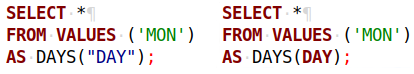

# SQL keywords: reserved vs. non-reserved 
Whether you are a user of Exasol or a software developer working on a SQL client, keywords are an important concept to know.

SQL key words are part of the syntax of SQL statements — the smallest building blocks if you will. `SELECT` for example is a keyword that everyone knows...

## What this article covers

What I want to point out in this article is that keywords come in two different flavors and that this has a big impact on what you can and can't do with them:

* reserved
* non-reserved

## Which keywords exist in Exasol?

Luckily there is a system table called `EXA_SQL_KEYWORDS` that contains that list and it obviously fits with the installed version.


```sql
SELECT * FROM EXA_SQL_KEYWORDS;
```
Notice the column named `RESERVED`. If that value is false, you are allowed to use that keyword as a regular identifier. Otherwise quoting is mandatory. Let's try this out.


```sql
SELECT * FROM VALUES ('MON'), ('TUE'), ('WED'), ('THU'), ('FRI'), ('SAT'), ('SUN') AS DAYS("DAY");
```
Here we use the reserved keyword "DAY" as an identifier. Try that statement in your SQL client to see the effect. You need to enclose the keyword in double quotes for the query to succeed.

## Syntax Highlighting

In a proper SQL client, syntax highlighting is a good indicator whether you hit a keyword or not. Look at the side-by-side comparison in this screenshot from [DBeaver](https://dbeaver.io/).



On the left side you see a the keyword "DAY" properly quoted and displayed in the color of an identifier. On the right I "forgot" the quotes and get the word highlighted as a keyword instead. Of course the query on the right will fail.

## Should I use keywords as identifiers?

The short answer is, no.

The reason is that it adds an unnecessary source of human error. If you don't use keywords as identifiers, then there is one less thing to worry about. That being said, you are sometimes forced to.

Imagine a user of your query expecting the columns of a table to have strict predefined names and those happen to be keywords.

So, the more precise answer is: only use keywords as identifiers if you are forced to.

*Please let us know about your experiences and any feedback you have on this article below!*

*We appreciate your input! Share your knowledge by contributing to the Knowledge Base directly in [GitHub](https://github.com/exasol/public-knowledgebase).* 