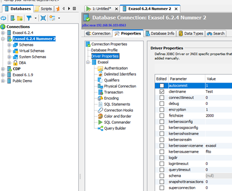
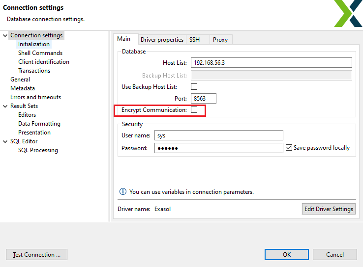
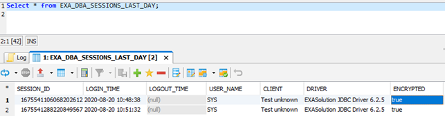

# Switching Ecryption on and off in Exasol 
If you want to connect other systems (such as BI, ETL tools, other databases) to Exasol, an encrypted connection is very important. Depending on which type of connection you choose, for example, a driver or connector), you can switch the encryption between on and off in different ways. This article provides you with an overview of encryption for the most common connections.

## Drivers

With a **JDBC**, **ODBC**, and **ADO.NET** driver, you can turn on encryption with a connection parameter. This connection parameter in all the three drivers is called Encryption.   
For information on how to use this parameter, refer to the relevant documentation:   
[https://docs.exasol.com/connect_exasol/drivers/jdbc.htm](https://docs.exasol.com/connect_exasol/drivers/jdbc.htm "Follow")  
[https://docs.exasol.com/connect_exasol/drivers/odbc/using_odbc.htm](https://docs.exasol.com/connect_exasol/drivers/odbc/using_odbc.htm "Follow")  
[https://docs.exasol.com/connect_exasol/drivers/ado_net.htm](https://docs.exasol.com/connect_exasol/drivers/ado_net.htm "Follow")

If you are using **WebSocket-API**, the encryption works differently. You need to specify the encryption in the URL similar to HTTP:// and HTTPS://. For example, **wss://<host>** indicates **encrypted** protocol and **ws://<host>** indicates **unencrypted** protocol.

## Clients

The two most common clients for Exasol are the DbVisualizer and the DBeaver. Both these clients include a parameter using which you can switch the encryption on or off.

In **DbVIsualizer**, you can switch the encryption on or off by

1. Double-clicking a **Connection** under the **Databases** section.   

2. Select the **Properties** tab, and then select **Driver Properties**.
3. For encryption, set it to **1** for **encryption on**, and set it to **0** for **encryption off**.

In **DBeaver**, you can switch the encryption on or off by

1. Right-clicking on an existing connection and then select **Edit Connection**.
2. Select the checkbox next to **Encrypt Communication** to enable encryption.   

Additionally, you can check if encryption is on or off using the system tables in both the clients. Using the select statement on the tables, EXA_DBA_SESSION_LAST_DAY, EXA_DBA_AUDIT_SESSIONS, EXA_USER_SESSIONS_LAST_DAY, EXA_USER_SESSIONS, EXA_DBA_SESSIONS, or EXA_ALL_SESSIONS, you can determine if the session is encrypted.

