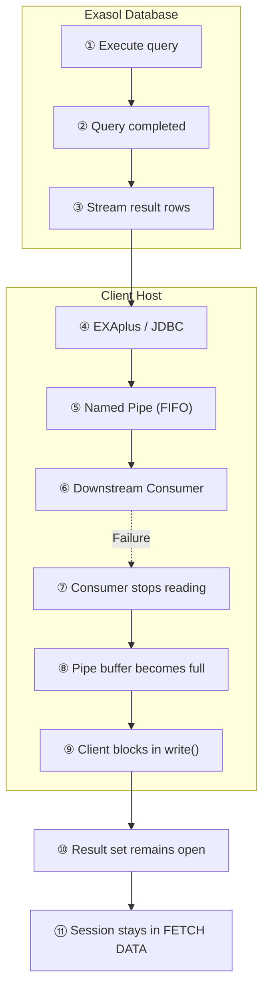

# Troubleshooting Active Session Limit Reached Due to FETCH DATA Sessions

## Overview

When a large number of sessions remain in the `FETCH DATA` state, Exasol may eventually reach the **Active Session Limit**, preventing new queries from being executed.

Although this often appears to be a database performance problem, the database has usually already completed query execution successfully. 
Instead, the client application has stopped consuming the query result, forcing Exasol to keep the result set—and therefore the session—open.

This article explains why this happens, how to diagnose it, and how to prevent it.

### What Is an Active Session?

An **active session** is a session that occupies one active session slot. A session is considered active while it is executing a statement, holding an open result set, an open write transaction, or an open sub-connection.

By default, Exasol provides **100 active session slots per cluster**. When all slots are in use, additional sessions are queued until a slot becomes available.

> **Note:** This article focuses on sessions that remain active because they hold an **open result set** in the `FETCH DATA` state.

For more information, see the [Session Management](https://docs.exasol.com/db/latest/database_concepts/session_management.htm) documentation.

### What Does `FETCH DATA` Mean?

A session in the `FETCH DATA` state has already finished executing its SQL statement.

The database is no longer processing the query—it is simply waiting for the client application to fetch the remaining result rows.

As long as the result set remains open, the session continues to count against the Active Session Limit.

A small number of `FETCH DATA` sessions is completely normal. Problems arise only when many sessions remain in this state for an extended period.

---

## Symptoms

When many sessions become stuck in the `FETCH DATA` state, administrators typically observe one or more of the following symptoms.

### Error Messages

Monitoring systems or database logs report alerts such as:

- `Query queue limit of active sessions nearly reached`
- `Limit of active sessions has been reached`

### Session Congestion

Approximately 100 concurrent sessions (the default per cluster) appear in the `FETCH DATA` state.

### Blocked Query Execution

New SQL statements are queued or rejected because no active session slots remain available.

### Sessions Remain Active

Simply terminating the SQL statement is often insufficient because the client process itself remains blocked in an operating system I/O operation.

---

## Root Cause

In most cases, the database is **not** the root cause.

The database has already finished executing the query and is waiting for the client to fetch the remaining rows.

The problem occurs when the client application stops consuming the result set—for example because it blocks while writing fetched rows to an output destination.

Since the client still owns an open result set, Exasol must keep the session active.

This behavior is intentional.

From the database's perspective, the client may continue fetching rows at any time. Automatically closing the session would risk truncating a valid query result. Therefore, Exasol keeps the session open until the client either finishes fetching all rows or disconnects.

---

### Example: Export to a Named Pipe


A common production scenario looks like this:

1. A scheduler starts an export using EXAplus, JDBC, or another SQL client.
2. Query output is redirected to a named pipe (FIFO).
3. Another process (for example compression, parsing, or file transfer) is expected to read the data from that pipe.

#### Where It Fails

Problems begin when the downstream consumer:

- never starts,
- crashes,
- or opens the pipe without actually reading data.

### Data Flow

The following diagram illustrates where the pipeline becomes blocked and why the database session remains in the `FETCH DATA` state.



#### Step-by-Step Explanation

| Step | Description |
|------|-------------|
| **①** | The client submits a SQL query to Exasol. |
| **②** | Exasol finishes executing the query. At this point, the database work is complete. |
| **③** | Exasol starts streaming the result rows to the client. |
| **④** | The SQL client (for example EXAplus or a JDBC application) receives the rows. |
| **⑤** | The client writes the rows to a named pipe (FIFO). |
| **⑥** | A downstream process is expected to read and process the data. |
| **⑦** | The downstream consumer crashes, never starts, or stops reading from the pipe. |
| **⑧** | The operating system's pipe buffer eventually becomes full because no data is being consumed. |
| **⑨** | The client blocks inside the operating system's `write()` system call while trying to write additional data. It can no longer fetch more rows from Exasol. |
| **⑩** | Because the client stops fetching, the result set remains open. |
| **⑪** | Exasol keeps the session in the `FETCH DATA` state until the client disconnects or the result set is closed. The session therefore continues to count against the active session limit. |

> **Key point:** The SQL query has already completed successfully inside Exasol. The remaining bottleneck is entirely on the client side, where the application is blocked while writing the fetched result data to its output destination.
---

## Reproducing the Issue

The following Linux example reproduces this behavior.

### 1. Create a ExaPlus Script

Create `/tmp/long.sql`.

```sql
SPOOL /tmp/SPOOL_TEST.lst;

SELECT
    i,
    SUM(i) OVER (
        ORDER BY i
        ROWS BETWEEN UNBOUNDED PRECEDING AND CURRENT ROW
    ) AS running_sum
FROM VALUES BETWEEN 1 AND 100000000 AS t(i);

SPOOL OFF;
```

---

### 2. Replace the Output File with a Named Pipe

```bash
rm -f /tmp/SPOOL_TEST.lst
mkfifo /tmp/SPOOL_TEST.lst
```

---

### 3. Open the Pipe Without Reading Data

```bash
sleep 3600 < /tmp/SPOOL_TEST.lst
```

The pipe is opened for reading but no data is actually consumed.

---

### 4. Execute the SQL Script

```bash
exaplus -c <host>:8563 \
         -u sys \
         -p <password> \
         -f /tmp/long.sql
```

After the pipe buffer fills, EXAplus blocks in `write()` while the database session remains in `FETCH DATA`.

---

## Diagnosing the Issue

Use `EXA_DBA_SESSIONS` (or `EXA_ALL_SESSIONS`) to identify long-running `FETCH DATA` sessions.

> **Note:** If the **Active Session Limit** has already been reached, regular user connections may be queued and you may not be able to execute diagnostic queries. In this situation, connect as the **`SYS`** user using a **super connection** (JDBC connection property `superconnection=1`). Super connections are reserved for administrative tasks and can still be established when the active session limit has been reached. For details, see the [Exasol JDBC Driver documentation](https://docs.exasol.com/db/latest/connect_exasol/drivers/jdbc.htm).

```sql
SELECT
    session_id,
    user_name,
    status,
    command_name,
    activity,
    duration,
    client,
    driver
FROM EXA_DBA_SESSIONS
WHERE status = 'FETCH DATA'
ORDER BY duration DESC;
```

### Typical Indicators

Look for:

- many sessions using the same client or JDBC driver
- unusually long durations
- sessions that started at nearly the same time
- service accounts running automated ETL jobs
- repeated export statements

### Immediate Operational Relief

If the cluster has already reached the Active Session Limit:

1. Identify sessions stuck in `FETCH DATA`.
2. Correlate them with the corresponding client processes, hosts, or ETL jobs.
3. Terminate the blocked client processes at the operating system level.
4. Repair or restart the downstream consumer.
5. Remove broken named pipes if necessary.
6. Restart the affected export jobs.
7. Temporarily reduce export concurrency until the underlying issue has been resolved.

## Prevention and Best Practices

### Prefer Regular Files

Whenever possible, export to a regular file instead of directly streaming into a named pipe.

Avoid:

```bash
exaplus ... > /tmp/export.pipe
```

Prefer:

```bash
exaplus ... > /tmp/export.dat
downstream_consumer /tmp/export.dat
```

Regular files are considerably more robust than FIFO-based streaming.

### Verify Consumers First

If named pipes are required, ensure that the downstream process is:

- running,
- healthy,
- and actively reading

before starting the export.

### Configure Timeouts

Implement watchdog timers, execution timeouts, and monitoring that detect blocked exports or stagnant output files.

### Limit Export Concurrency

Restrict the number of concurrent export jobs so that one downstream failure cannot consume all available active session slots.

### Clean Up Stale Processes

Automatically remove:

- orphaned client processes
- abandoned named pipes
- failed export jobs

before restarting workflows.

### Use More Robust Data Handoffs

Where possible, replace FIFO streaming with more resilient alternatives such as:

- regular files
- object storage (for example S3-compatible storage)
- message queues
- batch staging workflows

---

## Key Takeaway

A large number of sessions in the `FETCH DATA` state **does not indicate slow query execution inside Exasol**.

Instead, it usually means that the database finished processing the query long ago, but the client application can no longer consume the result set because its downstream output destination is blocked.

Since the client still owns an open result set, Exasol must keep the session active. If enough of these sessions accumulate, the Active Session Limit is eventually exhausted, preventing new queries from starting until the blocked client processes are resolved.

## References

- [Active Session Limit Reached (Knowledge Base)](https://exasol.my.site.com/s/article/Active-Session-Limit-Reached?language=en_US) – General troubleshooting guide for diagnosing and resolving the **Active Session Limit Reached** warning and related errors.

- [Session Management](https://docs.exasol.com/db/latest/database_concepts/session_management.htm) – Explains how Exasol manages active and inactive sessions, defines active session slots, and describes the active session limit and queueing behavior.

- [EXA_DBA_SESSIONS System Table](https://docs.exasol.com/db/latest/sql_references/system_tables/metadata/exa_dba_sessions.htm) – Reference for monitoring active sessions and identifying long-running `FETCH DATA` sessions.

- [EXA_ALL_SESSIONS System Table](https://docs.exasol.com/db/latest/sql_references/system_tables/metadata/exa_all_sessions.htm) – Describes session states such as `FETCH DATA` and `QUEUED`, and explains the meaning of the `STATUS` column.
## Further Reading

The following resources explain the operating system behavior that commonly causes this issue:

- [Named Pipe (FIFO) – Wikipedia](https://en.wikipedia.org/wiki/Named_pipe) – Overview of named pipes and their blocking behavior.

- [pipe(7) – Linux Manual](https://man7.org/linux/man-pages/man7/pipe.7.html) – Explains pipe buffers and why writers block when the pipe buffer becomes full.

- [write(2) – Linux Manual](https://man7.org/linux/man-pages/man2/write.2.html) – Describes the POSIX `write()` system call and the conditions under which it blocks.

*We appreciate your input! Share your knowledge by contributing to the Knowledge Base directly in [GitHub](https://github.com/exasol/public-knowledgebase).*
