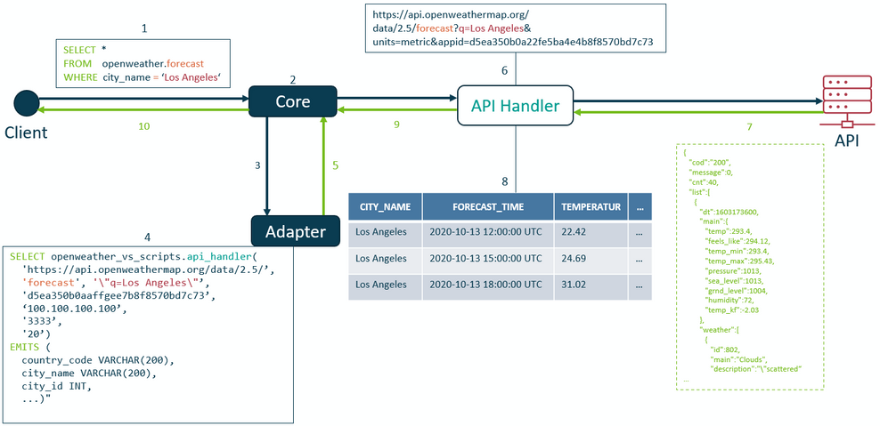
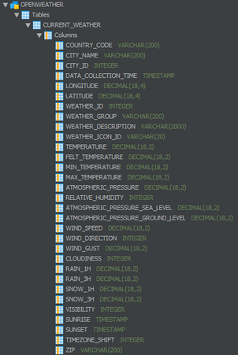

# Using Virtual Schema on a REST API 
## Background

When looking at Exasol Virtual Schemas in our [Documentation](https://docs.exasol.com/database_concepts/virtual_schemas.htm) the first sentence states: 

*Exasol Virtual Schemas are an abstraction layer that makes external data sources accessible in our data analytics platform through regular SQL commands.*

Notice, how it sais "external **data sources**" and not "external databases". This is for a reason. As a matter of fact Virtual Schemas allow you to access **ANY** arbitrary data source through the standard interface of SQL. Up until now we provided Virtual Schema adapters for numerous relational database management systems. I took the concept a step further with this project. In this article I'll explain to you how Exasol Virtual Schemas enable you access a REST API via standard SQL and use it as if the API were a table in your database. This concept can be carried over to **any** API (public or private) and is of great use for data scientists and power users. Enjoy!

If you want to learn more about the inner workings of Exasols Virtual Schema adapter please consult 's series on them: [How to build your own Virtual Schema Adapter](https://www.exasol.com/en/resource/how-to-build-your-own-virtual-schema-adapter-part-1/).

## Explanation

You'll find the code I am talking about on our GitHub: [openweather-virtual-schema](https://github.com/exasol/openweather-virtual-schema)

A Virtual Schema translates Exasol SQL to something, that the source can understand. With RDBMS this might be another SQL dialect. In our case it's `GET` requests we send to an API. The simplified workflow looks like this.



1. The user sends a SQL statement to the database core using a SQL client.  
2. + 3. The database core sends the SQL to the Virtual Schema adapter.  
4. The Virtual Schema adapter transforms the users SQL so that it can query the source using the API Handler.  
5. The adapter returns the re-formatted SQL to the database core which executes it.  
6. During execution the SQL statement uses the API Handler (which itself is a [UDF](https://docs.exasol.com/7.0/database_concepts/udf_scripts.htm)) to parametrize a `GET` request which is send to the REST API.  
7. The source returns a `JSON` object to the API Handler.  
8. The API Handler takes the `JSON` object and emits a relational table structure.  
9. The table / result set is returned to the database core.  
10. The database core aggregates every result set from the query and returns them to the client.

## Creating the Virtual Schema

In order to create the Virtual Schema you need to create the adapter script and it's utility UDFs first. The solution consists of four files:

* `openweather-virtual-schema.sql`
* `openweather_adapter.py`
* `api_handler.py`
* `plain_text_tcp_handler.py`

`openweather-virtual-schema.sql` works as a wrapper around the whole creation and execution process. For better readability I truncated some of the files contents below.

1. Create the Virtual Schema adapter script
2. Create the API Handler script
3. Create the Virtual Schema
4. A SQL query to test the CURRENT_WEATHER Virtual Schema table is executed
5. A SQL query to test the FORECAST Virtual Schema table is executed

### openweather-virtual-schema


```markup
--/
CREATE OR REPLACE PYTHON3 ADAPTER SCRIPT openweather_vs_scripts.openweather_adapter AS 
import requests
import sys
from pathlib import Path


def download_python_files():
   ...
            

def adapter_call(request) -> str:
    """Public entry point to any adapter script on Exasol"""
    download_python_files()
    sys.path.append('tmp/')
    from openweather_adapter import AdapterCallHandler
    
    call_handler = AdapterCallHandler(request)
    return call_handler.controll_request_processing()
/

--/
--Adapter uses this UDF to request the API
CREATE OR REPLACE PYTHON3 SET SCRIPT openweather_vs_scripts.api_handler(api_host varchar(100),
                                                                        api_method varchar(100),
                                                                        api_parameters varchar(2000),
                                                                        api_key varchar(50),
                                                                        logger_ip varchar(20),
                                                                        logger_port varchar(10),
                                                                        logger_level varchar(10))
EMITS(...) AS
import requests
import sys
from pathlib import Path


def download_python_files():
    ...

def run(ctx) -> None:
    """Public run method as entry point to any Python UDF on Exasol"""
    download_python_files()
    sys.path.append('tmp/')
    from api_handler import ApiHandler
    
    api_handler = ApiHandler(ctx)

    api_handler.logger.info('>>>>API CALL<<<<')
    api_handler.logger.info(f'URL PARAMETER SET \n{ctx.api_parameters}\n')

    api_handler.api_calls()
/

--/
CREATE VIRTUAL SCHEMA openweather
USING openweather_vs_scripts.openweather_adapter
WITH API_KEY = '...'
     LOG_LISTENER = '0.0.0.0'   --IP Address
     LOG_LISTENER_PORT = '3333'         --Port
     LOG_LEVEL = 'INFO'                 --INFO or WARNING
/

-- Test Current_Weather
SELECT * FROM OPENWEATHER.CURRENT_WEATHER
WHERE  city_name = 'München' OR
       ...

---- Test forecast
SELECT * FROM OPENWEATHER.FORECAST
WHERE   city_name = 'Los Angeles' OR
        ...
```
Note that the solution is built in a modular way. The actual code for the adapter script and the API Handler is not contained in the openweather-virtual-schema.sql but is dynamically loaded at runtime from GitHub using the `download_python_files()` method. To find out more about the inner workings of those files please visit the [GitHub](https://github.com/exasol/openweather-virtual-schema) repository. After 1. and 2. from the `openweather-virtual-schema.sql` is completed we can create the Virtual Schema itself (Step 3).


```markup
--/
CREATE VIRTUAL SCHEMA openweather
USING openweather_vs_scripts.openweather_adapter
WITH API_KEY = 'd5ea350b0aff3ba4e448f8570bd7c73'
     LOG_LISTENER = '192.168.177.83'
     LOG_LISTENER_PORT = '3333'
     LOG_LEVEL = 'INFO'
/
```
The creation of the Virtual Schema takes 4 arguments:

##### API_KEY

Unfortunately there are very little free and public APIs out there. For this Example I went with <https://openweathermap.org/api>. In order to use the API you need an account with openweather. Please register at their site and get your API key - it's free for low volumes.

Disclaimer: In a production environment, you should never put your `API_KEY` in plain text here. Instead create a [named connection](https://docs.exasol.com/7.0/sql/create_connection.htm). Otherwise the `API_KEY` will show up in your database logging.  
  


##### LOG_LISTENER/ ..._PORT

For debugging purposes I included a rudimental debugger in this Virtual Schema. Debug messages are send out to `<LOG_LISTENER>:<LOG_LISTENER_PORT>`. If you have a TCP listener like `netcat` running on the specified port you will see debug messages coming in as the Virtual Schema works.

##### LOG_LEVEL

You can specify a log level here. Only `INFO` and `WARNING` are supported. `INFO` will give you a ton of information and is useful to better understand what a Virtual Schema is doing in the background. `WARNING` will only give you error messages on malformed SQL queries.

## Using the Virtual Schema

You can explore the layout of the Virtual Schema using your SQL-Editor:    



The two tables `CURRENT_WEATHER` and `FORECAST` refer to the two API methods [Current weather data](https://openweathermap.org/current) and [5 day weather forecast](https://openweathermap.org/forecast5).Here is an example query showcasing the covered functionalities - this is step 4 and 5 from above:
```markup
SELECT * 
FROM   OPENWEATHER.CURRENT_WEATHER
WHERE  city_name = 'Stuttgart' OR
       'Los Angeles' = city_name OR
       latitude = 41.89 AND longitude = 12.48 OR
       city_id = 3060972 OR
       zip = 96050 AND country_code = 'DE' OR
       country_code = 'US' AND zip = 10301 OR
       city_id IN (2759794, 3247449, 2957773) OR
       city_name IN ('Memphis', 'Zirndorf', 'Kassel');

```
Note that only those features can be supported by the Virtual Schema push-down that are supported by the source. For example


```markup
SELECT * FROM OPENWEATHER.CURRENT_WEATHER WHERE temperature = 30.0;
```
won't work. The Virtual Schema will try to push down the `PREDICATE_EQUAL` expression (`temperature = 30.0`) to the source but openweather does us not allow to request places by temperature. With other words: *No you can't use this to look for a vacation destination* 

Apart from `PREDICATE_EQUAL` (e.g. `city_name **=** 'Nuremberg'`) no other predicates are supported for push-down to the source. This means that any other expression like `<`, `>`, `=>`, `<=` or `NOT` will be carried out on the core database. This makes sure that every correct SQL you run against the Virtual Schema results in what you expect. Hence this:


```markup
SELECT * FROM OPENWEATHER.CURRENT_WEATHER 
WHERE city_name IN ('Berlin', 'Los Angeles', 'Oslo') 
AND temperature > 25.0;
```
 will work.

### Limitation

Because we are using openweathers free plan rate limits apply. No more then 60 requests can be made each minute. If the rate limit is exceeded an error will be returned. Further more as free users we are not permitted to use other more powerful APIs openweather is offering. But for demo purposes that's fine.

