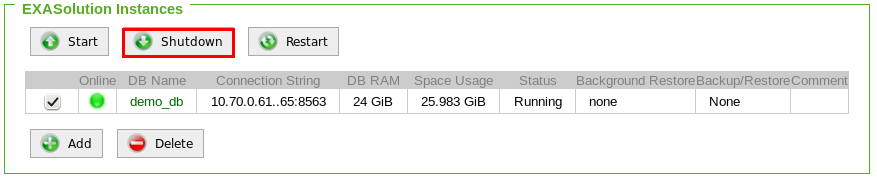
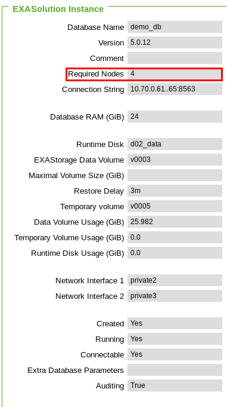
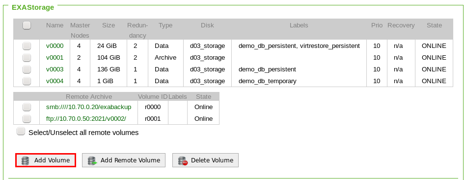
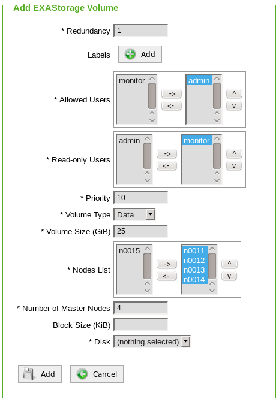
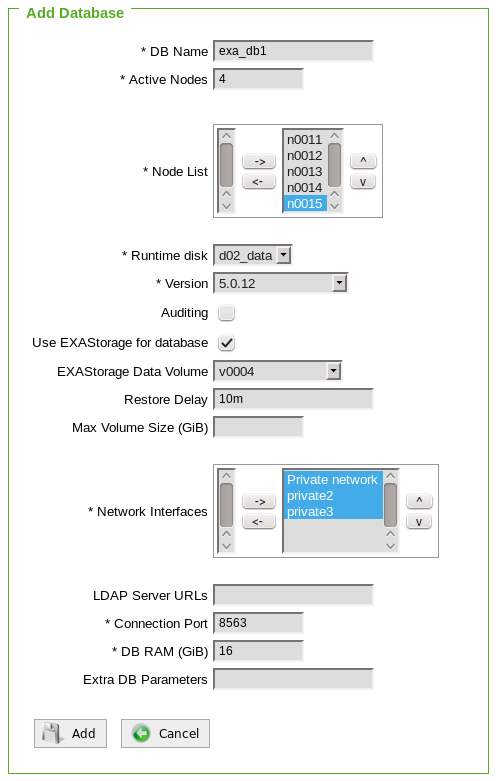
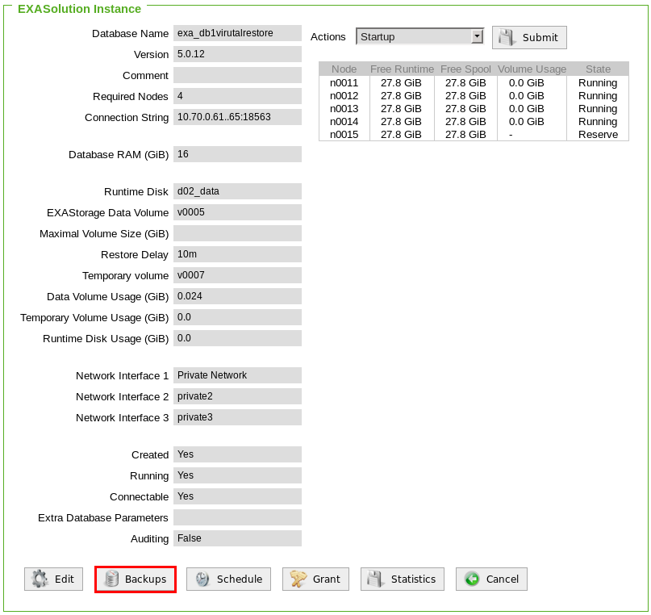
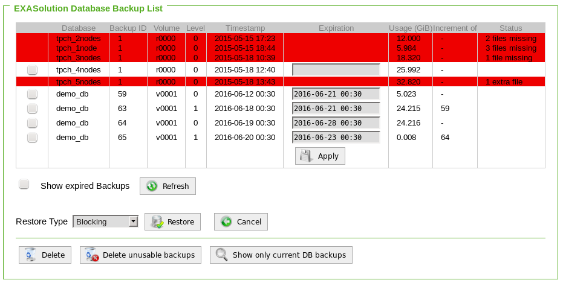

# Virtual-access on database backups 
## Background

You can access to database backups virtually. The scenario will be like this:

* Extract tables/data from backup
* In case the database is configured to use all available memory, the DB RAM needs to be decreased before creating a VR instance. If your system has enough free memory available proceed with step 2
* Reducing the DB RAM requires a short downtime of the production database

#### Prerequisites

* Online backup, Virtual Restore access is not supported for remote backups.
* Enough free disk space for an EXAStorage DATA volume (used for metadata)
* Unused Main Memory (DB RAM)
* The VR instance needs the same amount of active nodes as the backup
* VR instance database port, e.g. TCP 9563 (please be aware this port should be allowed through the firewall)
	+ Recommendation at least 4GiB per node for a small amount of data and max. 5% of the memory of the nodes
	+ Amount of VR DB RAM depends on the amount of data to be restored

#### Calculate DB RAM for the VR instance:

In this example:

* each node has 31GiB of Main Memory
* The amount of data is very small (small table), thus 4GiB DB RAM per node is sufficient (see **Prerequisites**)
* The database is running on 4 active nodes and has 112GiB DB RAM


```python
Amount of active nodes * 4GiB = DB RAM VR instance:  4 * 4GiB = 16GiB DB RAM VR instance
```
## How to virtual-access on database backups

**Step 1: Reducing the DB RAM to allocate RAM for the VR instance**
```markup
DB RAM - DB RAM VR instance = reduced DB RAM: 112GiB - 16GiB = 96GiB
```
**Step 1.1: Shutdown database**  
Select the database and click Shutdown from Services > EXASolution. Skip this step if the database is already shut down.



**Step 1.2: Edit/Adjust DB RAM**  
Wait for the database to be shut down. Then edit database settings:

* Click on the "Edit" Button
* Set the DB RAM to 96GiB
* Apply changes
* Start the database

**Step 2: Create DATA volume for the VR instance**
Go to the database properties:


Note down amount of active database nodes:



**Step 2.1: Create EXAStorage DATA volume**
Click on EXAStorage and then click on "Add Volume":



* Redundancy 1
* Allowed Users e.g. Admin
* Read-only Users: None
* Priority 10
* Volume Type: DATA
* Volume Size: 20GiB
* Nodes List: Active database nodes
* Number of Master Nodes: Same amount as active database nodes
* Block Size: None
* Disk: e.g. d03_storage



**Step 3: Create EXAStorage DATA volume**
* EXASolution - Add
* DB name: VR
* Active Nodes: Same amount as active database nodes
* Node List: Active database nodes
* EXAStorage DATA Volume: Choose the previously created volume ID
* Network Interfaces: Same as the active database
* Connection Port: e.g. 9563 it must differ from production
* DB RAM: 16GiB



**Step 4: Create EXAStorage DATA volume**
* Click on the newly created database
* Click on "Backups"
* Click on "Show foreign database backups"
* Select backup you want to restore (Ensure backup dependencies are fulfilled)





* Restore Type: Virtual Access
* Click on Restore, this will start the VR instance
* Wait for the database to become online

**Step 5: Example Import/Export data**

IMPORT:

```"code-sql"
    CREATE OR REPLACE TABLE SCHEMA.TABLE AS     
    SELECT *     
    FROM ( import from EXA at 'CONNECTION-STRING:PORT' 
    USER 'myuser' IDENTIFIED BY "mypass" table SCHEMA.TABLE ); 
```
EXPORT:

```"code-sql"
    EXPORT SCHEMA.TABLE     
    INTO EXA at 'CONNECTION-STRING:PORT' 
    USER "myuser" IDENTIFIED BY "mypass" 
    TABLE SCHEMA.TABLE; 
```
**Step 6: Cleanup VR database instance**
* Shutdown VR instance
* Delete VR instance
* Delete EXAStorage DATA volume of the VR instance
* Afterward, increase DB RAM for production

*We appreciate your input! Share your knowledge by contributing to the Knowledge Base directly in [GitHub](https://github.com/exasol/public-knowledgebase).* 